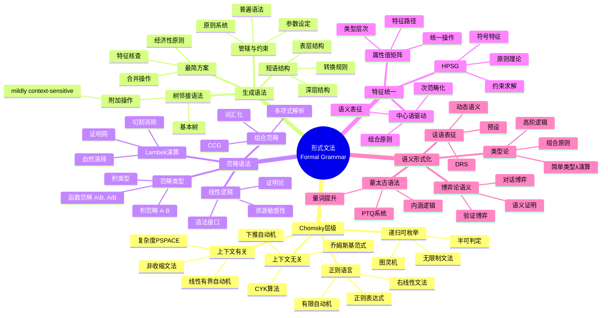
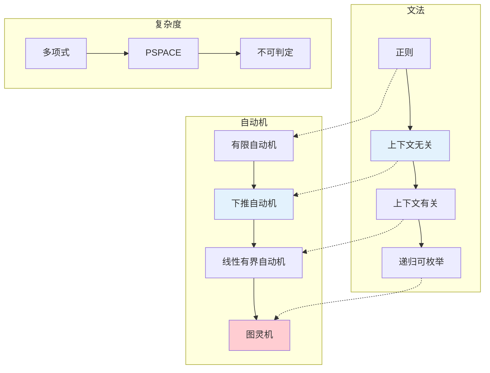

# 数学×语言学：形式文法的代数结构

## 概述

形式语言学研究自然语言的数学结构，运用代数、逻辑和自动机理论来刻画语法规则。从Chomsky层级到范畴语法，从树邻接语法到最简方案，数学工具为理解人类语言的普遍规律提供了形式化框架。

---

## 核心思维导图



---

## Chomsky层级与自动机



---

## 文法形式化对比

| 框架 | 生成能力 | 核心操作 | 语言学现象 | 计算特性 |
|------|----------|----------|------------|----------|
| CFG | 上下文无关 | 重写规则 | 树形结构 | 多项式可解析 |
| TAG | 轻度上下文有关 | 树附加 | 交叉依赖 | 多项式O(n⁶) |
| LIG | 轻度上下文有关 | 栈操作 | 树邻接 | 多项式O(n³) |
| CCG | 上下文无关 | 函数应用/复合 | 长距离依赖 | 多项式 |
| HPSG | 上下文无关 | 特征统一 | 一致关系 | NP-hard |
| MG | 递归可枚举 | 合并+移位 | 位移 | 多项式 |

---

## 蒙太古语法框架

```mermaid
mindmap
  root((蒙太古语法<br/>Montague Grammar))
    核心思想
      句法-语义同态
        组合性原则
        逐词解释
        无剩余意义
      类型论基础
        e: 实体
        t: 真值
        函数类型: e→t, (e→t)→t
    PTQ系统
      句法规则
        S17规则
        量词提升
        类型提升
      语义翻译
        λ演算
        内涵逻辑
        可能世界
      处理现象
        量词辖域
        不定指
        预设
    扩展
      广义量词
        关系性
        单调性
        对称性
      动态转向
        DRT
        文件变换
        话语更新
    影响
      形式语义学
        逻辑语义
        类型语法
        话语理论

```

---

## 现代形式句法

- **最简方案**: 合并(Merge)、移位(Move)、一致(Agree)
- **构式语法**: 符号-功能配对、频率效应
- **依存语法**: 中心词-依存关系、射影性
- **话语语法**: 信息结构、话题-焦点

---

*文档版本：1.0*
*创建时间：2026年4月*
*分类：数学×语言学 / 交叉学科*
