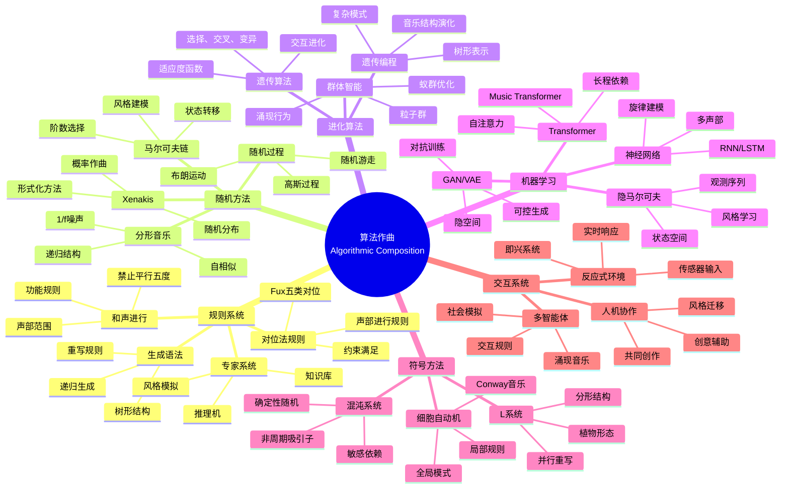
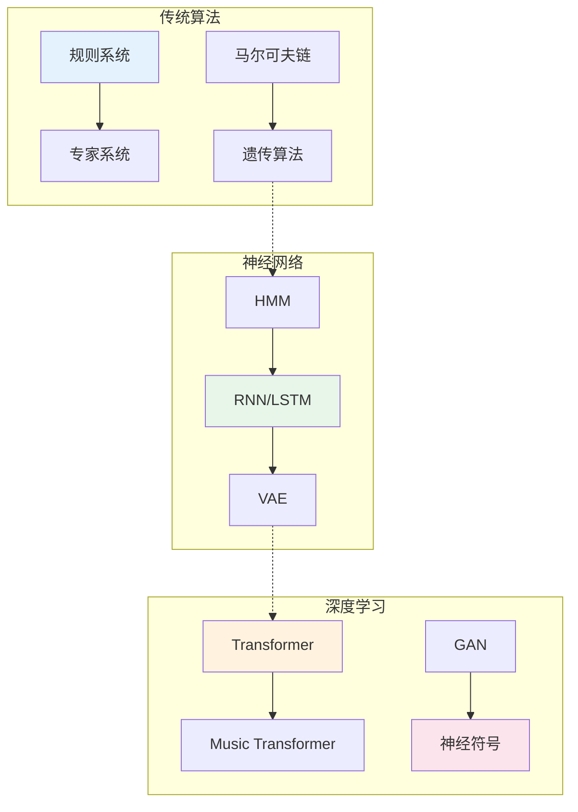
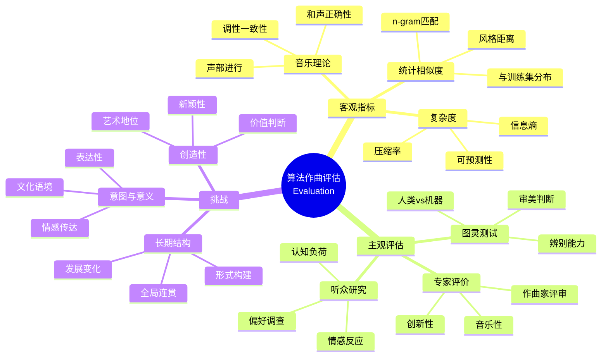

# 数学×音乐：算法作曲的生成模型

## 概述

算法作曲运用计算方法和数学模型来创作音乐。从基于规则的系统到随机过程，从遗传算法到深度学习，算法作曲探索了人类创造力与机器生成之间的边界。

---

## 核心思维导图

---

## 作曲方法演化

---

## 代表性系统

| 系统 | 方法 | 年代 | 特点 |
|------|------|------|------|
| Illiac Suite | 随机+规则 | 1957 | 第一部计算机作曲 |
| EMI | 专家系统 | 1995 | 风格模仿 |
| AIVA | 深度学习 | 2016 | 电影配乐 |
| BachBot | LSTM | 2016 | 巴赫风格 |
| Music Transformer | 注意力 | 2019 | 长程依赖 |
| Jukebox | VQ-VAE | 2020 | 带歌词音频 |
| MuseNet | Transformer | 2019 | 多乐器 |

---

## 评估与挑战

---

## 创造力与计算

- **涌现**: 简单规则产生复杂行为
- **风格迁移**: 跨风格音乐转换
- **交互即兴**: 人与AI实时协作
- **可解释AI**: 理解模型决策

---

*文档版本：1.0*
*创建时间：2026年4月*
*分类：数学×音乐 / 交叉学科*
