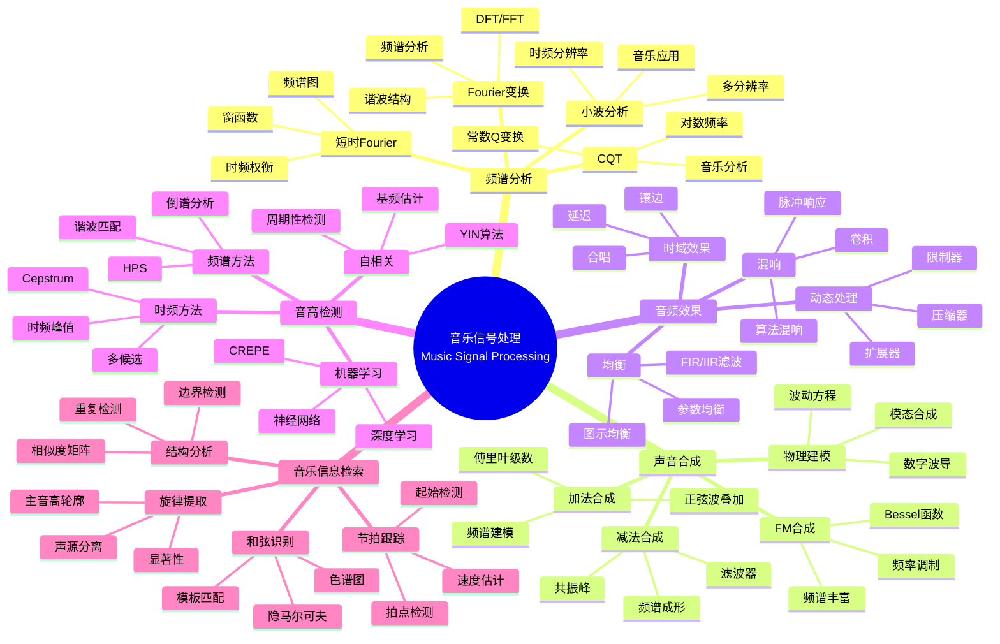
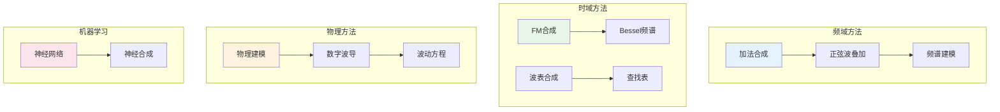
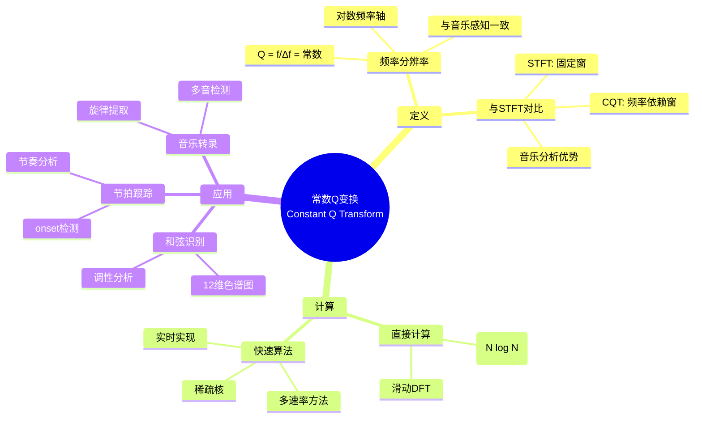

# 数学×音乐：音乐信号的傅里叶分析

## 概述

音乐信号处理运用数字信号处理技术来分析、合成和变换音乐声音。从傅里叶变换到时频分析，从滤波器设计到物理建模合成，数学方法使数字音乐的创作、录制和传播成为可能。

---

## 核心思维导图

---

## 音乐合成方法对比

---

## 音高检测算法

| 方法 | 原理 | 优点 | 缺点 |
|------|------|------|------|
| 自相关 | 周期相似性 | 简单、时域 | 高频假峰值 |
| YIN | 差分函数 | 改进自相关 | 计算量 |
| HPS | 谐波乘积谱 | 频域清晰 | 低分辨率 |
| Cepstral | 倒谱峰值 | 基频提取 | 混合音难 |
| ML-based | 神经网络 | 准确、鲁棒 | 数据依赖 |

---

## 常数Q变换(CQT)

---

## 现代音乐技术

- **自动调音**: 音高校正、实时处理
- **声源分离**: 人声/伴奏分离、Demucs
- **神经合成**: WaveNet、DDSP、神经声码器
- **生成模型**: Music Transformer、Jukebox

---

*文档版本：1.0*
*创建时间：2026年4月*
*分类：数学×音乐 / 交叉学科*
