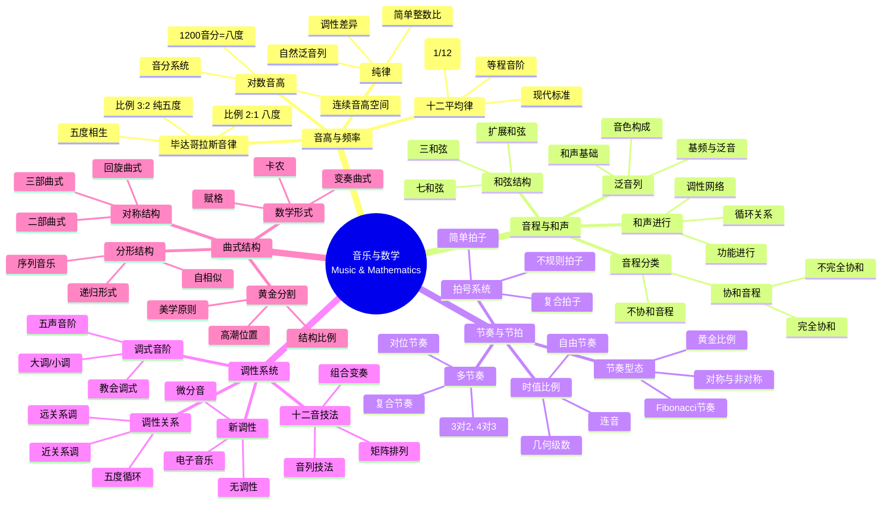
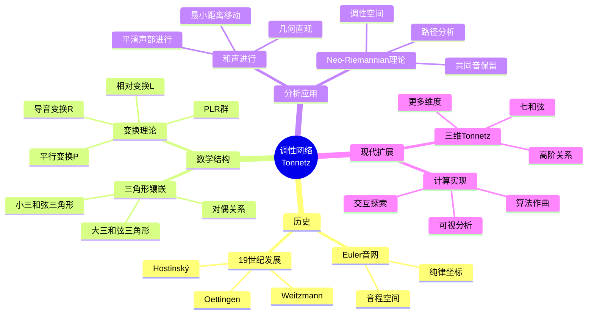

# 数学×音乐：音乐理论的数与形

## 概述

音乐与数学自古以来就有深刻的联系。从毕达哥拉斯发现的音程比例到现代十二平均律，从节奏模式到调性网络，数学为理解音乐结构提供了精确的语言。

---

## 核心思维导图



---

## 音律系统的数学

```mermaid
graph TD
    subgraph 毕达哥拉斯
        P[纯五度 3/2] --> C[五度圈]
        C --> W[狼音]
        W --> P1[毕达哥拉斯音差]
    end
    
    subgraph 纯律
        J[自然泛音] --> R[简单整数比]
        R --> S[音差问题]
    end
    
    subgraph 平均律
        E[2^(1/12)] --> T[十二平均律]
        T --> C1[等音等价]
        C1 --> M[现代标准]
    end
    
    P1 -.-> E
    S -.-> E
    
    style P fill:#e3f2fd
    style T fill:#e8f5e9
    style M fill:#fff3e0

```

---

## 音程频率比

| 音程 | 频率比(纯律) | 频率比(十二平均律) | 音分 |
|------|-------------|-------------------|------|
| 纯一度 | 1:1 | 1.0000 | 0 |
| 纯八度 | 2:1 | 2.0000 | 1200 |
| 纯五度 | 3:2 = 1.5 | 2^(7/12) ≈ 1.498 | 700 |
| 纯四度 | 4:3 ≈ 1.333 | 2^(5/12) ≈ 1.335 | 500 |
| 大三度 | 5:4 = 1.25 | 2^(4/12) ≈ 1.260 | 400 |
| 小三度 | 6:5 = 1.2 | 2^(3/12) ≈ 1.189 | 300 |

---

## 调性网络(Tonnetz)



---

## 序列音乐与组合

- **全序列**: 音高、时值、力度、音色的序列化
- **矩阵排列**: 12×12矩阵的48种形式(原型、逆行、倒影、逆行倒影)
- **组合**: 六音组与补集的关系
- **积分序列**: 音高序列的派生

---

*文档版本：1.0*
*创建时间：2026年4月*
*分类：数学×音乐 / 交叉学科*
