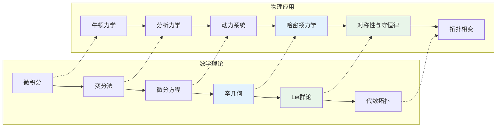
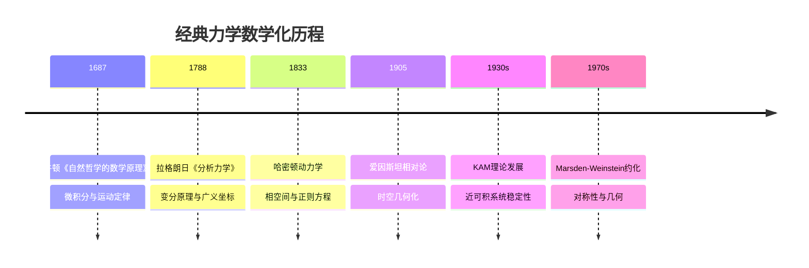

# 数学×物理学：经典力学中的数学

## 概述

经典力学是物理学中最先被数学化的分支，从牛顿的微积分到拉格朗日和哈密顿的分析力学，数学工具不断演进，深刻揭示了物理系统的结构与对称性。

---

## 核心思维导图

```mermaid
mindmap
  root((经典力学<br/>Classical Mechanics))
    牛顿力学
      牛顿三定律
        F = ma
        作用反作用
        惯性定律
      运动方程
        二阶ODE系统
        初值问题
        存在唯一性
      守恒定律
        动量守恒
        角动量守恒
        能量守恒
    拉格朗日力学
      作用量原理
        S = ∫L dt
        变分法 δS = 0
      拉格朗日量
        L = T - V
        广义坐标
        广义速度
      Euler-Lagrange方程
        d/dt(∂L/∂q̇) = ∂L/∂q
        运动方程导出
      诺特定理
        对称性 ↔ 守恒律
        时间平移 → 能量
        空间平移 → 动量
    哈密顿力学
      勒让德变换
        H = p·q̇ - L
        广义动量 p = ∂L/∂q̇
      哈密顿方程
        q̇ = ∂H/∂p
        ṗ = -∂H/∂q
        2n个一阶ODE
      相空间
        (q,p) ∈ T*Q
        辛流形
        体积守恒
      Poisson括号
        {f,g} = Σ(∂f/∂q·∂g/∂p - ∂f/∂p·∂g/∂q)
        代数结构
        正则变换
    辛几何
      辛形式
        ω = Σdpᵢ∧dqᵢ
        闭形式 dω = 0
        非退化
      Hamiltonian流
        向量场 X_H
        积分曲线
        能量守恒
      Liouville定理
        相空间体积不变
        统计力学基础
      可积系统
        作用-角变量
        Liouville可积
        KAM理论
    对称性与约化
      Lie群作用
        动量映射
        等变映射
      Marsden-Weinstein约化
        J⁻¹(μ)/G_μ
        约化相空间
      对称性破缺
        Goldstone模式
        分岔理论

```

---

## 数学工具对应关系



---

## 核心方程对比

| 框架 | 基本方程 | 变量 | 几何结构 |
|------|----------|------|----------|
| 牛顿力学 | mẍ = F(x) | 位置x∈ℝ³ | 欧氏空间 |
| 拉格朗日 | d/dt(∂L/∂q̇) = ∂L/∂q | (q,q̇)∈TQ | 切丛 |
| 哈密顿 | q̇=∂H/∂p, ṗ=-∂H/∂q | (q,p)∈T*Q | 余切丛/辛流形 |
| Poisson | df/dt = {f,H} | 相空间函数 | Poisson代数 |

---

## 守恒律与对称性

```mermaid
mindmap
  root((诺特定理<br/>Noether's Theorem))
    时间平移
      t → t + ε
      对称性生成元
      守恒量: 能量 E
    空间平移
      x → x + ε
      对称性生成元
      守恒量: 动量 p
    空间旋转
      x → Rx
      SO(3)对称性
      守恒量: 角动量 L
    规范对称
      局域变换
      U(1), SU(N)
      守恒量: 荷 Q
    生成元代数
      [Gᵢ,Gⱼ] = fᵢⱼₖGₖ
      Lie代数结构
      量子化对应

```

---

## 历史发展时间线



---

## 现代应用

- **天体力学**: 多体问题的稳定性分析
- **分子动力学**: 辛积分算法设计
- **量子力学**: 经典极限与半经典近似
- **控制论**: 最优控制与变分法
- **金融数学**: 随机力学与期权定价

---

*文档版本：1.0*
*创建时间：2026年4月*
*分类：数学×物理学 / 交叉学科*
