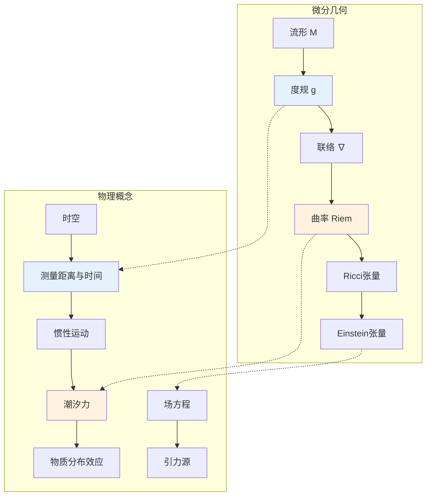

# 数学×物理学：广义相对论的微分几何

## 概述

广义相对论将引力几何化，描述为时空的弯曲。黎曼几何成为其自然的数学语言，而Einstein场方程则将物质-能量分布与时空几何联系起来，是20世纪数学与物理结合的典范。

---

## 核心思维导图

```mermaid
mindmap
  root((广义相对论<br/>General Relativity))
    数学基础
      流形理论
        4维光滑流形
        坐标卡覆盖
        微分同胚不变性
      张量分析
        切丛与余切丛
        (k,l)型张量
        张量场代数
      度规张量
        g_μν = g_νμ
        号差 (-,+,+,+)
        洛伦兹几何
      联络理论
        Levi-Civita联络
        Christoffel符号
        无挠且保度规
    曲率理论
      Riemann张量
        R^ρ_σμν
        曲率定义
        20个独立分量
      Ricci张量
        R_μν = R^ρ_μρν
        对称张量
        10个独立分量
      标量曲率
        R = g^μνR_μν
        标量不变量
      Einstein张量
        G_μν = R_μν - ½g_μνR
        守恒性 ∇^μG_μν = 0
        几何部分
    Einstein方程
      场方程
        G_μν = 8πG/c⁴ T_μν
        几何 = 物质
      作用量原理
        S = ∫(R/16πG + L_m)√-g d⁴x
        Hilbert作用量
        变分导出
      弱场近似
        g_μν ≈ η_μν + h_μν
        线性化方程
        牛顿极限
      精确解
        Schwarzschild解
        Kerr解
        Friedmann-Lemaître-Robertson-Walker
    因果结构
      光锥
        时向/空向/类光
        因果未来/过去
        依赖域
      测地线
        自平行曲线
        自由粒子运动
        光传播
      奇点定理
        Penrose-Hawking
        测地不完备性
        奇点不可避免
    引力波
      线性化引力
        度规扰动 h_μν
        规范自由度
        TT规范
      传播方程
        □h̄_μν = -16πT_μν
        光速传播
        横波
      探测
        LIGO/Virgo
        双黑洞并合
        多信使天文学
    现代发展
      黑洞热力学
        熵与面积律
        Hawking辐射
        信息悖论
      量子引力
        圈量子引力
        弦理论
        黑洞全息

```

---

## 微分几何与引力的对应



---

## Einstein场方程的数学性质

| 性质 | 描述 | 数学表达 |
|------|------|----------|
| 张量性 | 坐标无关 | G_μν, T_μν 为 (0,2)张量 |
| 对称性 | 10个独立方程 | G_μν = G_νμ |
| 守恒性 | 自动满足 | ∇^μG_μν = 0 (Bianchi恒等式) |
| 超定/欠定 | 4个坐标自由度 | 实际6个动力学方程 |
| 拟线性双曲 | 适定性 | 初值问题良好定义 |

---

## 经典精确解

```mermaid
mindmap
  root((精确解<br/>Exact Solutions))
    Schwarzschild
      真空球对称
        静态解
        唯一性(Birkhoff)
      事件视界
        r = 2GM/c²
        单向膜
      奇点
        r = 0
        时空奇点
    Kerr
      旋转黑洞
        轴对称
        稳态解
      能层
        r_ergo > r_+
        Penrose过程
      内/外视界
        r_±
        环状奇点
    FLRW
      宇宙学
        均匀各向同性
        度规因子a(t)
      弗里德曼方程
        ȧ²/a² = 8πGρ/3
        ä/a = -4πG(ρ+3p)/3
      演化
        物质主导
        辐射主导
        暗能量主导
    Reissner-Nordström
      带电黑洞
        电荷Q
        双视界
    引力波解
      平面波
        线性近似
        TT规范
      脉冲波
        波前奇点

```

---

## 数学未解问题

- **宇宙审查假设**: 奇点是否总是被视界隐藏
- **Penrose不等式**: 质量与角动量的关系
- **正质量定理**: ADM质量的正定性 (Schoen-Yau证明)
- **黑洞稳定性**: Kerr解的线性/非线性稳定性
- **奇点定理推广**: 量子引力中的奇点消解

---

## 与其他数学领域的联系

- **几何分析**: 正质量定理、Ricci流
- **偏微分方程**: Einstein方程的初值问题
- **动力系统**: 测地流的混沌性
- **拓扑学**: 时空的整体结构
- **代数几何**: 复化时空、扭量理论

---

*文档版本：1.0*
*创建时间：2026年4月*
*分类：数学×物理学 / 交叉学科*
