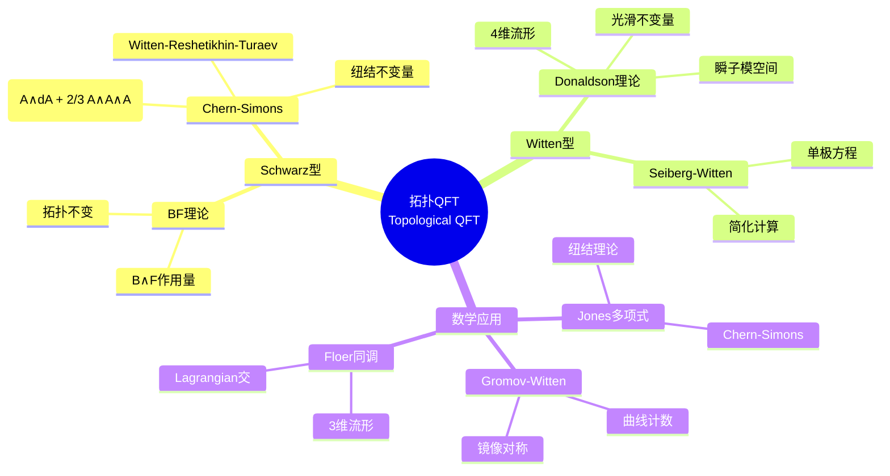

# 数学×物理学：量子场论的代数拓扑

## 概述

量子场论是现代理论物理的基石，融合了量子力学、狭义相对论和经典场论。其数学结构涉及泛函分析、表示论、代数拓扑和微分几何，是目前数学与物理交叉最深刻的领域之一。

---

## 核心思维导图

```mermaid
mindmap
  root((量子场论<br/>Quantum Field Theory))
    经典场论
      场构型
        φ: M → V
        光滑映射
        函数空间
      Lagrangian密度
        L = L(φ, ∂φ)
        局域性
        洛伦兹不变性
      Euler-Lagrange方程
        ∂L/∂φ = ∂_μ(∂L/∂(∂_μφ))
        运动方程
        场方程
      对称性
        内部对称
        规范对称
        Noether流
    量子化
      正则量子化
        场算符 φ̂(x)
        共轭动量 π̂(x)
        对易关系
      路径积分
        Z = ∫Dφ exp(iS/ℏ)
        泛函积分
        生成泛函
      微扰理论
        Feynman图
        圈展开
        正规化
      重整化
        抵消项
        跑动耦合
        重整化群
    规范场论
      主丛
        结构群 G
        底流形 M
        联络形式
      曲率
        场强 F = dA + A∧A
        Bianchi恒等式
        Yang-Mills方程
      标准模型
        SU(3)×SU(2)×U(1)
        夸克轻子
        规范玻色子
      瞬子
        自对偶场强
        拓扑荷
        θ真空
    反常与拓扑
      手征反常
        轴矢流散度
        三角图
        Wess-Zumino
      指标定理
        Atiyah-Singer
        Dirac算子
        拓扑不变量
      陈类
        c₁, c₂
        特征类
        示性数
    代数方法
      公理化QFT
        Wightman公理
        关联函数
        谱条件
      代数QFT
        局域代数
        Haag-Kastler
        编织张量范畴
      共形场论
        Virasoro代数
        共形块
        模不变性
    弦论与对偶
      世界面
        Polyakov作用量
        共形对称
        顶点算子
      对偶性
        T对偶
        S对偶
        镜像对称
      AdS/CFT
        全息原理
        Maldacena对偶
        强耦合计算

```

---

## 数学结构与物理概念对应

```mermaid
graph TD
    subgraph 数学
        B[主丛 P(M,G)] --> C[联络 ∇]
        C --> F[曲率 Ω]
        F --> CS[Chern类 c_k]
        PI[路径积分] --> FU[泛函分析]
        FU --> AS[Atiyah-Singer指标]
    end
    
    subgraph 物理
        B1[规范场] --> C1[规范势 A_μ]
        C1 --> F1[场强 F_μν]
        F1 --> I[反常/拓扑项]
        PI1[QFT配分函数] --> OP[算子谱]
        OP --> A[手征反常]
    end
    
    B -.-> B1
    C -.-> C1
    CS -.-> I
    AS -.-> A
    
    style B fill:#e3f2fd
    style B1 fill:#e3f2fd
    style AS fill:#fff3e0
    style A fill:#fff3e0

```

---

## 重整化群流

| 能量尺度 | 行为 | 物理现象 |
|----------|------|----------|
| UV (高能) | 自由/弱耦合 | 渐近自由 (QCD) |
| IR (低能) | 束缚态/手征对称破缺 | 强子物理 |
| 固定点 | 共形不变 | 临界现象 |
|  Landau极点 | 理论失效 |  triviality |

---

## 拓扑量子场论



---

## 数学未解问题

- **Yang-Mills存在性与质量间隙**: Clay千禧年问题
- **共形场论的分类**: 模张量范畴
- **弦景观**: 真空选择问题
- **非微扰定义**: 格点QFT严格极限
- **量子引力**: UV完备性

---

*文档版本：1.0*
*创建时间：2026年4月*
*分类：数学×物理学 / 交叉学科*
