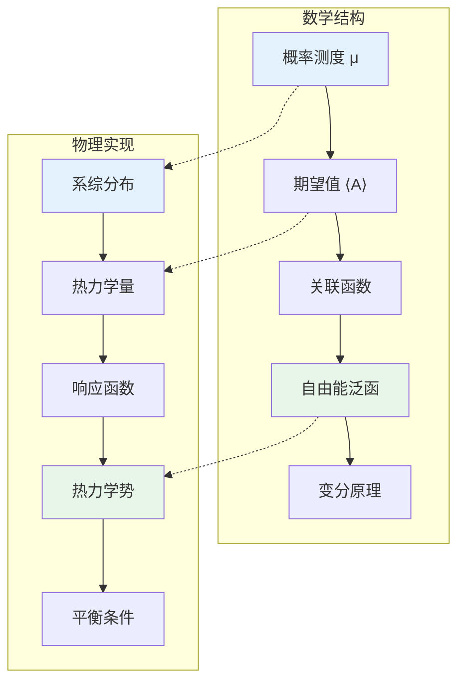

# 数学×物理学：统计力学的概率基础

## 概述

统计力学架起了微观力学与宏观热力学之间的桥梁，运用概率论和统计方法处理大量粒子系统。从系综理论到相变理论，数学工具在理解多体系统的集体行为中发挥核心作用。

---

## 核心思维导图

```mermaid
mindmap
  root((统计力学<br/>Statistical Mechanics))
    概率基础
      概率空间
        样本空间 Ω
        σ-代数 ℱ
        概率测度 P
      随机变量
        可观测量
        分布函数
        矩生成函数
      大数定律
        弱大数律
        强大数律
        系综平均 = 时间平均
      中心极限定理
        涨落正态分布
        O(1/√N)量级
    系综理论
      微正则系综
        E,V,N固定
        等概率原理
        S = k_B ln Ω
      正则系综
        T,V,N固定
        Boltzmann分布
        P ∝ exp(-E/k_BT)
      巨正则系综
        T,V,μ固定
        化学势
        粒子数涨落
      统计热力学
        配分函数 Z
        自由能 F = -k_BT ln Z
        熵 S = -∂F/∂T
    理想系统
      经典理想气体
        Maxwell分布
        状态方程 PV = Nk_BT
        熵 Sackur-Tetrode
      量子理想气体
        Bose-Einstein统计
        Fermi-Dirac统计
        黑体辐射
        电子气
      Ising模型
        格点自旋
        最近邻相互作用
        相变模型
    相变与临界现象
      相变分类
        一级相变
        连续相变
        临界点
      序参量
        磁化强度 M
        密度差
        对称性破缺
      临界指数
        α, β, γ, δ, ν, η
        标度律
        普适性类
      重正化群
        Kadanoff块自旋
        Wilson RG
        不动点分析
    涨落与耗散
      涨落理论
        涨落-耗散定理
        响应函数
        Onsager回归
      Brown运动
        Langevin方程
        Fokker-Planck方程
        扩散过程
      线性响应
        Kubo公式
        电导率
        关联函数
    遍历理论
      遍历假设
        时间平均 = 系综平均
        混合性质
        Bernoulli系统
      Birkhoff定理
        遍历系统的时间平均存在
        几乎处处收敛
      Lyapunov指数
        混沌敏感性
        熵产生率
        Kolmogorov-Sinai熵

```

---

## 系综理论的数学结构



---

## 配分函数与热力学量

| 系综 | 配分函数 | 热力学势 | 自然变量 |
|------|----------|----------|----------|
| 微正则 | Ω(E) = Tr δ(H-E) | 熵 S = k_B ln Ω | E,V,N |
| 正则 | Z = Tr exp(-βH) | Helmholtz自由能 F = -k_BT ln Z | T,V,N |
| 巨正则 | Ξ = Tr exp(-β(H-μN)) | 巨势 Ω = -k_BT ln Ξ | T,V,μ |
| 等温等压 | Δ = ∫Z exp(-βpV)dV | Gibbs自由能 G = -k_BT ln Δ | T,p,N |

---

## 相变理论框架

```mermaid
mindmap
  root((相变理论<br/>Phase Transitions))
    Landau理论
      自由能展开
        F = F₀ + a(T-T_c)m² + bm⁴
        平均场近似
      临界行为
        m ~ (T_c-T)^β
        β = 1/2 (平均场)
      对称性破缺
        高温相: m=0
        低温相: m≠0
    标度理论
      标度假设
        自由能奇异部分
        齐次函数
      标度律
        Rushbrooke: α+2β+γ=2
        Widom: γ=β(δ-1)
        Fisher: α+νd=2
      临界维度
        d_c = 4 (Ising)
        平均场在d>d_c正确
    重正化群
      粗粒化
        块自旋变换
        长度重标度
      RG方程
        耦合常数流
        β函数
      不动点
        高斯不动点
        Wilson-Fisher不动点
        关联长度发散
    普适性
      普适性类
        空间维度
        序参量维数
        对称性
      典型系统
        Ising: d=2, n=1
        XY模型: d=2, n=2
        Heisenberg: d=3, n=3

```

---

## 现代数学物理问题

- **严格结果**: Yang-Lee零点、相变的数学证明
- **随机矩阵**: 能级统计、关联函数
- **可积系统**: 六顶点模型、XXZ链精确解
- **量子相变**: 零温相变、拓扑相
- **非平衡统计**: 涨落定理、热力学不确定性关系

---

*文档版本：1.0*
*创建时间：2026年4月*
*分类：数学×物理学 / 交叉学科*
