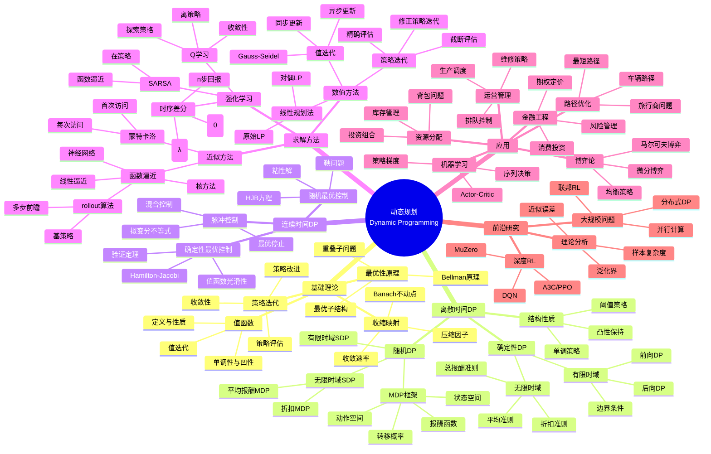

msc_primary: "00A99"
msc_secondary: ['00-XX']
---

# 动态规划思维导图

## 概述

动态规划是解决多阶段决策问题的强大方法，由Bellman于1950年代创立。其核心思想是最优性原理：最优策略的子策略也是最优的。适用于离散/连续时间、确定/随机环境。

## 核心概念详解

### 1. Bellman方程

**离散时间（确定性）**：
$$V_t(x) = \min_{u \in U(x)} \{g_t(x,u) + V_{t+1}(f_t(x,u))\}$$

**离散时间（随机，MDP）**：
$$V^*(x) = \min_{u \in U(x)} \{g(x,u) + \gamma \sum_{y} P(y|x,u)V^*(y)\}$$

**连续时间（HJB方程）**：
$$\rho V = \min_u \{g(x,u) + \nabla V \cdot f(x,u)\} + \frac{1}{2}\text{tr}(\sigma\sigma^T \nabla^2 V)$$

### 2. 算法比较

| 方法 | 存储需求 | 计算量 | 收敛速度 |
|------|----------|--------|----------|
| 值迭代 | O(\|S\|\|A\|) | O(\|S\|²\|A\|) | 线性 |
| 策略迭代 | O(\|S\|²) | 解线性方程组 | 二次 |
| Q学习 | O(\|S\|\|A\|) | 样本驱动 | 渐近 |

### 3. 收敛性条件

**值迭代收敛**：
- 折扣因子 γ ∈ [0,1)
- 或：所有策略 proper（有限步终止）

**策略迭代收敛**：
- 有限状态/动作空间
- 或：满足一定正则条件

### 4. 近似动态规划

**线性架构**：
$$\tilde{V}(x; r) = \sum_{i=1}^k r_i \phi_i(x) = \phi(x)^T r$$

**投影Bellman方程**：
$$\Phi r = \Pi T(\Phi r)$$

其中 Π 是到特征空间的投影，T 是Bellman算子

## 相关主题

- [最优控制](./optimal-control.md)
- [随机优化](./stochastic-optimization.md)
- [应用数学思维导图索引](./00-应用数学思维导图索引.md)

## 参考资源

- Bertsekas: "Dynamic Programming and Optimal Control"
- Puterman: "Markov Decision Processes"
- Powell: "Approximate Dynamic Programming"
- Sutton & Barto: "Reinforcement Learning"
