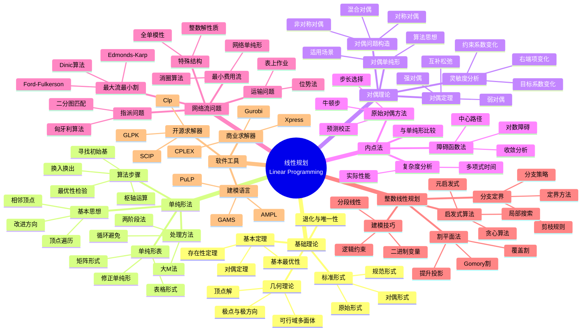

# 线性规划思维导图

## 概述

线性规划是优化理论中最成熟的分支，研究线性目标函数在线性约束下的极值问题。自1947年单纯形法提出以来，线性规划已成为运筹学和决策科学的基础工具。



## 核心概念详解

### 1. 标准形式

**原始问题**：
$$\begin{aligned}
\min \quad & c^T x \\
\text{s.t.} \quad & Ax = b \\
& x \geq 0
\end{aligned}$$

**对偶问题**：
$$\begin{aligned}
\max \quad & b^T y \\
\text{s.t.} \quad & A^T y \leq c
\end{aligned}$$

### 2. 单纯形法迭代

```
1. 选择非基变量 x_j 使 c_j < 0（进基）
2. 计算方向 d = B⁻¹A_j
3. 确定步长 θ = min{b_i/d_i : d_i > 0}
4. 更新基，重复直到最优
```

### 3. 复杂度比较

| 方法 | 最坏复杂度 | 平均性能 | 适用规模 |
|------|-----------|----------|----------|
| 单纯形法 | 指数级 | 多项式 | 大规模稀疏 |
| 椭球法 | O(n⁶L) | 差 | 理论分析 |
| 内点法 | O(√n L) | 好 | 大规模稠密 |

### 4. 网络流特殊性

**全单模性**：约束矩阵 A 的所有方子行列式值为 0, ±1

**推论**：若 b 为整数，则 LP 存在整数最优解

## 相关主题

- [凸优化](./convex-optimization.md)
- [非线性规划](./nonlinear-programming.md)
- [应用数学思维导图索引](./00-应用数学思维导图索引.md)

## 参考资源

- Dantzig: "Linear Programming and Extensions"
- Bertsimas & Tsitsiklis: "Introduction to Linear Optimization"
- Vanderbei: "Linear Programming: Foundations and Extensions"
