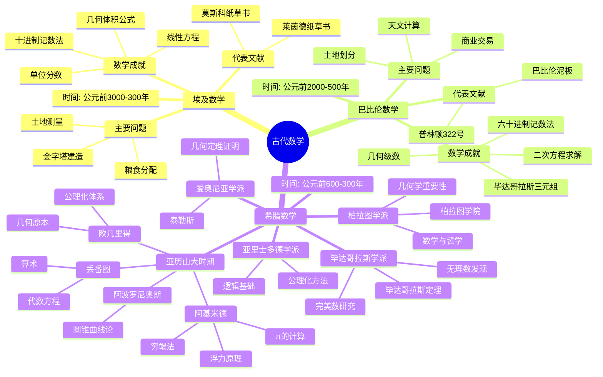

msc_primary: "00A99"
msc_secondary: ['00-XX']
---

# 古代数学思维导图

## 概述

## 详细内容

### 埃及数学

| 方面 | 内容 |
|------|------|
| **时间** | 公元前3000年 - 公元前300年 |
| **文献** | 莱茵德纸草书(约1650BC)、莫斯科纸草书(约1850BC) |
| **记数系统** | 十进制，象形数字符号 |
| **主要成就** | 单位分数运算、几何体积公式、线性方程求解 |

**关键数学家**：
- **阿默斯**：莱茵德纸草书抄写者
- **未知抄写员**：莫斯科纸草书作者

### 巴比伦数学

| 方面 | 内容 |
|------|------|
| **时间** | 公元前2000年 - 公元前500年 |
| **文献** | 普林顿322号泥板、YBC 7289泥板 |
| **记数系统** | 六十进制位置记数法 |
| **主要成就** | 二次方程、平方根近似、三角函数表 |

**关键成就**：
- √2的精确近似：1;24,51,10（≈1.414213）
- 毕达哥拉斯三元组的系统研究

### 希腊数学

| 时期 | 代表人物 | 主要贡献 |
|------|----------|----------|
| **古典时期** | 泰勒斯 | 几何命题证明 |
| | 毕达哥拉斯 | 数论、音乐数学 |
| | 希帕索斯 | 无理数发现 |
| **柏拉图时期** | 柏拉图 | 数学哲学 |
| | 欧多克索斯 | 比例理论、穷竭法 |
| **亚历山大时期** | 欧几里得 | 几何原本 |
| | 阿基米德 | 微积分先驱、力学 |
| | 阿波罗尼奥斯 | 圆锥曲线 |
| | 埃拉托斯特尼 | 素数筛法、地球周长 |
| | 喜帕恰斯 | 三角学奠基 |
| **罗马时期** | 托勒密 | 天文学数学 |
| | 丢番图 | 代数方程 |
| | 帕普斯 | 几何学综合 |

## 历史意义

1. **证明的诞生**：从经验计算到逻辑证明
2. **公理化方法**：欧几里得建立数学范式
3. **抽象思维**：从具体问题到一般理论
4. **几何传统**：影响西方数学两千余年

## 相关资源

- [希腊数学学派](./../00-数学史/01-古代数学/03-希腊数学.md)
- [几何原本](./../../数学家理念体系/欧几里得数学理念/02-数学内容深度分析/01-几何学理论/02-几何原本理论.md)
