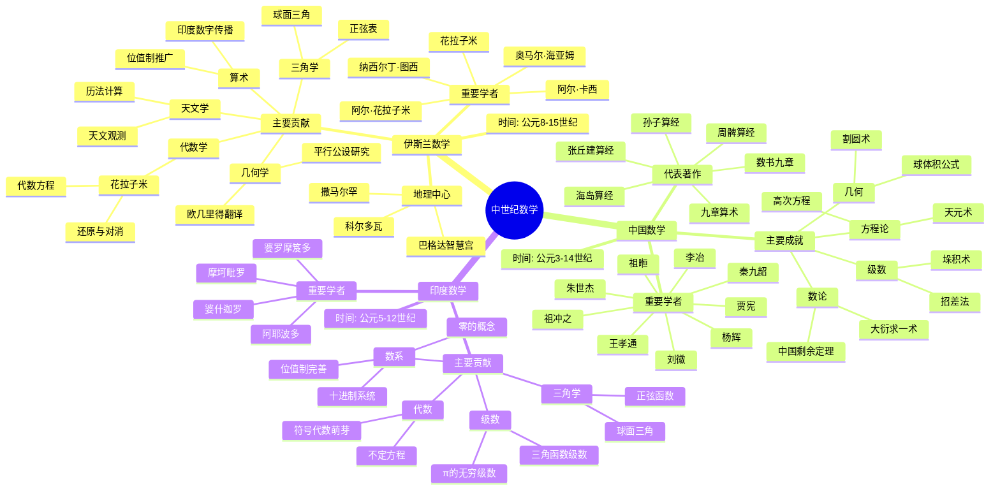
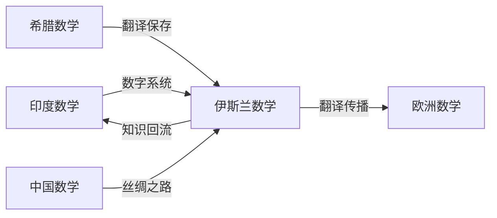

msc_primary: "00A99"
msc_secondary: ['00-00']
---

# 中世纪数学思维导图

## 概述

## 详细内容

### 伊斯兰数学

| 方面 | 内容 |
|------|------|
| **时间** | 公元8世纪 - 15世纪 |
| **中心** | 巴格达、科尔多瓦、开罗、撒马尔罕 |
| **特点** | 翻译运动、知识保存与创新 |

**关键数学家**：

| 数学家 | 时期 | 主要贡献 |
|--------|------|----------|
| **花拉子米** | 780-850 | 代数学奠基、印度-阿拉伯数字传播 |
| **塔比·伊本·库拉** | 836-901 | 非欧几何先驱、友好数 |
| **奥马尔·海亚姆** | 1048-1131 | 三次方程几何解、历法改革 |
| **纳西尔丁·图西** | 1201-1274 | 三角学系统化、天文台建设 |
| **阿尔·卡西** | 1380-1429 | π的精确计算、十进制小数 |

**主要成就**：
1. **代数学**：从具体算术到一般方程求解
2. **三角学**：从天文学工具到独立学科
3. **几何学**：平行公设的深度研究
4. **算术**：十进制系统的完善与传播

### 中国数学

| 方面 | 内容 |
|------|------|
| **时间** | 汉至元（约公元1-14世纪） |
| **特点** | 实用导向、算法化、机械化 |

**关键数学家**：

| 数学家 | 时期 | 主要贡献 |
|--------|------|----------|
| **刘徽** | 约225-295 | 割圆术、体积理论、注释九章 |
| **祖冲之** | 429-500 | π的精确值(3.1415926-7)、球体积 |
| **祖暅** | 5-6世纪 | 祖暅原理(卡瓦列里原理前身) |
| **王孝通** | 7世纪 | 三次方程、缉古算经 |
| **秦九韶** | 1202-1261 | 大衍求一术、高次方程数值解 |
| **李冶** | 1192-1279 | 天元术、测圆海镜 |
| **杨辉** | 1238-1298 | 杨辉三角、垛积术 |
| **朱世杰** | 1249-1314 | 四元术、招差法 |

**宋元数学高峰**：
- 天元术 → 四元术（多元高次方程）
- 大衍求一术（模运算）
- 招差法（高阶等差级数）
- 垛积术（高阶等差级数求和）

### 印度数学

| 方面 | 内容 |
|------|------|
| **时间** | 公元5-12世纪 |
| **特点** | 天文学驱动、位值制完善 |

**关键数学家**：

| 数学家 | 时期 | 主要贡献 |
|--------|------|----------|
| **阿耶波多** | 476-550 | 正弦表、π=3.1416、一次不定方程 |
| **婆罗摩笈多** | 598-668 | 零的运算规则、二次方程公式 |
| **婆什迦罗** | 1114-1185 | 不定方程、微积分萌芽、无穷概念 |

**革命性贡献**：
1. **数字系统**：位值制、零的概念
2. **代数符号**：缩写符号的使用
3. **三角学**：正弦函数的系统化
4. **无穷概念**：无穷级数的研究

## 文明交流

## 历史意义

1. **知识保存**：阿拉伯世界保存希腊数学
2. **数字革命**：印度-阿拉伯数字系统
3. **代数学诞生**：从算术到代数的飞跃
4. **三角学独立**：从天文学分支成为独立学科
5. **中国贡献**：高次方程、模运算的领先发展

## 相关资源

- [伊斯兰数学黄金时代](./../00-数学史/01-古代数学/06-伊斯兰数学.md)
- [中国数学史](./../00-数学史/01-古代数学/04-中国数学.md)
- [印度数学贡献](./../00-数学史/01-古代数学/05-印度数学.md)
