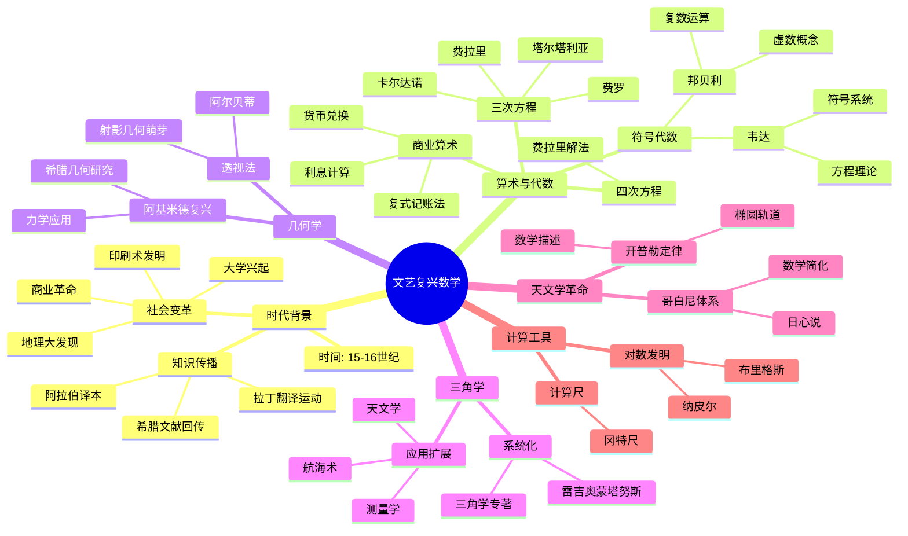
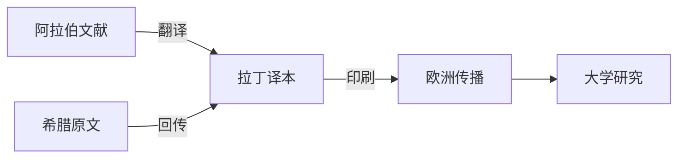

msc_primary: "00A99"
msc_secondary: ['00-XX']
---

# 文艺复兴数学思维导图

## 概述



## 详细内容

### 时代背景

| 方面 | 内容 |
|------|------|
| **时间** | 约1400-1600年 |
| **核心** | 人文主义、古典复兴、科学革命萌芽 |
| **关键事件** | 古腾堡印刷术(约1440)、君士坦丁堡陷落(1453) |

**知识传播路径**：



### 代数学革命

**三次方程求解竞赛**：

| 数学家 | 生卒年 | 贡献 |
|--------|--------|------|
| **费罗** | 1465-1526 | 发现x³+px=q的解法 |
| **塔尔塔利亚** | 1499-1557 | 独立发现，与卡尔达诺之争 |
| **卡尔达诺** | 1501-1576 | 《大术》公布解法，引入复数 |
| **费拉里** | 1522-1565 | 四次方程解法 |

**符号代数的诞生**：

| 数学家 | 贡献 |
|--------|------|
| **帕乔利** | 复式记账法，商业算术系统化 |
| **韦达** | 引入字母表示未知数和系数 |
| **邦贝利** | 复数运算规则，虚数符号 |

**韦达的符号革新**：
- 元音字母表示未知数 (A, E, I, O, U)
- 辅音字母表示已知量
- 代数从几何依赖中解放

### 三角学发展

| 数学家 | 贡献 |
|--------|------|
| **雷吉奥蒙塔努斯** | 《论各种三角形》(1464)，第一本三角学专著 |
| **哥白尼** | 三角函数表精确化 |
| **雷蒂库斯** | 定义六种三角函数，函数表 |

### 天文学革命

| 人物 | 贡献 | 数学意义 |
|------|------|----------|
| **哥白尼** | 日心说 | 数学简化性原则 |
| **第谷** | 精确观测数据 | 经验基础 |
| **开普勒** | 行星运动三定律 | 椭圆轨道数学描述 |

**开普勒三定律的数学突破**：
1. 轨道椭圆律：行星轨道是椭圆，太阳在焦点
2. 面积律：行星与太阳连线扫过面积速度恒定
3. 周期律：T² ∝ a³

### 计算革命

| 发明 | 发明者 | 时间 | 影响 |
|------|--------|------|------|
| **对数** | 约翰·纳皮尔 | 1614 | 将乘除化为加减 |
| **常用对数** | 亨利·布里格斯 | 1624 | 以10为底 |
| **计算尺** | 埃德蒙·冈特 | 1620 | 工程计算工具 |

**纳皮尔对数的创新**：

```

原理：利用运动的相对性
- 匀速运动点P
- 减速运动点L
- 距离与时间的关系

```

## 重要著作

| 著作 | 作者 | 年份 | 意义 |
|------|------|------|------|
| 《算术、几何、比及比例全书》 | 帕乔利 | 1494 | 商业算术大全 |
| 《论各种三角形》 | 雷吉奥蒙塔努us | 1464 | 三角学奠基 |
| 《大术》 | 卡尔达诺 | 1545 | 三次方程公开 |
| 《代数》 | 邦贝利 | 1572 | 复数系统化 |
| 《分析方法入门》 | 韦达 | 1591 | 符号代数诞生 |
| 《天文学大成》 | 哥白尼 | 1543 | 日心说数学基础 |
| 《新天文学》 | 开普勒 | 1609 | 椭圆轨道 |
| 《奇妙的对数表的描述》 | 纳皮尔 | 1614 | 计算革命 |

## 历史意义

1. **代数学独立**：从几何附庸到独立学科
2. **符号化革命**：数学语言的现代化
3. **复数诞生**：从"虚构"到必要工具
4. **科学革命**：数学成为自然科学语言
5. **计算工具**：降低数学应用的门槛

## 向近代过渡

文艺复兴数学为17世纪科学革命奠定基础：
- 代数方法 → 解析几何
- 运动研究 → 微积分
- 三角学 → 数学分析
- 天文学 → 万有引力理论

## 相关资源

- [三次方程求解史](../数学史/三次方程.md)
- [对数发明史](../数学史/对数.md)
- [韦达与符号代数](../数学家/韦达.md)
