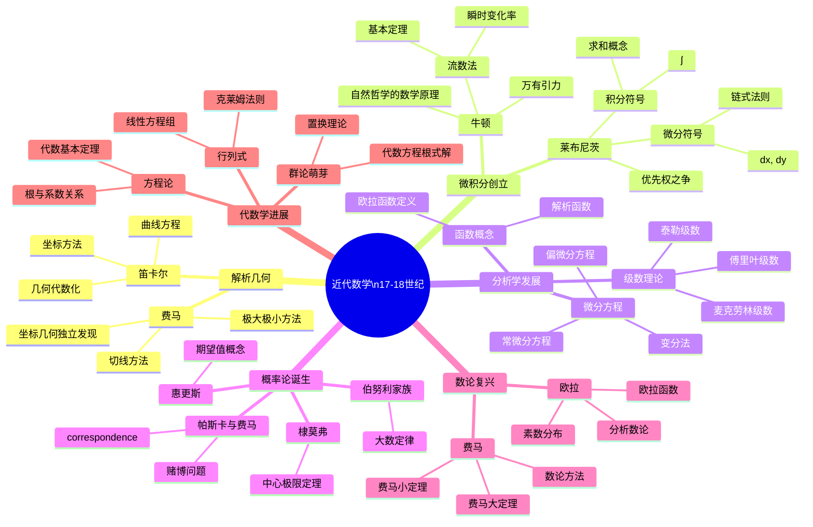

# 近代数学思维导图（17-18世纪）

## 概述

## 详细内容

### 解析几何（1637）

| 方面 | 笛卡尔 | 费马 |
|------|--------|------|
| **时间** | 1637年《几何学》 | 1629年发现，1679年出版 |
| **坐标** | 倾斜坐标 | 直角坐标 |
| **核心思想** | 几何问题化为代数方程 | 从方程研究曲线性质 |
| **应用** | 轨迹问题 | 极值与切线 |

**历史意义**：
- 几何与代数的统一
- 变量数学的开端
- 函数概念的萌芽

### 微积分创立

**牛顿的流数法**（1665-1671）：

| 概念 | 牛顿术语 | 现代术语 |
|------|----------|----------|
| 变量 | 流量 (fluent) | 变量 |
| 变化率 | 流数 (fluxion) | 导数 |
| 记号 | ẋ, ẍ | dx/dt, d²x/dt² |
| 积分 | 求原函数 | 不定积分 |

**莱布尼茨的微积分**（1675-1684）：

| 创新 | 内容 |
|------|------|
| **符号系统** | dx, dy, ∫ 至今沿用 |
| **运算规则** | 微分法则、链式法则 |
| **积分技术** | 分部积分、换元积分 |
| **应用导向** | 强调微积分的实用性 |

**优先权之争的影响**：
- 英国与欧洲大陆的数学隔离
- 符号分歧阻碍发展
- 直到19世纪才统一

### 数学分析的黄金时代

**欧拉时期（1707-1783）**：

| 领域 | 贡献 |
|------|------|
| **分析** | e, i, π, 欧拉公式 e^(iπ)+1=0 |
| **级数** | 欧拉-麦克劳林公式、ζ函数 |
| **函数** | 函数概念的精确化 |
| **变分法** | 欧拉方程 |
| **图论** | 七桥问题 |
| **数论** | 欧拉函数、同余理论 |

**伯努利家族**：

| 成员 | 贡献 |
|------|------|
| **雅各布** | 大数定律、等周问题、伯努利数 |
| **约翰** | 洛必达法则、变分法、虚数对数 |
| **丹尼尔** | 概率论、流体力学、数学物理 |

**18世纪分析学大师**：

| 数学家 | 主要贡献 |
|--------|----------|
| **泰勒** | 泰勒展开（1715） |
| **麦克劳林** | 麦克劳林级数（1742） |
| **克莱罗** | 微分方程、地球形状 |
| **达朗贝尔** | 偏微分方程、极限概念 |
| **拉格朗日** | 分析力学、变分法 |
| **拉普拉斯** | 天体力学、概率论 |
| **勒让德** | 椭圆积分、数论 |

### 概率论的数学化

| 阶段 | 时间 | 贡献者 | 内容 |
|------|------|--------|------|
| **起源** | 1654 | 帕斯卡、费马 | 赌博问题通信 |
| **奠基** | 1657 | 惠更斯 | 《论赌博中的计算》 |
| **定律** | 1713 | 雅各布·伯努利 | 大数定律 |
| **极限** | 1733 | 棣莫弗 | 中心极限定理 |
| **完备** | 1812 | 拉普拉斯 | 《分析概率论》 |

### 数论的发展

**费马的贡献**（1601-1665）：

| 定理 | 内容 | 证明状态 |
|------|------|----------|
| **大定理** | xⁿ+yⁿ=zⁿ, n>2无正整数解 | 1995年怀尔斯证明 |
| **小定理** | a^(p-1)≡1 (mod p) | 已证 |
| **素数** | 费马数2^(2ⁿ)+1 | 部分为合数 |
| **平方和** | 4k+1型素数可表为两平方和 | 已证 |

**欧拉在数论**：
- 欧拉函数 φ(n)
- 二次互反律（部分）
- 素数定理的猜想
- 分拆函数

### 代数学的进展

**方程论**：

| 成果 | 数学家 | 年份 | 内容 |
|------|--------|------|------|
| **代数基本定理** | 高斯（证明） | 1799 | n次方程有n个根 |
| **韦达定理** | 韦达 | 1591 | 根与系数关系 |
| **对称函数** | 牛顿 | 1707 | 幂和公式 |

**行列式与矩阵萌芽**：
- 莱布尼茨：行列式概念（1693）
- 克莱姆：克莱姆法则（1750）
- 范德蒙德：行列式理论（1772）
- 柯西：行列式术语（1812）

## 重要著作

| 著作 | 作者 | 年份 | 意义 |
|------|------|------|------|
| 《几何学》 | 笛卡尔 | 1637 | 解析几何奠基 |
| 《自然哲学的数学原理》 | 牛顿 | 1687 | 经典力学数学化 |
| 《无穷小分析引论》 | 欧拉 | 1748 | 分析学教科书 |
| 《微分学》 | 欧拉 | 1755 | 微积分系统论述 |
| 《分析力学》 | 拉格朗日 | 1788 | 力学数学化 |
| 《天体力学》 | 拉普拉斯 | 1799-1825 | 宇宙系统数学描述 |

## 历史意义

1. **微积分革命**：数学处理变化与运动的能力
2. **分析学确立**：严格化前的繁荣发展
3. **数学物理诞生**：数学成为自然科学的基础语言
4. **符号完善**：现代数学符号体系基本确立
5. **学科分化**：纯数学与应用数学分离趋势

## 向现代数学过渡

18世纪晚期的问题：
- 微积分基础的不严格性
- 无穷概念的混淆
- 对"证明"标准的要求提高

→ 19世纪的分析严格化运动

## 相关资源

- [微积分发展史](../数学史/微积分发展史.md)
- [牛顿与莱布尼茨](../数学家/牛顿莱布尼茨.md)
- [欧拉全集](../数学家/欧拉.md)
