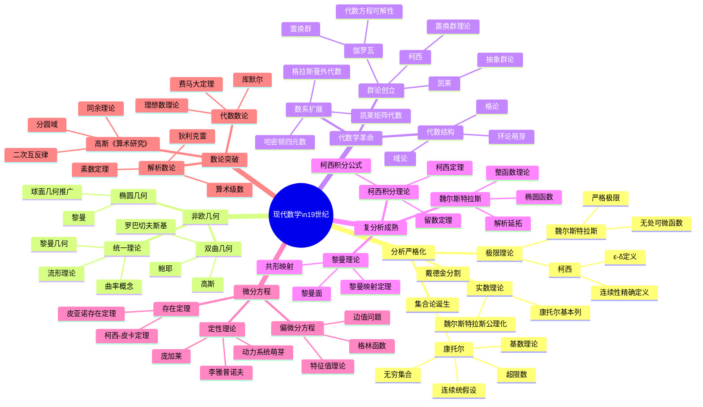

msc_primary: "00A99"
msc_secondary: ['00-00']
---

# 现代数学思维导图（19世纪）

## 概述

## 详细内容

### 分析严格化运动

**柯西革命**（1789-1857）：

| 领域 | 柯西贡献 | 意义 |
|------|----------|------|
| **极限** | ε-δ定义雏形 | 终结"无穷小幽灵" |
| **连续性** | 点态连续性定义 | 严格分析基础 |
| **收敛** | 级数收敛判别法 | 分析运算的合法性 |
| **积分** | 定积分作为极限和 | 积分严格定义 |
| **复分析** | 复变函数理论奠基 | 新数学分支 |

**魏尔斯特拉斯严格化**（1815-1897）：

| 贡献 | 内容 |
|------|------|
| **极限** | ε-δ语言的完善 |
| **反例** | 连续但无处可微函数（1872） |
| **实数** | 实数公理化定义 |
| **分析算术化** | 将分析建立在算术基础上 |

**实数构造理论**（1872年）：

| 数学家 | 构造方法 |
|--------|----------|
| **戴德金** | 戴德金分割 |
| **康托尔** | 基本列（柯西列） |
| **魏尔斯特拉斯** | 有界单调序列 |

### 集合论的诞生

**康托尔的革命**（1845-1918）：

| 阶段 | 时间 | 贡献 |
|------|------|------|
| **三角级数** | 1872 | 唯一性问题的集合论起源 |
| **无穷集合** | 1874 | 证明超越数存在、不可数性 |
| **基数理论** | 1878-1884 | 超限基数 ℵ₀, 2^ℵ₀ |
| **序数理论** | 1883 | 超限序数、良序定理 |
| **连续统** | 1878 | 连续统假设 |

**关键成果**：
- 可数集与不可数集的区分
- 实数不可数证明（对角线法的雏形）
- 幂集定理：|P(S)| > |S|

- 超限算术：ℵ₀ + 1 = ℵ₀, 2^ℵ₀ > ℵ₀

### 非欧几何革命

**双曲几何的发现**：

| 数学家 | 时间 | 贡献 |
|--------|------|------|
| **高斯** | 未发表 | 最早意识到可能性 |
| **罗巴切夫斯基** | 1829 | 系统发表，命名"虚几何" |
| **鲍耶** | 1832 | 独立发现 |

**黎曼几何**（1854）：

| 创新 | 内容 |
|------|------|
| **流形概念** | n维弯曲空间 |
| **度量** | 黎曼度量张量 |
| **曲率** | 高斯-博内定理推广 |
| **统一** | 欧氏、球面、双曲几何的框架 |

**历史意义**：
1. 终结欧氏几何的绝对地位
2. 开启几何学多样化时代
3. 为广义相对论提供数学基础

### 代数学革命

**伽罗瓦理论**（1830）：

| 内容 | 意义 |
|------|------|
| **群的概念** | 代数方程根的对称性 |
| **可解性判据** | 五次以上方程无根式解 |
| **域扩张理论** | 现代代数学核心 |

**群论发展脉络**：

**数系扩展**：

| 发明 | 数学家 | 时间 | 特点 |
|------|--------|------|------|
| **四元数** | 哈密顿 | 1843 | a+bi+cj+dk, 非交换 |
| **八元数** | 凯莱 | 1845 | 非结合 |
| **外代数** | 格拉斯曼 | 1844 | 向量代数推广 |
| **矩阵代数** | 凯莱 | 1858 | 矩阵运算系统 |

### 复分析的发展

**柯西积分理论**（1814-1825）：

| 定理 | 内容 |
|------|------|
| **柯西定理** | 解析函数沿闭路积分为零 |
| **柯西积分公式** | f(z) = (1/2πi)∮f(ζ)/(ζ-z)dζ |
| **留数定理** | 围道积分与奇点的关系 |

**黎曼的贡献**（1826-1866）：

| 领域 | 贡献 |
|------|------|
| **黎曼面** | 多值函数的单值化 |
| **共形映射** | 黎曼映射定理 |
| **ζ函数** | 黎曼假设 |
| **微分几何** | 黎曼几何奠基 |

**魏尔斯特拉斯的分析**（1815-1897）：

| 方法 | 内容 |
|------|------|
| **解析延拓** | 幂级数延拓方法 |
| **整函数** | 无穷乘积表示 |
| **椭圆函数** | 与代数函数的联系 |

### 数论的飞跃

**高斯的《算术研究》**（1801）：

| 内容 | 贡献 |
|------|------|
| **同余理论** | 模算术系统建立 |
| **二次互反律** | "数论酵母" |
| **二元二次型** | 类数理论 |
| **分圆方程** | 正多边形作图 |

**解析数论的创立**：

| 数学家 | 贡献 |
|--------|------|
| **狄利克雷** | 算术级数素数定理、狄利克雷特征 |
| **切比雪夫** | 素数定理的近似 |
| **黎曼** | ζ函数与素数分布 |

**代数数论的起源**：

| 数学家 | 贡献 |
|--------|------|
| **库默尔** | 理想数理论、费马大定理 |
| **戴德金** | 理想理论、代数整数 |
| **克罗内克** | 代数数域理论 |

## 重要著作

| 著作 | 作者 | 年份 | 意义 |
|------|------|------|------|
| 《算术研究》 | 高斯 | 1801 | 现代数论奠基 |
| 《分析教程》 | 柯西 | 1821 | 分析严格化开端 |
| 《关于几何基础的假设》 | 黎曼 | 1854 | 现代几何学诞生 |
| 《置换与代数方程》 | 若尔当 | 1870 | 群论经典 |
| 《一般算术》 | 格拉斯曼 | 1861 | 线性代数萌芽 |
| 《集合论基础》 | 康托尔 | 1883 | 超限数理论 |

## 历史意义

1. **严格化完成**：分析学获得严密基础
2. **抽象化开端**：从具体计算到结构研究
3. **数学统一**：几何、代数、分析的融合
4. **基础危机**：集合论悖论的出现
5. **学科成熟**：现代数学各分支基本确立

## 向当代数学过渡

19世纪末的遗产：
- 严格化的方法
- 抽象化的思维
- 公理化的方向
- 结构化的视角

→ 20世纪数学的结构主义时代

## 相关资源

- [分析严格化运动](./../../数学家理念体系/狄利克雷数学理念/02-数学内容深度分析/02-分析学贡献/03-分析严格化.md)
- [非欧几何发展史](./../00-数学史/04-现代数学/01-非欧几何革命.md)
- [集合论革命](./../visualizations/思维导图/概念/开集.md)
- [伽罗瓦理论](./../../数学家理念体系/伽罗瓦数学理念/01-核心理论/04-伽罗瓦理论基础.md)
