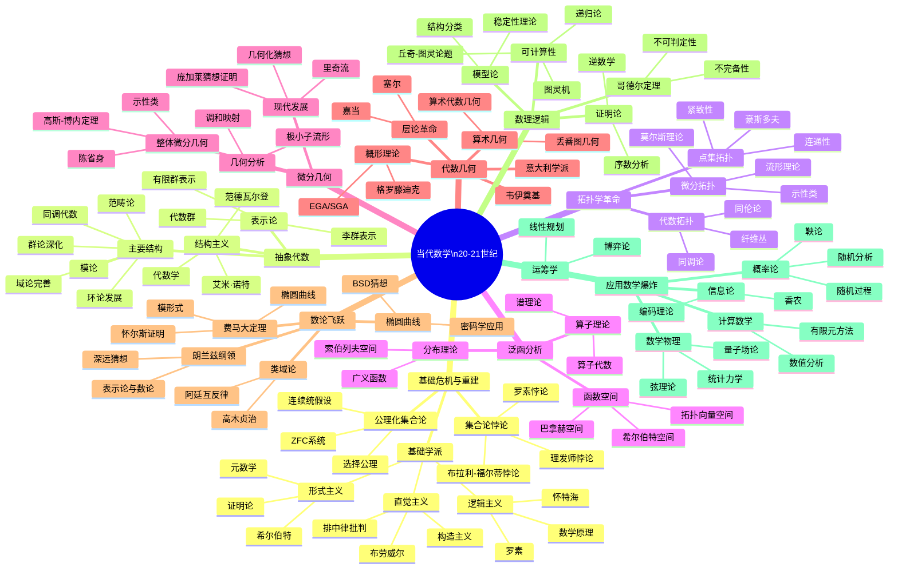

msc_primary: "00A99"
msc_secondary: ['00-00']
---

# 当代数学思维导图（20-21世纪）

## 概述

## 详细内容

### 数学基础危机

**集合论悖论**（1900年前后）：

| 悖论 | 发现者 | 内容 |
|------|--------|------|
| **罗素悖论** | 罗素 1901 | R = {x | x ∉ x} |
| **布拉利-福尔蒂悖论** | 1897 | 最大序数悖论 |
| **理查德悖论** | 1905 | 可定义性与可数性 |

**三大基础学派**：

| 学派 | 代表 | 核心观点 | 影响 |
|------|------|----------|------|
| **逻辑主义** | 罗素、怀特海 | 数学是逻辑的延伸 | 《数学原理》 |
| **直觉主义** | 布劳威尔 | 数学是心智构造 | 构造性数学 |
| **形式主义** | 希尔伯特 | 形式符号游戏 | 证明论 |

**希尔伯特计划**（1920s）：
1. 形式化数学
2. 证明一致性
3. 证明完备性
4. 证明可判定性

→ 被哥德尔不完备性定理（1931）推翻

### 抽象代数

**诺特革命**（1882-1935）：

| 贡献 | 内容 |
|------|------|
| **抽象化** | 从具体代数系统到抽象结构 |
| **理想理论** | 环论的系统化 |
| **表示论** | 群表示的代数方法 |
| **诺特环/模** | 现代交换代数基础 |

**范德瓦尔登《代数学》**（1930）：
- 抽象代数的第一本教科书
- 结构主义方法的确立

**同调代数**（1940s-1950s）：

| 发展 | 贡献者 | 内容 |
|------|--------|------|
| **群上同调** | 艾伦伯格、麦克莱恩 | Ext, Tor函子 |
| **层上同调** | 嘉当、格罗滕迪克 | 代数几何工具 |
| **同调代数** | 同上 | 导出范畴 |

**范畴论**（1945-）：

| 概念 | 提出者 | 年份 | 意义 |
|------|--------|------|------|
| **范畴** | 艾伦伯格、麦克莱恩 | 1945 | 数学结构的统一语言 |
| **函子** | 同上 | 1945 | 结构保持映射 |
| **自然变换** | 同上 | 1945 | 范畴论核心 |
| **泛性质** | 格罗滕迪克 | 1950s | 抽象定义方法 |

### 拓扑学发展

**代数拓扑**（1920-1960）：

| 概念 | 发展者 | 时间 | 内容 |
|------|--------|------|------|
| **同调群** | 诺特 | 1920s | 代数拓扑的基础不变量 |
| **同伦群** | 霍普夫、胡雷维奇 | 1930s | 高维洞的分类 |
| **上同调** | 惠特尼、斯廷罗德 | 1930s-40s | 乘积结构 |
| **谱序列** | 勒雷 | 1946 | 计算工具 |
| **K理论** | 阿蒂亚、希策布鲁赫 | 1960 | 广义上同调 |

**微分拓扑**（1950s-1970s）：

| 成就 | 数学家 | 年份 | 内容 |
|------|--------|------|------|
| **流形分类** | 米尔诺 | 1956 | 怪球面 |
| **h配边定理** | 斯梅尔 | 1961 | 高维庞加莱猜想 |
| **指标定理** | 阿蒂亚-辛格 | 1963 | 分析与拓扑的联系 |
| **四维拓扑** | 唐纳森 | 1983 | 四维流形的特殊性 |

### 泛函分析

**空间理论**（1900-1940）：

| 空间 | 提出者 | 特点 |
|------|--------|------|
| **希尔伯特空间** | 冯·诺依曼 | 内积、完备、量子力学基础 |
| **巴拿赫空间** | 巴拿赫 | 范数、完备、线性算子 |
| **分布空间** | 施瓦茨 | 广义函数、索伯列夫空间 |

**算子代数**（1930s-1940s）：

| 理论 | 创始人 | 内容 |
|------|--------|------|
| **冯·诺依曼代数** | 冯·诺依曼 | 弱闭算子代数 |
| **C*代数** | 盖尔范德 | 抽象算子代数 |
| **谱理论** | 冯·诺依曼等 | 无界算子、量子力学 |

### 微分几何

**整体微分几何**（1940s-1970s）：

| 贡献 | 数学家 | 内容 |
|------|--------|------|
| **示性类** | 陈省身 | 陈类、曲率与拓扑的联系 |
| **高斯-博内-陈** | 陈省身 | 整体曲率公式 |
| **阿蒂亚-辛格指标定理** | 阿蒂亚、辛格 | 分析与拓扑的深刻联系 |

**几何化猜想与庞加莱猜想**（2002-2003）：

| 人物 | 贡献 |
|------|------|
| **瑟斯顿** | 几何化猜想（1982） |
| **汉密尔顿** | 里奇流方法 |
| **佩雷尔曼** | 证明几何化猜想（2002-2003） |

### 代数几何革命

**格罗滕迪克革命**（1958-1970）：

| 创新 | 内容 |
|------|------|
| **层论** | 塞尔、嘉当，局部-整体原理 |
| **概形** | 格罗滕迪克，素谱上的环层 |
| **拓扑斯** | 格罗滕迪克，广义空间 |
| ** motives** | 格罗滕迪克，普适上同调理论 |

**重要成果**：
- 韦伊猜想（1949-1974，德利涅证明）
- 法尔廷斯定理（1983，莫德尔猜想）
- 谷山-志村猜想 → 费马大定理

### 数论的飞跃

**类域论**（1920s）：

| 贡献 | 数学家 | 内容 |
|------|--------|------|
| **高木存在定理** | 高木贞治 | 1920 | 阿贝尔扩张分类 |
| **阿廷互反律** | 阿廷 | 1927 | 整体类域论完成 |

**朗兰兹纲领**（1967-）：

| 层面 | 对应关系 |
|------|----------|
| **局部** | GL_n(F)表示 ↔ n维Galois表示 |
| **整体** | 自守表示 ↔ 整体Galois表示 |
| **数论意义** | 解析方法解决代数问题 |

**费马大定理**（1995）：

| 阶段 | 内容 |
|------|------|
| **谷山-志村猜想** | 椭圆曲线 ↔ 模形式 |
| **里贝特定理** | 费马大定理 ↔ 谷山-志村 |
| **怀尔斯证明** | 半稳定椭圆曲线的模性 |

### 数理逻辑

**哥德尔定理**（1931）：

| 定理 | 内容 | 影响 |
|------|------|------|
| **第一不完备性定理** | 包含算术的一致形式系统不完全 | 希尔伯特计划失败 |
| **第二不完备性定理** | 一致性不可证 | 元数学限制 |

**可计算性理论**（1936）：

| 模型 | 提出者 | 等价性 |
|------|--------|--------|
| **图灵机** | 图灵 | |
| **λ演算** | 丘奇 | 丘奇-图灵论题 |
| **递归函数** | 哥德尔、埃尔布朗 | |

### 应用数学的爆炸

**计算数学**（1940s-）：

| 发展 | 内容 |
|------|------|
| **数值分析** | 有限差分、有限元、谱方法 |
| **计算复杂性** | P vs NP问题（库克-列文-卡普） |
| **计算机代数** | 符号计算、自动证明 |

**概率论**（1930s-）：

| 发展 | 贡献者 | 内容 |
|------|--------|------|
| **随机过程** | 柯尔莫哥洛夫 | 公理化概率论（1933） |
| **鞅论** | 杜布 | 随机分析工具 |
| **随机分析** | 伊藤清 | 伊藤积分、随机微分方程 |

**21世纪发展**：
- 机器学习与深度学习
- 大数据与统计学习
- 量子计算与量子信息
- 生物数学与系统生物学

## 重要著作与里程碑

| 著作/成果 | 作者 | 年份 | 意义 |
|----------|------|------|------|
| 《数学原理》 | 罗素、怀特海 | 1910-1913 | 逻辑主义巅峰 |
| 《代数学》 | 范德瓦尔登 | 1930 | 抽象代数教科书 |
| EGA/SGA | 格罗滕迪克 | 1960-1970 | 现代代数几何 |
| 费马大定理证明 | 怀尔斯 | 1995 | 数论巅峰 |
| 庞加莱猜想证明 | 佩雷尔曼 | 2003 | 几何分析胜利 |

## 21世纪趋势

1. **交叉融合**：数学与物理、生物、计算机的深度交叉
2. **计算实验**：计算机辅助证明与发现
3. **大数据**：统计学习与人工智能的数学基础
4. **开放协作**：数学知识的数字化与共享
5. **未解问题**：黎曼假设、P vs NP等 Millennium 问题

## 相关资源

- [20世纪数学发展](./../../research/08-数学历史/现代数学/01-20世纪数学.md)
- [格罗滕迪克革命](./../../research/09-数学人物/现代数学家/02-格罗滕迪克.md)
- [朗兰兹纲领](./../../concept/核心概念/33-朗兰兹纲领.md)
- 千禧年问题
