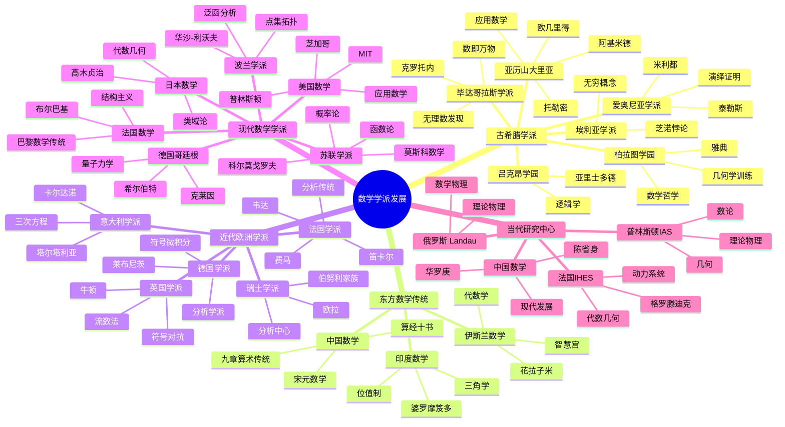

msc_primary: "00A99"
msc_secondary: ['00-XX']
---

# 数学学派发展思维导图

## 概述

## 详细内容

### 古希腊数学学派

#### 爱奥尼亚学派（公元前7-6世纪）

| 特征 | 内容 |
|------|------|
| **地点** | 米利都（小亚细亚） |
| **创始人** | 泰勒斯（约624-546 BC） |
| **核心贡献** | 命题证明的开端 |
| **著名命题** | 泰勒斯定理（直径所对圆周角为直角） |

**历史意义**：西方数学证明传统的起源

#### 毕达哥拉斯学派（公元前6-4世纪）

| 特征 | 内容 |
|------|------|
| **地点** | 克罗托内（意大利南部）→ 梅塔蓬图姆 |
| **创始人** | 毕达哥拉斯（约570-495 BC） |
| **核心思想** | "万物皆数"（整数与比例） |
| **组织形式** | 宗教-哲学-科学团体 |

**数学贡献**：
- 毕达哥拉斯定理
- 无理数的发现（√2）
- 完美数、亲和数
- 音乐数学（弦长比例）

**危机**：无理数的发现动摇了学派的哲学基础

#### 柏拉图学园（公元前387年-529年）

| 特征 | 内容 |
|------|------|
| **地点** | 雅典郊外 |
| **创始人** | 柏拉图（427-347 BC） |
| **门上铭文** | "不懂几何者不得入内" |
| **教育内容** | 算术、几何、天文、音乐（四艺） |

**影响**：
- 确立了数学在理性教育中的核心地位
- 影响了欧几里得《几何原本》的编写
- 柏拉图主义对数学哲学影响深远

#### 亚历山大里亚学派（公元前3世纪-公元4世纪）

| 特征 | 内容 |
|------|------|
| **地点** | 埃及亚历山大城 |
| **机构** | 缪斯学院、图书馆 |
| **性质** | 希腊化世界的学术中心 |

**代表人物**：

| 数学家 | 时期 | 贡献 |
|--------|------|------|
| **欧几里得** | 约300 BC | 《几何原本》 |
| **阿基米德** | 287-212 BC | 数学物理 |
| **阿波罗尼奥斯** | 约262-190 BC | 圆锥曲线 |
| **埃拉托斯特尼** | 276-194 BC | 地理学、素数筛 |
| **托勒密** | 100-170 | 《天文学大成》 |
| **丢番图** | 约200-284 | 《算术》 |
| **帕普斯** | 约290-350 | 《数学汇编》 |
| **希帕提娅** | 约355-415 | 第一位女数学家 |

### 东方数学传统

#### 中国数学传统

| 时期 | 特点 | 代表 |
|------|------|------|
| **汉** | 九章算术体系 | 刘徽注 |
| **南北朝** | 圆周率精确计算 | 祖冲之 |
| **宋元** | 天元术、四元术 | 秦九韶、朱世杰 |
| **明清** | 西学东渐 | 梅文鼎 |

**特色**：实用算法、机械化方法、十进位值制

#### 伊斯兰数学黄金时代（8-15世纪）

| 中心 | 时间 | 特点 |
|------|------|------|
| **巴格达智慧宫** | 8-10世纪 | 翻译运动、代数诞生 |
| **中亚撒马尔罕** | 14-15世纪 | 天文数学、精确计算 |
| **西班牙科尔多瓦** | 10-12世纪 | 知识传播 |

**传播作用**：保存希腊数学，传播印度数字，创造代数学

### 近代欧洲数学学派

#### 意大利文艺复兴数学（15-16世纪）

| 中心 | 贡献 |
|------|------|
| **博洛尼亚** | 三次方程求解竞赛 |
| **威尼斯** | 商业算术、印刷传播 |

**关键人物**：费罗、塔尔塔利亚、卡尔达诺、费拉里

#### 法国数学传统

**17世纪**：

| 人物 | 贡献 |
|------|------|
| **韦达** | 符号代数 |
| **笛卡尔** | 解析几何 |
| **费马** | 数论、微积分先驱 |
| **帕斯卡** | 概率论、射影几何 |
| **德沙格** | 射影几何 |

**18-19世纪**：
- 分析学派：达朗贝尔、拉格朗日、拉普拉斯、柯西
- 数论：勒让德、索菲·热尔曼

**20世纪（布尔巴基）**：
- 尼古拉·布尔巴基（集体笔名）
- 《数学原理》：结构主义方法
- 影响：现代数学教育的标准化

#### 英国数学传统

**17-18世纪**：

| 人物 | 贡献 |
|------|------|
| **牛顿** | 流数法、经典力学 |
| **沃利斯** | 无穷小分析 |
| **麦克劳林** | 级数展开 |
| **泰勒** | 泰勒级数 |

**特点**：牛顿符号传统，与欧洲大陆隔离

**19世纪复兴**：
- 剑桥分析学派：皮科克、巴贝奇、赫谢尔
- 符号代数改革
- 剑桥数学Tripos考试

**20世纪**：
- 哈代-李特尔伍德：解析数论
- 拉马努金：印度数学天才

#### 德国哥廷根学派

**高斯时期**（18世纪末-19世纪中叶）：
- "数学王子"高斯
- 数论、几何、分析、天文学

**黎曼-狄利克雷时期**（1850s-1860s）：
- 黎曼：现代几何、复分析
- 狄利克雷：分析严格化

**克莱因-希尔伯特时期**（1886-1933）：

| 时期 | 主导 | 特点 |
|------|------|------|
| **克莱因** | 1886-1913 | 几何学、数学教育 |
| **希尔伯特** | 1895-1943 | 公理化方法、数学基础 |
| **辉煌期** | 1900-1933 | 世界数学中心 |

**1933年后**：纳粹迫害，大量学者移民美国

#### 瑞士伯努利-欧拉传统

| 时期 | 特点 |
|------|------|
| **伯努利家族** | 雅各布、约翰、丹尼尔 |
| **欧拉** | 18世纪最多产的数学家 |
| **传统延续** | 分析学、力学、变分法 |

### 20世纪数学学派

#### 法国数学（巴黎）

**传统中心**：
- 巴黎大学、法兰西学院、综合理工
- 庞加莱、阿达马、勒贝格

**布尔巴基运动**（1935-）：
- 成员：韦伊、迪厄多内、嘉当、谢瓦莱等
- 目标：重写数学基础
- 成果：《数学原理》（Éléments de mathématique）
- 影响：结构主义成为主流

#### 波兰数学学派（1918-1939）

| 中心 | 专长 | 代表人物 |
|------|------|----------|
| **华沙** | 点集拓扑、数理逻辑 | 谢尔宾斯基、库拉托夫斯基 |
| **利沃夫** | 泛函分析 | 巴拿赫、斯坦豪斯 |

**特点**：
- 国家独立后的数学复兴
- 期刊《数学基础》（Fundamenta Mathematicae）
- 咖啡馆数学文化

**悲剧**：二战期间遭受重创

#### 苏联数学学派（1920s-1991）

**莫斯科数学学派**：

| 领域 | 代表人物 |
|------|----------|
| **拓扑学** | 亚历山德罗夫、乌雷松、庞特里亚金 |
| **概率论** | 科尔莫戈罗夫 |
| **函数论** | 卢津、辛钦 |
| **泛函分析** | 盖尔范德 |

**列宁格勒学派**：
- 函数论、逼近论

**特点**：
- 与西方隔离下的独立发展
- 重视基础理论
- 数学物理传统

#### 美国数学崛起（20世纪）

**早期发展**（19世纪末）：
- 欧洲学者移民（Sylvester等）
- 约翰霍普金斯大学、芝加哥大学

**普林斯顿大学/I.A.S.**：

| 时期 | 特点 |
|------|------|
| **1920s** | 维布伦建立拓扑学派 |
| **1930s** | 爱因斯坦、外尔、冯·诺依曼 |
| **战后** | 世界数学中心 |

**移民潮的影响**（1930s-1940s）：

| 来源 | 人物 | 去向 |
|------|------|------|
| **德国** | 外尔、冯·诺依曼、哥德尔 | IAS普林斯顿 |
| **波兰** | 塔尔斯基、乌拉姆 | 伯克利等 |
| **匈牙利** | 冯·诺依曼、埃尔德什 | 多所大学 |

**应用数学发展**：
- 二战期间的运筹学
- 冷战时期的国防数学
- MIT、斯坦福的应用数学中心

#### 日本数学学派

**明治维新后**（1868-）：
- 高木贞治：类域论（1920）
- 日本数学的国际化

**20世纪中后叶**：

| 领域 | 代表人物 |
|------|----------|
| **代数几何** | 小平邦彦、广中平祐、森重文 |
| **微分几何** | 小平邦彦、志村五郎 |
| **分析学** | 伊藤清（随机分析） |

**菲尔兹奖获得者**：
- 小平邦彦（1954）
- 广中平祐（1970）
- 森重文（1990）

### 当代数学研究中心

#### 普林斯顿高等研究院（IAS）

| 时期 | 特点 |
|------|------|
| **1930s创立** | 亚伯拉罕·弗莱克斯纳创立 |
| **黄金期** | 爱因斯坦、外尔、冯·诺依曼、哥德尔 |
| **当代** | 理论物理、数论、几何中心 |

#### 法国高等科学研究所（IHÉS）

| 时期 | 特点 |
|------|------|
| **1958创立** | 利昂·莫查纳创立 |
| **格罗滕迪克时期** | 代数几何革命 |
| **当代** | 动力系统、几何分析 |

#### 俄罗斯/前苏联传统延续

- 莫斯科大学、斯捷克洛夫研究所
- 朗道理论物理研究所

#### 中国数学发展

| 时期 | 特点 | 代表人物 |
|------|------|----------|
| **民国** | 数学教育起步 | 姜立夫、熊庆来 |
| **1950s** | 华罗庚、陈建功归国 | 华罗庚、陈建功、苏步青 |
| **改革开放** | 国际交流恢复 | 陈省身回国推动 |
| **当代** | 快速发展 | 田刚、张益唐等 |

## 学派发展的规律

### 繁荣因素

1. **核心人物**：杰出数学家的引领作用
2. **制度支持**：大学、研究院的稳定环境
3. **学术交流**：研讨会、期刊、通讯网络
4. **代际传承**：导师-学生体系的延续
5. **问题驱动**：重大数学问题的聚焦

### 衰落原因

1. **政治动荡**：战争、迫害、意识形态
2. **核心人物流失**：死亡、移民、转行
3. **学术孤立**：与主流脱节
4. **资源匮乏**：资金、图书馆、设备

### 当代特点

1. **全球化**：国际合作取代单一学派
2. **网络化**：arXiv、电子邮件、视频会议
3. **多元化**：纯数学与应用数学并重
4. **跨学科**：数学与物理、生物、计算机融合

## 相关资源

- [布尔巴基学派](./../00-数学史/08-数学学派介绍/01-布尔巴基学派.md)
- [哥廷根数学传统](./../../数学家理念体系/希尔伯特数学理念/03-教育与影响/02-哥廷根学派.md)
- 普林斯顿高等研究院
- [中国数学发展史](./../00-数学史/01-古代数学/04-中国数学.md)
