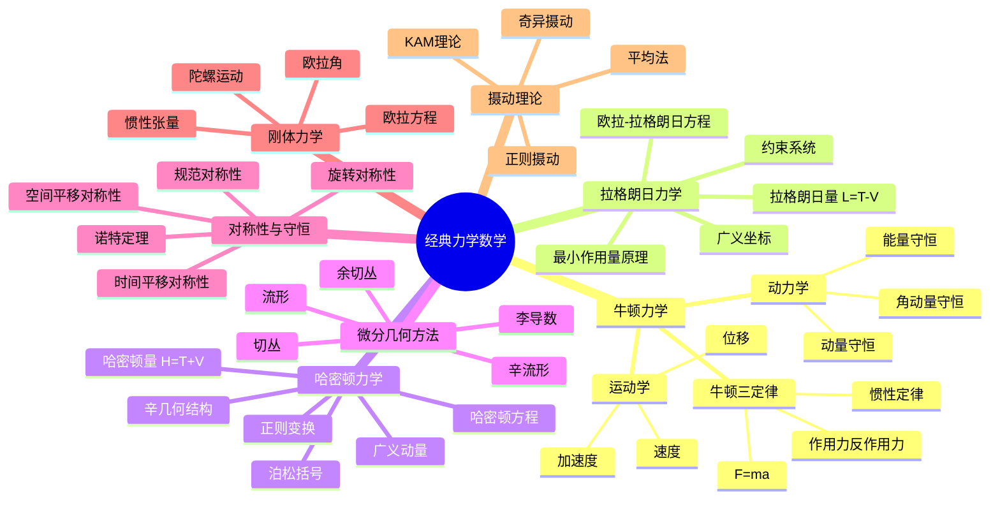

# 经典力学数学 - 思维导图

## 概述
经典力学数学是描述宏观物体运动规律的数学框架，从牛顿力学到分析力学的严谨数学结构。

## 核心概念详解

### 1. 牛顿力学基础
- **牛顿三定律**：经典力学的基石
- **守恒律**：动量、角动量、能量的严格守恒

### 2. 分析力学框架
- **拉格朗日力学**：基于能量和变分原理
- **哈密顿力学**：相空间中的几何描述

### 3. 现代数学工具
- **辛几何**：哈密顿系统的自然语言
- **李群李代数**：对称性的数学描述

## 参考
- 阿诺尔德《经典力学的数学方法》
- Goldstein《Classical Mechanics》
