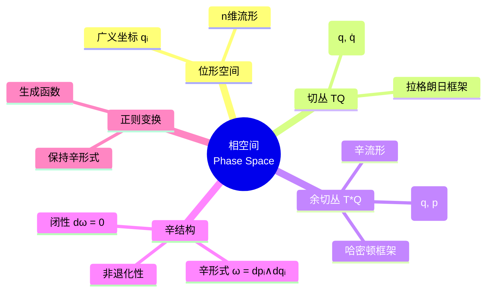

# 经典力学数学 - 思维导图

## 概述

经典力学数学是描述宏观物体运动规律的数学框架，从牛顿力学到分析力学的严谨数学结构。这一理论为物理学和工程学提供了坚实的数学基础。

---

## 核心思维导图

```mermaid
mindmap
  root((经典力学数学<br/>Mathematical Classical Mechanics))
    牛顿力学
      牛顿三定律
        惯性定律
        F=ma: 动力学基本
        作用力反作用力
      运动学
        位移
        速度: dr/dt
        加速度: d²r/dt²
      动力学
        动量守恒
        角动量守恒
        能量守恒
    拉格朗日力学
      广义坐标 qᵢ
      拉格朗日量 L=T-V
      欧拉-拉格朗日方程
        d/dt(∂L/∂q̇ᵢ) = ∂L/∂qᵢ
      最小作用量原理
        δS = 0
      约束系统
        完整约束
        非完整约束
    哈密顿力学
      广义动量 pᵢ = ∂L/∂q̇ᵢ
      哈密顿量 H=T+V
      哈密顿方程
        q̇ᵢ = ∂H/∂pᵢ
        ṗᵢ = -∂H/∂qᵢ
      泊松括号
        {f,g} = Σ(∂f/∂qᵢ·∂g/∂pᵢ - ∂f/∂pᵢ·∂g/∂qᵢ)
      正则变换
        保持辛结构
    微分几何方法
      流形
        位形空间
      切丛
        速度相空间
      余切丛
        动量相空间
      辛流形
        辛形式 ω
      李导数
    对称性与守恒
      诺特定理
        对称性 ⇔ 守恒律
      时间平移对称性
        ⇒ 能量守恒
      空间平移对称性
        ⇒ 动量守恒
      旋转对称性
        ⇒ 角动量守恒
      规范对称性
    刚体力学
      欧拉角
        (φ, θ, ψ)
      惯性张量
      欧拉方程
      陀螺运动
        定轴转动
        进动
        章动
    摄动理论
      正则摄动
      奇异摄动
      平均法
      KAM理论
        拟周期运动
        稳定性
```

---

## 力学理论框架

```mermaid
graph TD
    subgraph 牛顿力学
        A[牛顿定律<br/>F=ma] --> B[运动方程<br/>m·r̈ = F(r,v,t)]
        B --> C[守恒定律<br/>E, p, L]
    end
    
    subgraph 拉格朗日力学
        D[广义坐标 q] --> E[拉格朗日量<br/>L(q,q̇,t)]
        E --> F[欧拉-拉格朗日<br/>d/dt(∂L/∂q̇) = ∂L/∂q]
    end
    
    subgraph 哈密顿力学
        G[勒让德变换] --> H[哈密顿量<br/>H(q,p,t)]
        H --> I[哈密顿方程<br/>q̇=∂H/∂p, ṗ=-∂H/∂q]
    end
    
    A --> D
    F --> G
    I --> J[辛几何<br/>相空间结构]
```

---

## 核心方程对比

| 形式 | 方程 | 特点 |
|------|------|------|
| 牛顿 | $m\ddot{\mathbf{r}} = \mathbf{F}$ | 矢量形式，显含力 |
| 拉格朗日 | $\frac{d}{dt}\frac{\partial L}{\partial \dot{q}_i} = \frac{\partial L}{\partial q_i}$ | 标量形式，坐标无关 |
| 哈密顿 | $\dot{q}_i = \frac{\partial H}{\partial p_i}, \dot{p}_i = -\frac{\partial H}{\partial q_i}$ | 一阶方程，对称形式 |
| 泊松 | $\dot{f} = \{f, H\} + \frac{\partial f}{\partial t}$ | 代数结构，量子化前驱 |

---

## 诺特定理与守恒律

```mermaid
graph LR
    subgraph 对称性
        A[时间平移<br/>t→t+ε] --> B[空间平移<br/>r→r+ε]
        B --> C[旋转<br/>r→R(θ)r]
    end
    
    subgraph 守恒律
        D[能量E] --> E[动量p]
        E --> F[角动量L]
    end
    
    A --> D
    B --> E
    C --> F
    
    style A fill:#e3f2fd
    style B fill:#e3f2fd
    style C fill:#e3f2fd
    style D fill:#c8e6c9
    style E fill:#c8e6c9
    style F fill:#c8e6c9
```

---

## 相空间结构



---

## 约束分类与处理

| 约束类型 | 定义 | 处理方法 |
|---------|------|----------|
| 完整约束 | $f(q,t) = 0$ | 拉格朗日乘子 |
| 非完整约束 | $a_i(q,t)\dot{q}^i + b(q,t) = 0$ | 准坐标 |
| 定常约束 | 不显含时间 | 能量守恒 |
| 非定常约束 | 显含时间 | 广义能量守恒 |
| 理想约束 | 约束力不做功 | 虚功原理 |

---

## 刚体力学要点

```mermaid
graph TD
    A[刚体运动] --> B[平动<br/>质心运动]
    A --> C[转动<br/>绕质心]
    
    B --> D[质心定理<br/>M·R̈ = F_ext]
    
    C --> E[欧拉方程<br/>I·ω̇ + ω×(I·ω) = τ]
    E --> F[惯量主轴<br/>I对角化]
    
    G[欧拉角] --> H[转动矩阵<br/>R(φ,θ,ψ)]
    H --> I[角速度<br/>ω = ω(φ̇,θ̇,ψ̇)]
    
    style A fill:#e3f2fd
    style B fill:#fff3e0
    style C fill:#e8f5e9
```

---

## 学习路径


---

## 与其他概念的联系

- **微分几何**: 流形、切丛、辛几何
- **李群李代数**: 对称性、守恒量
- **泛函分析**: 变分原理、泛函极值
- **量子力学**: 正则量子化、泊松括号→对易子
- **动力系统**: 可积系统、混沌
- **控制理论**: 最优控制、变分法

---

## 参考

- 阿诺尔德《经典力学的数学方法》
- Goldstein《Classical Mechanics》
- Marsden & Ratiu《Introduction to Mechanics and Symmetry》

---

*文档版本：1.1（质量提升版）*
*最后更新：2026年4月*
*分类：数学物理 / 经典力学 / 思维导图*
