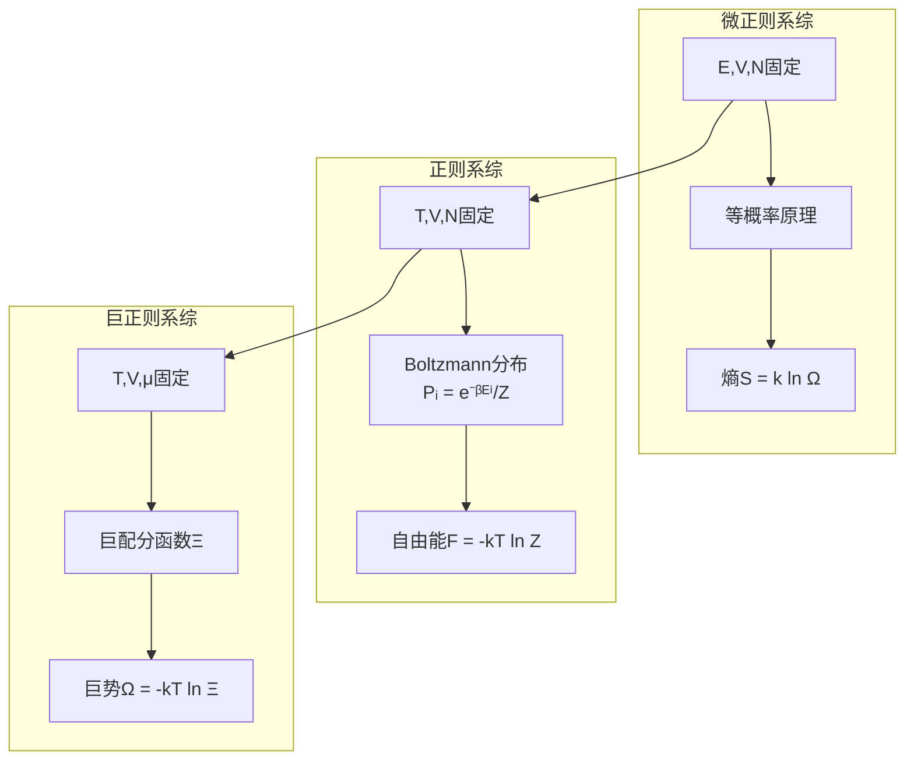
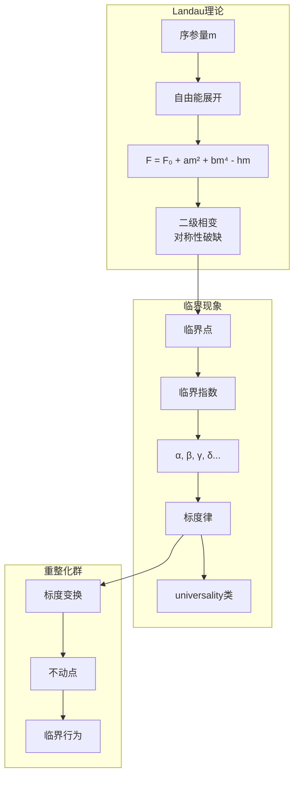

# 统计力学数学 - 思维导图

## 概述

统计力学架起了微观力学与宏观热力学之间的桥梁。通过概率论和系综理论，它从大量粒子的微观状态推导出宏观物理量的统计规律。

---

## 核心思维导图

```mermaid
mindmap
  root((统计力学数学<br/>Statistical Mechanics))
    系综理论
      微正则系综
        孤立系统
        E,V,N固定
        等概率原理
      正则系综
        与热库接触
        T,V,N固定
        Boltzmann分布
      巨正则系综
        粒子交换
        T,V,μ固定
        化学势
      等温等压系综
        T,P,N固定
    配分函数
      正则配分函数
        Z = Tr(e⁻ᵝĤ)
        β = 1/kT
      巨配分函数
        Ξ = Tr(e⁻ᵝ(Ĥ-μN̂))
      热力学关系
        F = -kT ln Z
        状态方程
        响应函数
    量子统计
      Bose-Einstein统计
        玻色子
        整数自旋
        玻色-爱因斯坦凝聚
      Fermi-Dirac统计
        费米子
        半整数自旋
        Pauli不相容
      分布函数
        ⟨nₖ⟩ = 1/(eᵝ⁽ᴱ⁻ᵘ⁾±1)
    相变理论
      序参量
      Landau理论
        自由能展开
        对称性破缺
      临界现象
        临界指数
        标度律
        重整化群
    涨落与耗散
      涨落定理
        能量涨落
        粒子数涨落
      关联函数
        空间关联
        时间关联
      线性响应
        Kubo公式
        涨落-耗散定理
```

---

## 系综理论体系



---

## 配分函数与热力学量

| 配分函数 | 定义 | 热力学势 | 重要关系 |
|---------|------|----------|----------|
| **正则** $Z$ | $\sum_i e^{-\beta E_i}$ | $F = -kT \ln Z$ | $U = -\frac{\partial \ln Z}{\partial \beta}$ |
| **巨正则** $\Xi$ | $\sum_N e^{\beta \mu N} Z_N$ | $\Omega = -kT \ln \Xi$ | $\langle N \rangle = \frac{\partial \ln \Xi}{\partial (\beta \mu)}$ |
| **微正则** $\Omega$ | 状态数 | $S = k \ln \Omega$ | $\frac{1}{T} = \frac{\partial S}{\partial E}$ |

---

## 量子统计分布

```mermaid
graph LR
    subgraph 玻色子
        A[整数自旋] --> B[对称波函数]
        B --> C[Bose-Einstein统计]
        C --> D[⟨n⟩ = 1/(eᵝ⁽ᴱ⁻ᵘ⁾-1)]
        D --> E[玻色-爱因斯坦凝聚]
    end
    
    subgraph 费米子
        F[半整数自旋] --> G[反对称波函数]
        G --> H[Fermi-Dirac统计]
        H --> I[⟨n⟩ = 1/(eᵝ⁽ᴱ⁻ᵘ⁾+1)]
        I --> J[Fermi面]
        I --> K[Pauli不相容]
    end
    
    style E fill:#e3f2fd
    style J fill:#fff3e0
    style K fill:#fff3e0
```

---

## 相变与临界现象



---

## 涨落与关联

```mermaid
mindmap
  root((涨落与关联))
    涨落
      能量涨落
        ⟨(ΔE)²⟩ = kT²Cᵥ
      粒子数涨落
        ⟨(ΔN)²⟩ = kT(∂N/∂μ)
      压缩率联系
        与响应函数关系
    关联函数
      定义
        G(r) = ⟨n(0)n(r)⟩ - n²
      特征
        关联长度ξ
        指数衰减
      临界行为
        ξ → ∞
        幂律衰减
    涨落-耗散定理
      平衡涨落
      非平衡响应
        线性响应
        Kubo公式
```

---

## 重要统计系综对比

| 特征 | 微正则 | 正则 | 巨正则 |
|------|--------|------|--------|
| **约束** | E,V,N | T,V,N | T,V,μ |
| **分布** | 等概率 | Boltzmann | 巨正则 |
| **热力学势** | S | F | Ω |
| **涨落** | 无 | ΔE | ΔE, ΔN |
| **适用** | 孤立系统 | 与热库接触 | 粒子交换 |

---

## 学习路径


---

## 与其他概念的联系

- **热力学**: 宏观极限、状态方程
- **量子力学**: 量子统计、密度矩阵
- **场论**: 路径积分方法、重整化群
- **信息论**: 熵的统计诠释
- **随机过程**: 主方程、Fokker-Planck方程
- **凝聚态物理**: 多体问题、平均场理论

---

## 参考

- 《统计物理》Landau & Lifshitz
- 《Statistical Mechanics》Pathria
- 《Introduction to Statistical Field Theory》Cardy

---

*文档版本：1.1（质量提升版）*
*最后更新：2026年4月*
*分类：数学物理 / 统计力学 / 思维导图*
