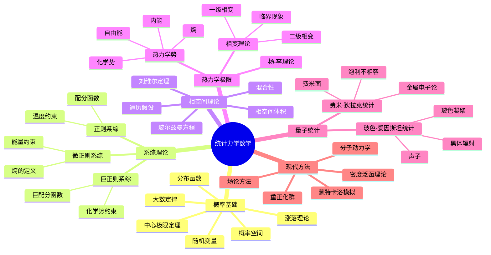

# 统计力学数学 - 思维导图

## 概述
统计力学数学为大量粒子系统提供概率描述，连接微观动力学与宏观热力学性质。

## 核心概念详解

### 1. 系综理论
- **微正则系综**：孤立系统的统计描述
- **正则系综**：与热库接触的系统
- **巨正则系综**：粒子数可变的系统

### 2. 相变与临界现象
- **杨-李理论**：相变的严格数学基础
- **重正化群**：临界行为的普适性

### 3. 量子统计
- **玻色-爱因斯坦凝聚**：宏观量子现象
- **费米液体理论**：相互作用费米子系统

## 参考
- Ruelle《Statistical Mechanics: Rigorous Results》
- 黄克孙《Statistical Mechanics》
