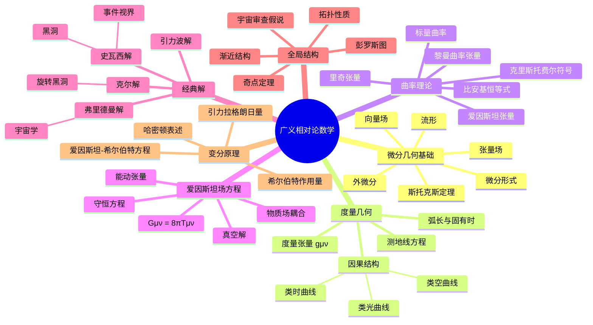

# 广义相对论数学 - 思维导图

## 概述
广义相对论数学描述引力作为时空几何的表现，基于微分几何和张量分析。

## 核心概念详解

### 1. 几何结构
- **黎曼几何**：广义相对论的数学语言
- **曲率与引力**：等效原理的几何诠释

### 2. 爱因斯坦方程
- **场方程的推导**：从变分原理出发
- **能动张量**：物质场的几何描述

### 3. 黑洞与宇宙学
- **史瓦西解**：最简单的黑洞解
- **弗里德曼方程**：宇宙演化的动力学

## 参考
- Wald《General Relativity》
- 霍金&埃利斯《The Large Scale Structure of Space-Time》
