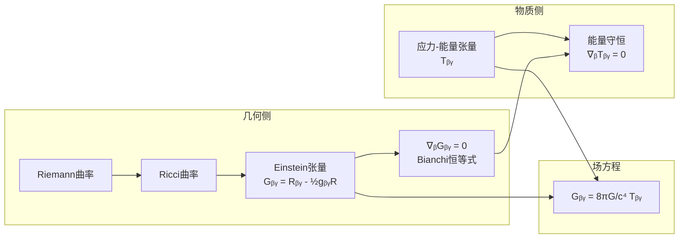
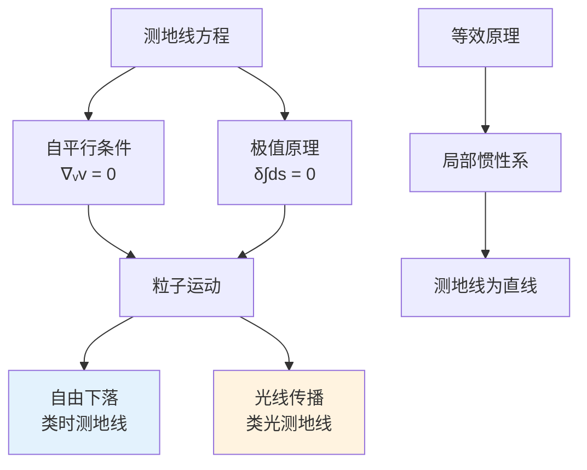
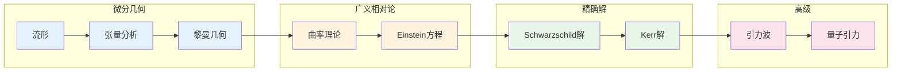

# 广义相对论数学 - 思维导图

## 概述

广义相对论的爱因斯坦场方程将物质-能量的分布与时空几何联系起来。微分几何，特别是黎曼几何，为这一理论提供了数学基础，描述了引力作为时空弯曲的效应。

---

## 核心思维导图

```mermaid
mindmap
  root((广义相对论数学<br/>General Relativity))
    微分几何基础
      流形
        四维时空<br/>Lorentz流形
        坐标卡与图册
      张量场
        协变/逆变指标
        张量代数
        度规张量
      仿射联络
        Christoffel符号
        协变导数∇
        Levi-Civita联络
    曲率理论
      Riemann曲率张量
        Rᵃᵦᵧᵟ定义
        代数性质
        几何意义
      Ricci张量
        Rᵦᵧ = Rᵃᵦᵃᵧ
        缩并
      标量曲率
        R = gᵦᵧRᵦᵧ
      Einstein张量
        Gᵦᵧ = Rᵦᵧ - ½gᵦᵧR
        守恒性∇ᵦGᵦᵧ=0
    Einstein场方程
      基本形式
        Gᵦᵧ = 8πGTᵦᵧ/c⁴
      几何量
        Einstein张量
        描述时空弯曲
      物质量
        应力-能量张量
        描述物质分布
      物理意义
        物质告诉时空如何弯曲
        时空告诉物质如何运动
    测地线
      定义
        自平行曲线
        极值曲线
      方程
        d²xᵘ/dτ² + Γᵘᵦᵧ(dxᵝ/dτ)(dxᵞ/dτ) = 0
      物理解释
        自由下落粒子
        光线传播
    精确解
      Schwarzschild解
        球对称静态
        黑洞
        事件视界
      Kerr解
        旋转黑洞
        能层
      Friedmann解
        宇宙学
        膨胀宇宙
    物理效应
      引力红移
      光线偏折
      近日点进动
      引力时间膨胀
      引力波
```

---

## 广义相对论数学结构

```mermaid
graph TD
    subgraph 时空结构
        A[Lorentz流形<br/>(M,g)] --> B[度规符号(+---)]
        B --> C[类时/类空/类光曲线]
    end
    
    subgraph 曲率与物质
        D[曲率张量R] --> E[Ricci张量]
        E --> F[Einstein张量G]
        
        G[应力-能量张量T] --> H[物质分布]
    end
    
    subgraph 场方程
        F --> I[G = 8πT]
        I --> J[几何 = 物质]
    end
    
    subgraph 运动方程
        K[测地线方程] --> L[自由下落]
        K --> M[光线传播]
    end
    
    C --> K
    I --> K
```

---

## 曲率张量分解

| 张量 | 定义 | 对称性 | 自由度 |
|------|------|--------|--------|
| **Riemann** $R_{\alpha\beta\gamma\delta}$ | $R^\rho{}_{\sigma\mu\nu} = \partial_\mu\Gamma^\rho_{\nu\sigma} - ...$ | $R_{\alpha\beta\gamma\delta} = -R_{\beta\alpha\gamma\delta} = -R_{\alpha\beta\delta\gamma}$ | 20 |
| **Ricci** $R_{\mu\nu}$ | $R^\alpha{}_{\mu\alpha\nu}$ | $R_{\mu\nu} = R_{\nu\mu}$ | 10 |
| **标量** $R$ | $g^{\mu\nu}R_{\mu\nu}$ | 标量 | 1 |
| **Weyl** $C_{\alpha\beta\gamma\delta}$ | 无迹部分 | 共形不变 | 10 |
| **Einstein** $G_{\mu\nu}$ | $R_{\mu\nu} - \frac{1}{2}g_{\mu\nu}R$ | $\nabla^\mu G_{\mu\nu} = 0$ | 10 |

---

## Einstein场方程



### 场方程形式

| 形式 | 方程 | 说明 |
|------|------|------|
| **标准形式** | $G_{\mu\nu} = \frac{8\pi G}{c^4} T_{\mu\nu}$ | Einstein场方程 |
| **含宇宙常数** | $G_{\mu\nu} + \Lambda g_{\mu\nu} = \frac{8\pi G}{c^4} T_{\mu\nu}$ | 暗能量 |
| **迹反向形式** | $R_{\mu\nu} = \frac{8\pi G}{c^4}(T_{\mu\nu} - \frac{1}{2}g_{\mu\nu}T)$ | 便于求解 |
| **弱场近似** | $\Box \bar{h}_{\mu\nu} = -\frac{16\pi G}{c^4} T_{\mu\nu}$ | 线性化 |

---

## 重要精确解

```mermaid
mindmap
  root((精确解))
    Schwarzschild解
      条件
        球对称
        静态真空
        Tᵦᵧ = 0
      度规
        ds² = -(1-2M/r)dt² + (1-2M/r)⁻¹dr² + r²dΩ²
      物理意义
        球对称质量外部
        非旋转黑洞
      特征
        事件视界 r=2M
        奇点 r=0
    Kerr解
      条件
        轴对称
        稳态旋转
      物理意义
        旋转黑洞
        角动量J
      特征
        能层
        内/外视界
    Friedmann解
      条件
        均匀各向同性
        宇宙学
      度规
        FLRW度规
      演化
        尺度因子a(t)
        宇宙膨胀
```

---

## 测地线与运动



---

## 经典检验

| 效应 | 描述 | 观测验证 |
|------|------|----------|
| **引力红移** | 光子从强引力场逃逸频率降低 | Pound-Rebka实验 |
| **光线偏折** | 引力场中光线偏转 | 日食观测 |
| **近日点进动** | 水星轨道额外进动 | 43"/世纪 |
| **引力时间膨胀** | GPS卫星时钟校正 | GPS系统 |
| **引力波** | 时空涟漪 | LIGO直接探测 |
| **Shapiro延迟** | 雷达信号通过引力场延迟 | 行星雷达 |

---

## 学习路径



---

## 与其他概念的联系

- **微分几何**: 黎曼几何、张量分析
- **狭义相对论**: 局部惯性系中的狭义相对论
- **宇宙学**: 宇宙演化、大爆炸理论
- **黑洞物理**: 事件视界、奇点定理
- **引力波**: 线性化理论、辐射
- **量子场论**: 弯曲时空量子场论
- **弦理论**: 引力量子化尝试

---

## 参考

- 《Gravitation》Misner, Thorne, Wheeler
- 《General Relativity》Wald
- 《Spacetime and Geometry》Carroll

---

*文档版本：1.1（质量提升版）*
*最后更新：2026年4月*
*分类：数学物理 / 广义相对论 / 思维导图*
