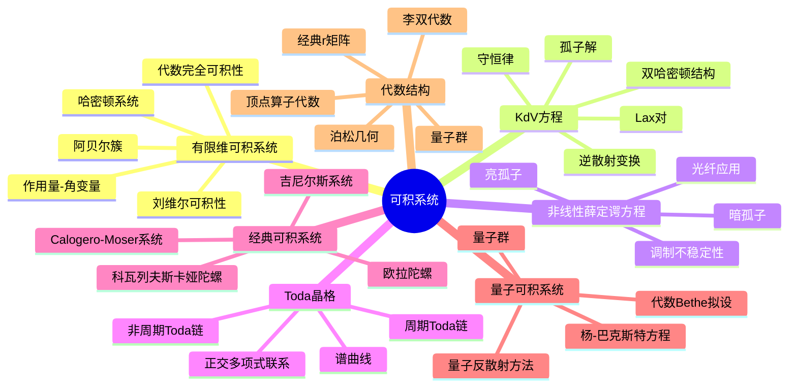

# 可积系统 - 思维导图

## 概述
可积系统是一类具有足够守恒量、可精确求解的非线性动力系统，在数学物理中有广泛应用。

## 核心概念详解

### 1. 可积性定义
- **刘维尔可积性**：存在足够多的独立守恒量
- **代数可积性**：解可以用代数几何描述

### 2. 孤子理论
- **KdV方程**：孤子现象的经典例子
- **逆散射方法**：求解非线性方程的有力工具

### 3. 量子可积性
- **杨-巴克斯特方程**：量子可积性的核心方程
- **量子群**：可积系统的代数结构

## 参考
- 阿诺尔德《Mathematical Methods of Classical Mechanics》
- Faddeev & Takhtajan《Hamiltonian Methods in the Theory of Solitons》
