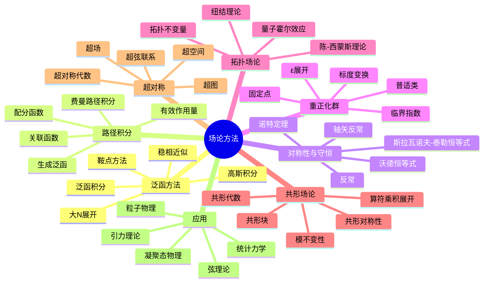

msc_primary: "00A99"
msc_secondary: ['00-XX']
---

# 场论方法 - 思维导图

## 概述
场论方法是现代理论物理的核心工具，涵盖经典场论、量子场论及其在多个物理领域的应用。

## 核心概念详解

### 1. 路径积分方法
- **费曼路径积分**：量子力学的拉格朗日表述
- **泛函方法**：连续无穷自由度的处理

### 2. 对称性与拓扑
- **拓扑场论**：与度规无关的量子场论
- **陈-西蒙斯理论**：三维拓扑不变量

### 3. 现代发展
- **共形场论**：临界现象和弦理论的核心
- **超对称**：费米子与玻色子的对称联系

## 参考
- Peskin & Schroeder《An Introduction to Quantum Field Theory》
- Zinn-Justin《Quantum Field Theory and Critical Phenomena》
