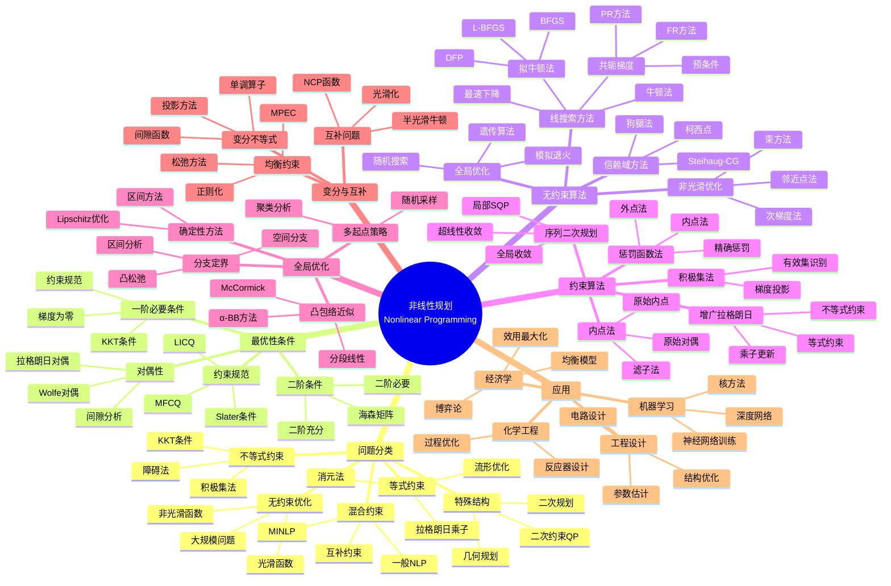

# 非线性规划思维导图

## 概述

非线性规划研究目标函数或约束条件为非线性函数的优化问题。与线性规划相比，非线性规划更加一般化，但求解难度也显著增加，可能出现多个局部最优解。

## 核心概念详解

### 1. KKT条件

对于问题：
$$\begin{aligned}
\min \quad & f(x) \\
\text{s.t.} \quad & g_i(x) \leq 0, \; i=1,...,m \\
& h_j(x) = 0, \; j=1,...,p
\end{aligned}$$

**KKT条件**：
- 平稳性：∇f(x) + Σλᵢ∇gᵢ(x) + Σνⱼ∇hⱼ(x) = 0
- 原始可行性：gᵢ(x) ≤ 0, hⱼ(x) = 0
- 对偶可行性：λᵢ ≥ 0
- 互补松弛：λᵢgᵢ(x) = 0

### 2. 牛顿法与拟牛顿法

**牛顿法**：
$$x_{k+1} = x_k - [\nabla^2 f(x_k)]^{-1} \nabla f(x_k)$$

**BFGS更新**：
$$B_{k+1} = B_k - \frac{B_k s_k s_k^T B_k}{s_k^T B_k s_k} + \frac{y_k y_k^T}{y_k^T s_k}$$

### 3. SQP方法

每步求解子问题：
$$\begin{aligned}
\min \quad & \nabla f_k^T d + \frac{1}{2}d^T W_k d \\
\text{s.t.} \quad & g(x_k) + \nabla g(x_k)^T d \leq 0 \\
& h(x_k) + \nabla h(x_k)^T d = 0
\end{aligned}$$

### 4. 收敛速率

| 方法 | 收敛阶 | 收敛条件 |
|------|--------|----------|
| 梯度下降 | 线性 | 强凸性 |
| 牛顿法 | 二次 | 接近最优 |
| 拟牛顿 | 超线性 | 凸性 |
| SQP | 超线性 | LICQ, SSC |

## 相关主题

- [凸优化](./convex-optimization.md)
- [最优控制](./optimal-control.md)
- [应用数学思维导图索引](./00-应用数学思维导图索引.md)

## 参考资源

- Nocedal & Wright: "Numerical Optimization"
- Bazaraa et al.: "Nonlinear Programming"
- Bertsekas: "Nonlinear Programming"
