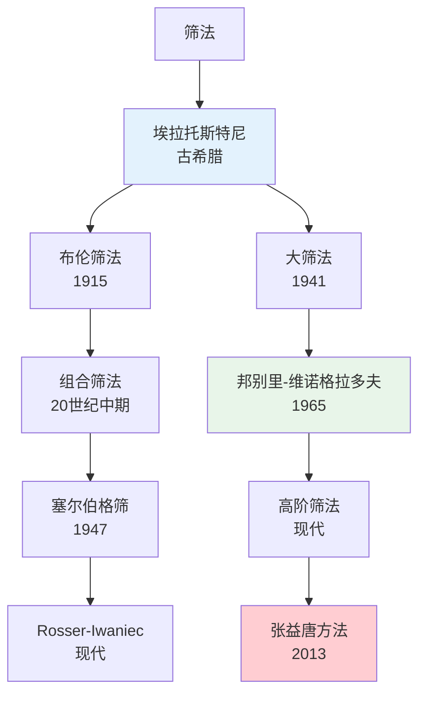

# 素数分布 - 思维导图

## 概述

素数分布是数论的核心课题，研究素数在正整数中的分布规律。从欧几里得证明素数无穷到黎曼假设，这一领域汇聚了人类数学智慧的精华。

---

## 核心思维导图

```mermaid
mindmap
  root((素数分布<br/>Prime Distribution))
    基本定理
      欧几里得定理
        素数有无穷多个
        反证法证明
      算术基本定理
        唯一分解
        标准分解式
      素数定理
        π(x) ~ x/ln x
        误差项估计
    素数计数函数
      定义
        π(x) = #{p≤x: p素数}
        ψ(x) = Σ_{n≤x}Λ(n)
        θ(x) = Σ_{p≤x}ln p
      渐近公式
        π(x) = li(x) + O(xe^{-c√lnx})
        ψ(x) ~ x
        θ(x) ~ x
      等价形式
        π(x)~x/lnx
        p_n~nlnn
        ψ(x)~x
    素数间隙
      定义
        g_n = p_{n+1} - p_n
      上界估计
        g_n = O(p_n^θ)
        当前最好结果 θ<0.525
      下界估计
        g_n ≥ 2 对无穷多n
        孪生素数猜想 g_n=2无穷多次
    著名猜想
      黎曼假设
        ζ(s)非平凡零点 Re(s)=1/2
        与π(x)误差项相关
      孪生素数猜想
        p, p+2同为素数无穷多对
        张益唐突破性进展
      哥德巴赫猜想
        强形式: 偶数=两素数和
        弱形式: 奇数=三素数和
      孪生素数常数
        C₂ = ∏_{p>2}(1-1/(p-1)²)
    筛法理论
      埃拉托斯特尼筛
        基本筛法
        时间复杂度O(nloglogn)
      组合筛法
        布伦筛法
        塞尔伯格筛法
      大筛法
        邦别里-维诺格拉多夫
        算术级数中的素数
    分布规律
      等差数列
        狄利克雷定理
        算术级数中有无穷多素数
      短区间
        π(x+y)-π(x)
        哈代-李特尔伍德猜想

```

---

## 素数定理发展脉络

```mermaid
graph TD
    subgraph 历史突破
        A[欧几里得<br/>公元前300年] --> B[勒让德猜想<br/>1798]
        B --> C[切比雪夫估计<br/>1850]
        C --> D[黎曼论文<br/>1859]
        D --> E[阿达玛-德拉瓦莱<br/>1896]
    end
    
    subgraph 证明方法
        E --> F[复分析方法<br/>ζ函数]
        E --> G[初等方法<br/>塞尔伯格-埃尔多斯]
    end
    
    subgraph 误差改进
        F --> H[经典误差<br/>O(xe^{-c√lnx})]
        H --> I[显式公式<br/>与零点相关]
        I --> J[黎曼假设<br/>O(√x lnx)]
    end
    
    style A fill:#e3f2fd
    style D fill:#fff3e0
    style E fill:#e8f5e9
    style J fill:#ffcdd2

```

---

## 黎曼ζ函数与素数分布

```mermaid
graph LR
    subgraph ζ函数
        A[黎曼ζ函数<br/>ζ(s) = Σn^{-s}] --> B[欧拉乘积<br/>∏(1-p^{-s})^{-1}]
        B --> C[解析延拓]
        C --> D[函数方程]
        D --> E[非平凡零点]
    end
    
    subgraph 显式公式
        E --> F[冯·曼戈尔特公式<br/>ψ(x) = x - Σx^ρ/ρ - ln2π - ½ln1-x^{-2}]
        F --> G[零点贡献<br/>素数分布振荡]
    end
    
    subgraph 关键影响
        E --> H[零点实部位置<br/>→ 误差项大小]
        H --> I[临界线Re(s)=1/2<br/>→ 最优误差]
    end
    
    style A fill:#e3f2fd
    style E fill:#fff3e0
    style I fill:#ffcdd2

```

---

## 素数计数函数比较

| 函数 | 定义 | 渐近行为 | 主要应用 |
|------|------|----------|----------|
| π(x) | ≤x的素数个数 | ~ x/ln x | 经典素数定理 |
| θ(x) | Σ_{p≤x} ln p | ~ x | 切比雪夫函数 |
| ψ(x) | Σ_{n≤x} Λ(n) | ~ x | 解析方法 |
| li(x) | ∫₂ˣ dt/lnt | ~ x/ln x | 更好的近似 |
| R(x) | 黎曼R函数 | 高精度 | 实际计算 |

---

## 著名猜想状态

```mermaid
mindmap
  root((素数猜想<br/>猜想状态))
    已解决
      素数定理
        阿达玛-德拉瓦莱 1896
      狄利克雷定理
        算术级数中素数
      弱哥德巴赫
        哈elfgott 2013
    重大突破
      孪生素数间隙
        张益唐: 有界间隙
        Maynard: 间隙≤600
      哥德巴赫进展
        陈景润 1+2
        三素数定理
    未解决核心
      黎曼假设
        百万美元难题
        所有零点在1/2线
      孪生素数
        有无穷多对
      哥德巴赫
        强形式未证
      勒让德猜想
        n²与(n+1)²间必有素数

```

---

## 筛法发展



---

## 关键公式速查

| 公式 | 说明 |
|------|------|
| $\pi(x) \sim \frac{x}{\ln x}$ | 素数定理基本形式 |
| $\pi(x) = \text{li}(x) + O(xe^{-c\sqrt{\ln x}})$ | 带误差项估计 |
| $\psi(x) = \sum_{n \leq x} \Lambda(n)$ | 切比雪夫第二函数 |
| $\sum_{p \leq x} \frac{1}{p} = \ln\ln x + M + O(1/\ln x)$ | 倒数和 |
| $\prod_{p \leq x} (1-\frac{1}{p}) \sim \frac{e^{-\gamma}}{\ln x}$ | 梅滕斯定理 |
| $p_n \sim n\ln n$ | 第n个素数渐近 |

---

## 学习路径


---

## 与其他概念的联系

- **解析数论**: ζ函数、L函数是核心工具
- **代数数论**: 代数整数环中的素理想
- **概率论**: 克拉梅模型、概率启发
- **计算数学**: 素性测试、大数分解
- **密码学**: RSA基于素数分解困难性
- **信息论**: 素数的随机性、熵

---

*文档版本：1.0*
*创建时间：2026年4月*
*分类：数论 / 素数分布 / 思维导图*
