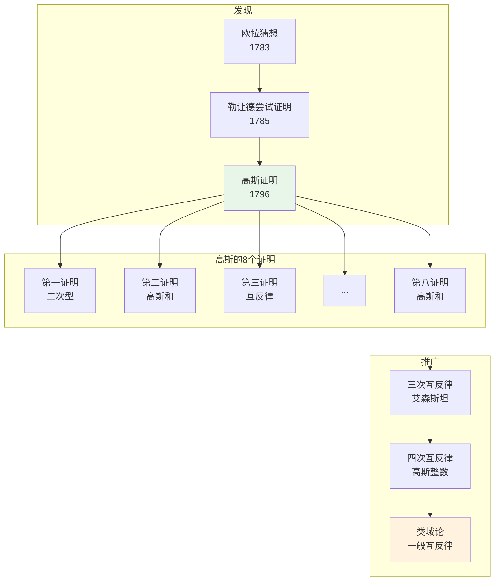

# 二次剩余 - 思维导图

## 概述

二次剩余理论研究哪些整数是模n的完全平方数。从高斯的《算术研究》到现代密码学，这一理论连接了初等数论与深层代数结构。

---

## 核心思维导图

```mermaid
mindmap
  root((二次剩余<br/>Quadratic Residue))
    基本定义
      二次剩余
        a是模p的QR
        ∃x: x²≡a (mod p)
      二次非剩余
        不存在这样的x
        记作NR
      Legendre符号
        (a/p)=1 QR
        (a/p)=-1 NR
        (a/p)=0 p|a
    欧拉准则
      判定方法
        a^{(p-1)/2}≡(a/p) (mod p)
      计算
        多项式时间
        实用判定法
      推论
        (-1/p)=(-1)^{(p-1)/2}
        即p≡1(4)时-1是QR
    二次互反律
      高斯证明
        8种不同证明
        代数、几何、解析
      核心公式
        (p/q)(q/p)=(-1)^{...}
      补充定律
        (-1/p)=(-1)^{(p-1)/2}
        (2/p)=(-1)^{(p²-1)/8}
    Jacobi符号
      定义
        (a/n)推广
        n复合
      性质
        多plicative
        计算快
      限制
        (a/n)=1≠QR
        仅能证非剩余
    高斯和
      定义
        G=Σ(a/p)ζ^a
        ζ=e^{2πi/p}
      性质
        G²=(-1/p)p
        |G|=√p
      应用
        互反律证明
        四次剩余
    高次剩余
      三次剩余
        艾森斯坦整数
        三次互反律
      四次剩余
        高斯整数
        四次互反律
      一般理论
        幂剩余符号
        类域论
```

---

## Legendre符号计算体系

```mermaid
graph TD
    subgraph 基础判定
        A[Legendre符号 (a/p)] --> B{欧拉准则}
        B --> C[a^{(p-1)/2} mod p]
    end
    
    subgraph 性质简化
        C --> D[乘法性]
        D --> E[(ab/p)=(a/p)(b/p)]
        E --> F[分解a=±2^e·q₁·q₂...]
    end
    
    subgraph 互反计算
        F --> G[二次互反律]
        G --> H[(p/q)(q/p)=(-1)^{...}]
        H --> I[符号反转]
    end
    
    subgraph 特殊值
        I --> J[(-1/p)]
        I --> K[(2/p)]
        J --> L[看p mod 4]
        K --> M[看p mod 8]
    end
    
    style A fill:#e3f2fd
    style G fill:#fff3e0
    style H fill:#e8f5e9
```

---

## 二次互反律历史



---

## Jacobi符号 vs Legendre符号

| 特性 | Legendre符号 (a/p) | Jacobi符号 (a/n) |
|------|-------------------|------------------|
| 模数 | 奇素数p | 奇正整数n |
| 值 | 确实指示QR/NR | (a/n)=1时可能是NR |
| 计算 | 需分解 | 不需分解 |
| 用途 | 精确判定 | 快速筛选 |
| 乘法性 | ✓ | ✓ |
| 互反律 | ✓ | ✓ |

---

## 二次同余方程求解

```mermaid
mindmap
  root((二次同余<br/>x²≡a (mod n)))
    模奇素数
      存在性
        欧拉准则判定
      解数
        0, 1, 或2个
      求解方法
        Tonelli-Shanks
        Cipolla算法
        特殊情况公式
    模素数幂
      Hensel提升
        单根唯一提升
        多重根需检验
      解数变化
        p∤2a: 同模p
        p|a: 复杂
    模复合数
      CRT分解
        分解n=∏p_i^{e_i}
        各模数求解
        组合解
      解数公式
        2^k (k个不同奇素因子)
        考虑p=2特殊情况
    模2^k
      特殊情况
        k=1: 总有解
        k=2: a≡1(4)
        k≥3: a≡1(8)
      解的结构
        4个解(k≥3)
        提升规律
```

---

## 高斯和应用

```mermaid
graph TD
    subgraph 定义
        A[高斯和<br/>G(χ)=Σχ(a)ζ^a] --> B[χ: 狄利克雷特征]
        B --> C[ζ=e^{2πi/p}]
    end
    
    subgraph 关键性质
        D[G² = (-1)^{(p-1)/2}p] --> E[|G| = √p]
        E --> F[G·Ḡ = p]
    end
    
    subgraph 证明应用
        F --> G[二次互反律证明]
        G --> H[符号确定]
        F --> I[四次剩余研究]
    end
    
    subgraph 推广
        I --> J[艾森斯坦和<br/>三次]
        J --> K[雅可比和<br/>特征乘积]
        K --> L[韦伊猜想<br/>代数簇]
    end
    
    style A fill:#e3f2fd
    style D fill:#fff3e0
    style K fill:#e8f5e9
```

---

## 代数整数环中的二次剩余

```mermaid
graph LR
    subgraph 高斯整数
        A[ℤ[i]<br/>i²=-1] --> B[范数N(a+bi)=a²+b²]
        B --> C[四次互反律]
    end
    
    subgraph 艾森斯坦整数
        D[ℤ[ω]<br/>ω³=1] --> E[范数N(a+bω)]
        E --> F[三次互反律]
    end
    
    subgraph 一般二次域
        G[ℚ(√d)] --> H[整数环O_d]
        H --> I[理想分解]
        I --> J[希尔伯特符号]
    end
    
    style A fill:#e3f2fd
    style D fill:#fff3e0
    style G fill:#e8f5e9
```

---

## 关键公式速查

| 公式 | 说明 |
|------|------|
| $(\frac{a}{p}) \equiv a^{(p-1)/2} \pmod{p}$ | 欧拉准则 |
| $(\frac{ab}{p}) = (\frac{a}{p})(\frac{b}{p})$ | 乘法性 |
| $(\frac{p}{q})(\frac{q}{p}) = (-1)^{(p-1)(q-1)/4}$ | 二次互反律 |
| $(\frac{-1}{p}) = (-1)^{(p-1)/2}$ | 第一补充律 |
| $(\frac{2}{p}) = (-1)^{(p^2-1)/8}$ | 第二补充律 |
| $G^2 = (\frac{-1}{p})p$ | 高斯和性质 |

---

## 学习路径


---

## 与其他概念的联系

- **代数数论**: 二次域、理想类群
- **代数几何**: 椭圆曲线、雅可比簇
- **表示理论**: 狄利克雷特征、L函数
- **密码学**: 二次剩余假设、Rabin加密
- **编码理论**: 二次剩余码
- **组合数学**: 差集、设计理论

---

*文档版本：1.0*
*创建时间：2026年4月*
*分类：数论 / 二次剩余 / 思维导图*
