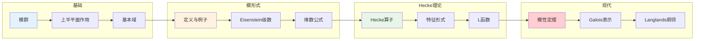

# 模形式 - 思维导图

## 概述

模形式是全纯函数，在上半平面满足特定的模变换性质。从椭圆函数到费马大定理的证明，模形式是现代数论的核心工具，连接了分析、代数与几何。

---

## 核心思维导图

```mermaid
mindmap
  root((模形式<br/>Modular Forms))
    模群
      SL(2,ℤ)
        行列式为1的整数矩阵
        生成元S,T
      作用
        γz=(az+b)/(cz+d)
        上半平面H
      基本域

        |z|>1, |Re(z)|<1/2

        商H/SL(2,ℤ)
    模形式定义
      权k模形式
        f(γz)=(cz+d)^k f(z)
        全纯性
        尖点全纯
      尖点形式
        尖点处为零
        S_k空间
      Eisenstein级数
        权k≥4偶数
        E_k∈M_k非尖点
    维数公式
      M_k维数
        k<0: 0
        k=0: 1
        k≥2偶: ⌊k/12⌋+δ
      S_k维数
        k<12: 0
        k≥12: dim M_k -1
      亏格公式
        模曲线X(N)
        黎曼-罗赫
    Hecke算子
      定义
        T_n作用
        平均过子格
      性质
        交换代数
        特征形式
        特征值a_n
      L函数
        L(f,s)=Σa_n n^{-s}
        欧拉乘积
        函数方程
    模性定理
      谷山-志村-韦伊
        有理椭圆曲线
        对应模形式
      费马大定理
        怀尔斯证明
        半稳定情形
        一般情形
      Langlands
        一般互反律
        自守表示
    应用
      同余数问题
        三角形面积
        椭圆曲线秩
      分拆函数
        p(n)
        Rademacher公式
      球堆积
        E₈格
        Leech格

```

---

## 模群与基本域

```mermaid
graph TD
    subgraph SL(2,ℤ)
        A[SL(2,ℤ)] --> B[S=(0 -1; 1 0)]
        A --> C[T=(1 1; 0 1)]
        B --> D[S²=-I]
        C --> E[平移z→z+1]
        B --> F[反演z→-1/z]
    end
    
    subgraph 基本域
        G[H={Im(z)>0}] --> H[基本域F]
        H --> I[|z|>1]
        H --> J[|Re(z)|<1/2]

    end
    
    subgraph 商空间
        K[H/SL(2,ℤ)] --> L[模曲线Y(1)]
        L --> M[尖点∞]
        M --> N[紧化X(1)]
    end
    
    style A fill:#e3f2fd
    style G fill:#fff3e0
    style K fill:#e8f5e9

```

---

## 模形式空间

```mermaid
graph TD
    subgraph 权k空间
        A[M_k: 权k模形式] --> B[S_k: 尖点形式]
        A --> C[E_k: Eisenstein级数]
    end
    
    subgraph 维数
        D[dim M_k] --> E[k<0: 0]
        D --> F[k=0: 1]
        D --> G[k≥2偶: ⌊k/12⌋+δ_{k≡2(12)}]
    end
    
    subgraph 基
        H[M_k = S_k ⊕ ℂ·E_k] --> I[Eisenstein级数]
        H --> J[尖点形式]
    end
    
    subgraph 例子
        K[Δ∈S_12] --> L[判别式形式]
        M[j∈M_0^!] --> N[模不变量]
    end
    
    style A fill:#e3f2fd
    style B fill:#e8f5e9
    style C fill:#fff3e0

```

---

## 维数公式

| 权k | dim M_k | dim S_k | 基 |
|-----|---------|---------|-----|
| 0 | 1 | 0 | 1 |
| 2 | 0 | 0 | - |
| 4 | 1 | 0 | E₄ |
| 6 | 1 | 0 | E₆ |
| 8 | 1 | 0 | E₄² |
| 10 | 1 | 0 | E₄E₆ |
| 12 | 2 | 1 | E₄³, E₆², Δ |
| 16 | 2 | 1 | E₄⁴, E₄²Δ |

---

## Hecke理论

```mermaid
graph TD
    subgraph Hecke算子
        A[T_n: M_k→M_k] --> B[n=p素数]
        B --> C[T_p f(z) = p^{k-1}f(pz) + 1/p Σ_{j=0}^{p-1}f((z+j)/p)]
    end
    
    subgraph 代数结构
        D[T_m T_n = T_n T_m] --> E[交换代数]
        E --> F[同时可对角化]
    end
    
    subgraph 特征形式
        G[T_n f = a_n f] --> H[归一化a_1=1]
        H --> I[Hecke特征形式]
        I --> J[a_{mn}=a_m a_n (m,n)=1]
    end
    
    subgraph L函数
        J --> K[L(f,s)=Σ a_n n^{-s}]
        K --> L[欧拉乘积]
        L --> M[函数方程<br/>Λ(f,s)=Λ(f,k-s)]
    end
    
    style A fill:#e3f2fd
    style G fill:#e8f5e9
    style K fill:#fff3e0

```

---

## 模性定理与费马大定理

```mermaid
graph TD
    subgraph 谷山-志村-韦伊猜想
        A[有理椭圆曲线E] --> B[对应权2模形式f_E]
        B --> C[L(E,s)=L(f_E,s)]
    end
    
    subgraph 怀尔斯证明
        D[半稳定椭圆曲线] --> E[对应模Galois表示]
        E --> F[形变理论]
        F --> G[ lifting 到特征0]
        G --> H[模性定理]
    end
    
    subgraph 费马大定理
        I[假设aⁿ+bⁿ=cⁿ] --> J[构造Frey曲线]
        J --> K[y²=x(x-aⁿ)(x+bⁿ)]
        K --> L[Ribet: 对应非模形式]
        L --> M[Wiles: 矛盾]
    end
    
    style A fill:#e3f2fd
    style D fill:#fff3e0
    style K fill:#ffcdd2

```

---

## 重要模形式

```mermaid
mindmap
  root((重要模形式<br/>Classical Forms))
    Eisenstein级数
      定义
        G_k(z)=Σ_{(m,n)≠(0,0)}(mz+n)^{-k}
        权k≥4偶数
      归一化
        E_k=G_k/G_k(i∞)
        E_k(i∞)=1
      例子
        E_4=1+240Σσ_3(n)q^n
        E_6=1-504Σσ_5(n)q^n
    判别式形式
      Δ
        Δ=(E_4³-E_6²)/1728
        权12尖点形式
      乘积公式
        Δ=q∏(1-q^n)^24
        η函数的24次幂
      j不变量
        j=E_4³/Δ
        模函数
    θ函数
      经典θ
        θ(z)=Σq^{n²}
        权1/2
      应用
        表示整数为平方和
        分拆函数
    Dedekind η
      η(z)=q^{1/24}∏(1-q^n)
        权1/2
      变换公式
        根数24次
        模判别式

```

---

## 同余子群

```mermaid
graph TD
    subgraph 同余子群
        A[Γ(N)] --> B[主同余子群]
        C[Γ_0(N)] --> D[(c d; N·* *)]
        E[Γ_1(N)] --> F[(1 *; 0 1) mod N]
    end
    
    subgraph 模曲线
        G[X(N)=H*/Γ(N)] --> H[紧黎曼面]
        G --> I[尖点]
    end
    
    subgraph 几何
        H --> J[亏格g]
        J --> K[模解释]
        K --> L[椭圆曲线+级结构]
    end
    
    style A fill:#e3f2fd
    style G fill:#e8f5e9
    style K fill:#fff3e0

```

---

## 关键公式速查

| 公式 | 说明 |
|------|------|
| $f(\gamma z) = (cz+d)^k f(z)$ | 模变换公式 |
| $T_n f(z) = n^{k-1} \sum_{d|n} \frac{1}{d^k} \sum_{b=0}^{d-1} f\left(\frac{nz+bd}{d^2}\right)$ | Hecke算子 |
| $L(f,s) = \sum_{n=1}^\infty \frac{a_n}{n^s} = \prod_p \frac{1}{1-a_p p^{-s}+p^{k-1-2s}}$ | L函数欧拉乘积 |
| $E_k(z) = 1 - \frac{2k}{B_k} \sum_{n=1}^\infty \sigma_{k-1}(n) q^n$ | Eisenstein级数 |
| $\Delta(z) = q \prod_{n=1}^\infty (1-q^n)^{24} = \sum_{n=1}^\infty \tau(n) q^n$ | 判别式形式 |
| $\Lambda(f,s) = (2\pi)^{-s} \Gamma(s) L(f,s) = (-1)^{k/2} \Lambda(f,k-s)$ | 函数方程 |

---

## 学习路径



---

## 与其他概念的联系

- **代数几何**: 模曲线、模空间
- **表示论**: 自守表示、Galois表示
- **算术几何**: 椭圆曲线、阿贝尔簇
- **代数数论**: 复乘、类域论
- **组合数学**: 分拆理论、计数问题
- **物理学**: 共形场论、弦理论

---

*文档版本：1.0*
*创建时间：2026年4月*
*分类：数论 / 模形式 / 思维导图*
