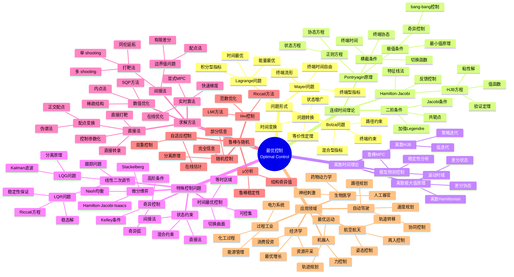

msc_primary: "00A99"
msc_secondary: ['00-00']
---

# 最优控制思维导图

## 概述

最优控制理论是现代控制理论的核心分支，研究如何使动态系统在给定性能指标下达到最优。它由Pontryagin等人于1950-60年代创立，综合了变分法、动态规划和微分方程理论。

## 核心概念详解

### 1. Pontryagin最小值原理

**标准问题**：
$$\min_{u} J = \phi(x(t_f)) + \int_{t_0}^{t_f} L(x,u,t) dt$$

**Hamiltonian**：
$$H(x,u,p,t) = L(x,u,t) + p^T f(x,u,t)$$

**必要条件**：
- 状态方程：$\dot{x} = \partial H / \partial p$
- 协态方程：$\dot{p} = -\partial H / \partial x$
- 极值条件：$H(x^*,u^*,p^*,t) = \min_u H(x^*,u,p^*,t)$
- 横截条件：$p(t_f) = \partial \phi / \partial x|_{t_f}$

### 2. Hamilton-Jacobi-Bellman方程

**连续时间**：
$$-\frac{\partial V}{\partial t} = \min_u \{L(x,u,t) + \nabla V \cdot f(x,u,t)\}$$

终端条件：$V(x,t_f) = \phi(x)$

**验证定理**：若 $V$ 是HJB方程的光滑解，则 $V$ 为最优值函数

### 3. 线性二次调节器

**问题**：
$$\min_u \int_0^\infty (x^TQx + u^TRu) dt$$

**解**：$u^* = -R^{-1}B^TPx = -Kx$

其中 $P$ 满足代数Riccati方程：
$$A^TP + PA - PBR^{-1}B^TP + Q = 0$$

**性质**：若 $(A,B)$ 能控，$(A,Q^{1/2})$ 能观，则闭环稳定

### 4. 数值方法比较

| 方法 | 精度 | 收敛域 | 计算量 | 适用问题 |
|------|------|--------|--------|----------|
| 间接法 | 高 | 小 | 小 | 简单问题 |
| 直接配点 | 中 | 大 | 大 | 复杂约束 |
| 伪谱法 | 高 | 中 | 中 | 光滑解 |
| MPC | 次优 | 大 | 实时 | 在线控制 |

## 相关主题

- [变分法](./calculus-of-variations.md)
- [动态规划](./dynamic-programming.md)
- [应用数学思维导图索引](./00-应用数学思维导图索引.md)

## 参考资源

- Pontryagin et al.: "The Mathematical Theory of Optimal Processes"
- Bryson & Ho: "Applied Optimal Control"
- Lewis et al.: "Optimal Control"
- Rawlings & Mayne: "Model Predictive Control"
