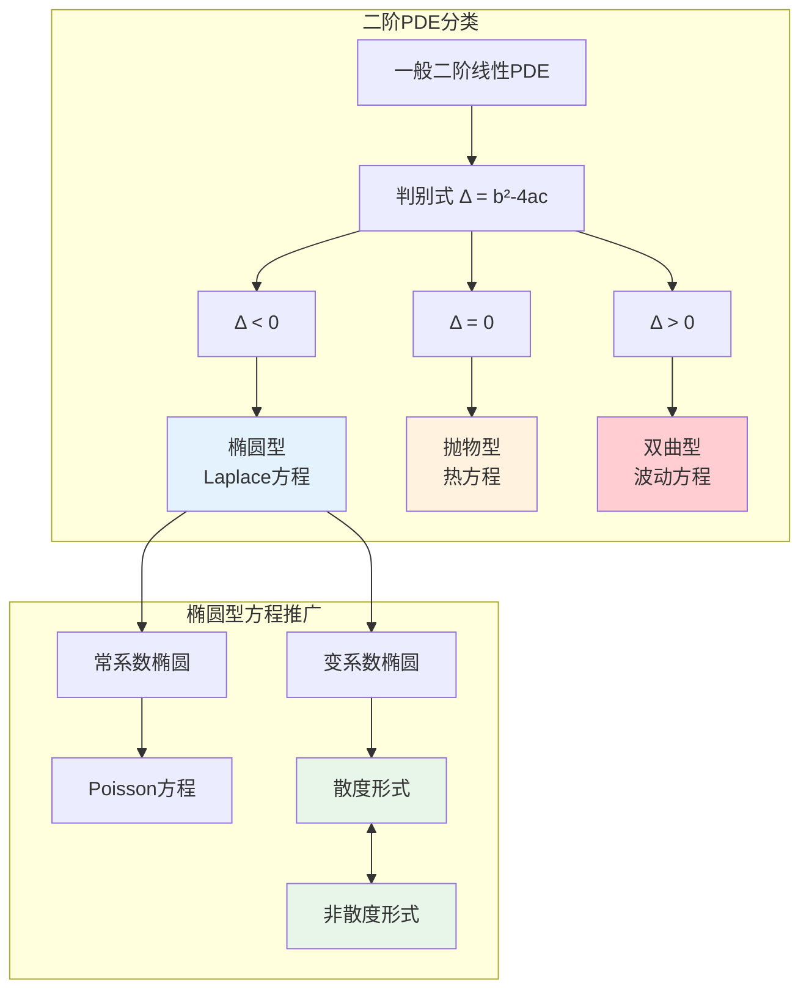
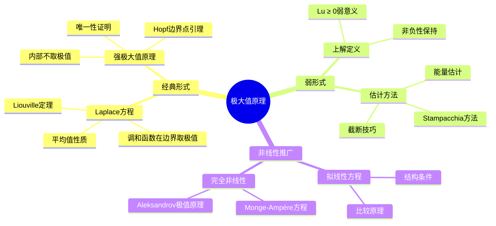

# 椭圆型方程 - 思维导图

## 概述

椭圆型偏微分方程是描述稳态（平衡）现象的数学模型，其典型代表是Laplace方程和Poisson方程。这类方程的特征是没有时间演化方向，解在区域内具有光滑性和极值原理。

---

## 核心思维导图

```mermaid
mindmap
  root((椭圆型方程<br/>Elliptic PDEs))
    基本定义
      二阶椭圆型PDE
        判别条件: Δ = b² - 4ac < 0
        标准形式: Lu = -Σaᵢⱼ∂²u/∂xᵢ∂xⱼ + ...
      一致椭圆性
        正定性条件
        椭圆常数
        一致椭圆算子
      主部系数
        对称矩阵(aᵢⱼ)
        特征值条件
        强椭圆与弱椭圆
    经典方程
      Laplace方程
        Δu = 0
        调和函数
        平均值性质
      Poisson方程
        Δu = f
        基本解
        Newton位势
      双调和方程
        Δ²u = 0
        板弯曲问题
        高阶正则性
    边值问题
      Dirichlet问题
        u|∂Ω = g

        存在唯一性
        极大值原理
      Neumann问题
        ∂u/∂n|∂Ω = g

        相容性条件
        常数解自由度
      Robin问题
        (∂u/∂n + σu)|∂Ω = g

        混合边界条件
      斜导数问题
        一般边界条件
        正则性要求
    弱解理论
      Sobolev空间框架
        H¹(Ω), H₀¹(Ω)
        弱导数定义
        迹定理
      Lax-Milgram引理
        双线性形式
        强制性条件
        存在唯一性证明
      变分公式
        能量泛函
        Euler-Lagrange方程
        极小化原理
    正则性理论
      内部正则性
        弱解→强解
        椭圆估计
        Schauder理论
      边界正则性
        边界光滑性影响
        奇性传播
        角点问题
      Schauder估计
        C²,α估计
        Lp估计
        一致估计
    极大值原理
      弱极大值原理
        sup u ≤ sup u⁺|∂Ω

        比较原理
        唯一性证明
      强极大值原理
        Hopf引理
        边界点引理
        严格极值性
      非线性推广
        拟线性方程
        完全非线性方程
        Aleksandrov极值原理
    先验估计
      H¹估计
        能量方法
        Gårding不等式
        一致有界性
      L∞估计
        Moser迭代
        De Giorgi方法
        弱Harnack不等式
      Harnack不等式
        内部Harnack
        边界Harnack
        正则性结果
    谱理论
      特征值问题
        -Δu = λu
        特征值序列
        Weyl渐近公式
      主特征值
        变分刻画
        Krein-Rutman定理
        正解存在性
      Green函数
        积分表示
        对称性
        估计性质

```

---

## 方程分类体系



---

## 边值问题类型

| 问题类型 | 边界条件 | 数学形式 | 物理意义 |
|----------|----------|----------|----------|
| Dirichlet | 第一类 | u = g on ∂Ω | 固定温度/势 |
| Neumann | 第二类 | ∂u/∂n = g on ∂Ω | 固定热流/通量 |
| Robin | 第三类 | ∂u/∂n + σu = g | 对流换热 |
| 混合 | 混合 | 分段不同类型 | 复杂边界 |

---

## 弱解存在性证明路径


---

## 正则性层级

```mermaid
graph TD
    L2[L²弱解] --> H1[H¹正则性]
    H1 --> H2[H²正则性<br/>内部正则性]
    H2 --> Hk[H^k正则性<br/>引导论证]
    Hk --> Ck[C^k正则性<br/>Sobolev嵌入]
    Ck --> Can[C^∞或解析<br/>椭圆正则性]
    
    H2 --> S1[Schauder估计<br/>C²,α]
    S1 --> S2[C^{k+2,α}估计]
    
    style L2 fill:#ffcdd2
    style H1 fill:#fff3e0
    style H2 fill:#e8f5e9
    style Can fill:#e3f2fd

```

---

## 极大值原理层次



---

## 关键公式速查

| 公式 | 名称 | 说明 |
|------|------|------|
| $-\Delta u = f$ | Poisson方程 | 基本椭圆型方程 |
| $\|u\|_{H^1} \leq C\|f\|_{H^{-1}}$ | 能量估计 | 弱解先验界 |
| $\|u\|_{C^{2,\alpha}} \leq C(\|f\|_{C^\alpha} + \|u\|_{L^\infty})$ | Schauder估计 | 经典解正则性 |
| $\sup_\Omega u \leq \sup_{\partial\Omega} u^+$ | 弱极大值原理 | 解的上界 |
| $\lambda_1 = \inf_{u\neq 0} \frac{\int|\nabla u|^2}{\int u^2}$ | Rayleigh商 | 主特征值 |

---

## 与其他概念的联系

- **Sobolev空间**: 弱解理论的函数空间框架
- **变分方法**: 能量极小化与弱解等价
- **谱理论**: 椭圆算子的特征值问题
- **位势理论**: 调和函数与边界行为
- **复分析**: 二维调和函数与全纯函数联系
- **几何分析**: Laplace-Beltrami算子、Yamabe问题

---

## 应用领域

- **物理学**: 静电势、引力势、稳态温度
- **流体力学**: 不可压势流、Stokes流
- **弹性力学**: 平衡方程、双调和问题
- **金融数学**: 期权定价的稳态模型
- **图像处理**: 图像修复、inpainting

---

*文档版本：1.0*
*创建时间：2026年4月*
*分类：偏微分方程 / 椭圆型方程 / 思维导图*
*MSC 2020: 35Jxx*
