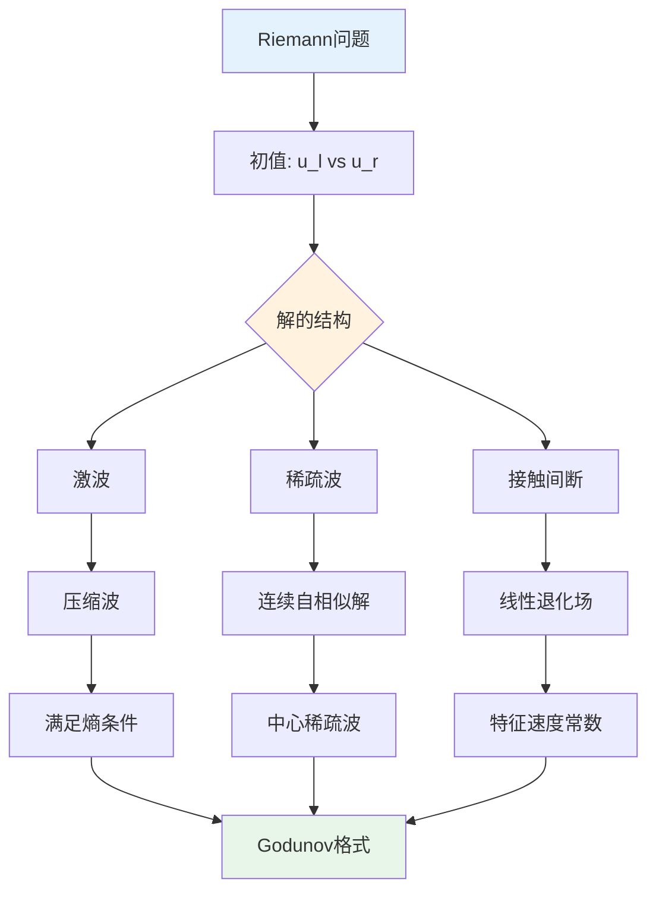

# 双曲型方程 - 思维导图

## 概述

双曲型偏微分方程描述波动、传播和守恒现象，其典型代表是波动方程。这类方程具有有限传播速度、能量守恒、特征线方法等独特性质，在物理、工程等领域有核心应用。

---

## 核心思维导图

```mermaid
mindmap
  root((双曲型方程<br/>Hyperbolic PDEs))
    基本定义
      二阶双曲型
        判别条件: Δ = b² - 4ac > 0
        标准形式: u_tt = Lu + f
      一阶双曲系统
        守恒律形式: u_t + f(u)_x = 0
        双曲性条件
        严格双曲性
      特征理论
        特征方程
        特征方向
        特征流形
    经典方程
      波动方程
        u_tt = c²Δu
        d'Alembert公式
        Kirchhoff公式
      传输方程
        u_t + c·∇u = 0
        特征线法
        平移解
      波动方程组
        Maxwell方程组
        弹性波方程
        声学方程组
    特征线方法
      一阶方程
        特征ODE系统
        沿特征线常数
        初值问题求解
      激波形成
        梯度爆破
        激波时间
        奇性发展
      弱解理论
        Rankine-Hugoniot条件
        熵条件
        Lax熵条件
    能量方法
      能量守恒
        波动方程能量
        E(t) = ∫(u_t² + c²|∇u|²)

        守恒定律
      能量估计
        Gronwall不等式
        先验估计
        解的适定性
      衰减估计
        几何扩散效应
        高维衰减
        非线性效应
    Fourier方法
      分离变量
        特征函数展开
        模式分析
        共振现象
      色散关系
        ω(k)关系
        相速度与群速度
        色散波
      驻波与行波
        驻波解
        行波解
        波包分析
    守恒律
      积分形式
        物理守恒
        弱解定义
        Rankine-Hugoniot
      熵条件
        Oleinik条件
        Lax熵不等式
        可容许性
      Riemann问题
        初值间断
        波分解
        Godunov方法
    激波理论
      激波定义
        间断解
        激波速度
        跳跃条件
      激波稳定性
        Lax熵条件
        熵增条件
        可容许激波
      激波结构
        粘性展开
        边界层
        渐近分析
    有限传播速度
      Huygens原理
        奇点传播
        波前传播
        影响区域
      依赖区域
        决定区域
        影响区域
        特征锥
      二维与三维差异
        奇性保持
        弥散效应
        惠更斯原理

```

---

## 双曲型方程分类

```mermaid
graph TD
    A[双曲型方程] --> B[线性双曲方程]
    A --> C[非线性守恒律]
    A --> D[对称双曲系统]
    
    B --> B1[波动方程<br/>u_tt = c²Δu]
    B --> B2[传输方程<br/>u_t + cu_x = 0]
    B --> B3[电报方程]
    
    C --> C1[标量守恒律<br/>u_t + f(u)_x = 0]
    C --> C2[Burgers方程<br/>u_t + uu_x = 0]
    C --> C3[激波方程]
    
    D --> D1[Maxwell方程组]
    D --> D2[弹性力学方程]
    D --> D3[声学方程组]
    
    B1 --> E[d'Alembert解]
    C1 --> F[特征线法+熵条件]
    D1 --> G[能量方法]
    
    style A fill:#e3f2fd
    style B fill:#e8f5e9
    style C fill:#fff3e0
    style D fill:#fce4ec

```

---

## 波动方程解的表示

```mermaid
graph TD
    subgraph 一维波动方程
        A1[u_tt = c²u_xx] --> B1[d'Alembert公式]
        B1 --> C1[u(x,t) = F(x-ct) + G(x+ct)]
        C1 --> D1[右行波 + 左行波]
    end
    
    subgraph 三维波动方程
        A2[u_tt = c²Δu] --> B2[Kirchhoff公式]
        B2 --> C2[u(x,t) = ∂_tM_f + M_g]
        C2 --> D2[球面平均公式]
    end
    
    subgraph 二维波动方程
        A3[u_tt = c²Δu] --> B3[Poisson公式]
        B3 --> C3[降维法]
        C3 --> D3[Huygens原理失效]
    end
    
    style A1 fill:#e3f2fd
    style A2 fill:#fff3e0
    style A3 fill:#e8f5e9

```

---

## 能量守恒与估计

```mermaid
graph LR
    A[波动方程能量] --> B[定义: E(t) = ½∫(u_t² + c²|∇u|²)]

    B --> C[守恒律: dE/dt = 0]
    C --> D[唯一性证明]
    C --> E[适定性分析]
    
    F[非齐次方程] --> G[能量增长估计]
    G --> H[E(t) ≤ E(0)e^{Ct}]
    
    style A fill:#e3f2fd
    style C fill:#e8f5e9
    style H fill:#fff3e0

```

---

## 特征线方法详解

```mermaid
mindmap
  root((特征线方法))
    一阶方程
      传输方程
        u_t + cu_x = 0
        特征线: x = x₀ + ct
        沿特征线u常数
      一般形式
        u_t + a(x,t)u_x = b(x,t,u)
        特征ODE: dx/dt = a
        du/dt = b沿特征线
    拟线性方程
      Burgers方程
        u_t + uu_x = 0
        特征线相交
        激波形成
      激波时间
        梯度爆破
        t_s = -1/min u'_0
        奇性分析
    守恒律弱解
      间断解
        Rankine-Hugoniot
        s = [f]/[u]
        激波速度
      熵条件
        物理可容许性
        Lax条件
        Oleinik条件

```

---

## Riemann问题结构



---

## 关键公式速查

| 公式 | 名称 | 说明 |
|------|------|------|
| $u(x,t) = \frac{1}{2}[f(x+ct) + f(x-ct)] + \frac{1}{2c}\int_{x-ct}^{x+ct} g(s)ds$ | d'Alembert公式 | 一维波动方程解 |
| $E(t) = \frac{1}{2}\int_{\mathbb{R}^n} (u_t^2 + c^2|\nabla u|^2)dx$ | 波动能量 | 守恒量 |
| $s = \frac{f(u_r) - f(u_l)}{u_r - u_l}$ | Rankine-Hugoniot | 激波速度 |
| $\lambda_k(u_l) > s > \lambda_k(u_r)$ | Lax熵条件 | 激波可容许性 |
| $u(x,t) = f(x-ct)$ | 行波解 | 传输方程解 |

---

## 有限传播速度

```mermaid
graph TD
    A[特征锥] --> B[影响区域]
    A --> C[依赖区域]
    
    B --> D[点(x₀,t₀)的影响]
    D --> E[锥体: \|x-x₀\| ≤ c(t-t₀)]
    
    C --> F[点(x₀,t₀)的依赖]
    F --> G[反向锥: \|x-x₀\| ≤ c(t₀-t)]
    
    H[Huygens原理] --> I[三维: 波前锐利]
    H --> J[二维: 波后弥散]
    
    style A fill:#e3f2fd
    style E fill:#e8f5e9
    style G fill:#fff3e0

```

---

## 与椭圆/抛物方程对比

| 性质 | 双曲型 | 抛物型 | 椭圆型 |
|------|--------|--------|--------|
| 时间方向 | 可逆 | 不可逆 | 无时间 |
| 传播速度 | 有限 | 无限 | 无传播 |
| 解的光滑性 | 保持奇性 | 光滑化 | 光滑 |
| 极值原理 | 无 | 有 | 有 |
| 能量 | 守恒 | 耗散 | 稳态 |

---

## 与其他概念的联系

- **特征线方法**: 一阶PDE的标准求解工具
- **守恒律**: 物理系统的基本方程
- **激波理论**: 气体动力学、交通流
- **Fourier分析**: 色散波分析、频谱方法
- **几何光学**: 射线理论、WKB近似
- **数值方法**: 有限差分、谱方法、间断Galerkin

---

## 应用领域

- **物理学**: 电磁波、声波、引力波
- **工程学**: 结构动力学、振动分析
- **流体力学**: 气体动力学、激波管
- **地球物理**: 地震波传播
- **交通流**: 宏观交通模型
- **金融数学**: 波动率建模

---

*文档版本：1.0*
*创建时间：2026年4月*
*分类：偏微分方程 / 双曲型方程 / 思维导图*
*MSC 2020: 35Lxx*
