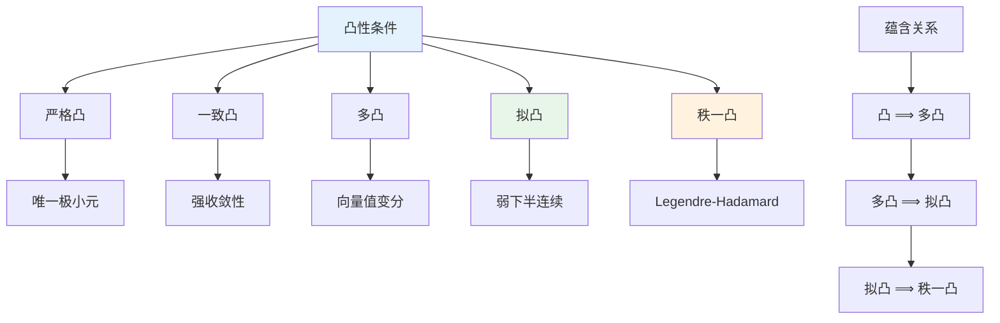

# 变分方法 - 思维导图

## 概述

变分方法是研究偏微分方程的重要工具，通过将微分方程转化为泛函的极值问题来研究解的存在性、唯一性和正则性。这种方法在椭圆型方程、几何分析和数学物理中有核心应用。

---

## 核心思维导图

```mermaid
mindmap
  root((变分方法<br/>Calculus of Variations))
    基础框架
      泛函定义
        J[u] = ∫_Ω L(x,u,∇u)dx
        Lagrange函数L
        容许函数类
      变分概念
        第一变分 δJ
        Gateaux导数
        Fréchet导数
      Euler-Lagrange方程
        临界点条件
        自然边界条件
        约束变分
    存在性理论
      直接方法
        极小化序列
        弱收敛
        下半连续性
      紧性论证
        Sobolev紧嵌入
        Rellich-Kondrachov
        有界序列提取
      弱下半连续性
        凸性条件
        Legendre条件
        拟凸性
      强制性条件
        强制性增长
        Poincaré不等式
        能量控制
    凸分析
      凸函数性质
        下半连续性
        次微分
        共轭函数
      Legendre-Fenchel变换
        L*(p) = sup_x(px-L(x))
        对偶性
        Young不等式
      次微分理论
        ∂J(u)
        变分不等式
        单调算子
    极小极大理论
      鞍点理论
        鞍点刻画
        Von Neumann定理
        零和博弈
      山路引理
        几何条件
        临界点存在
        Morse理论联系
      环绕理论
        拓扑方法
        范畴论
        Ljusternik-Schnirelmann
    约束变分
      Lagrange乘子
        等式约束
        不等式约束
        KKT条件
      等周问题
        周长约束
        特征值问题
        对称重排
      流形约束
        球面约束
        拓扑约束
        指标理论
    Gamma收敛
      定义
        Γ-liminf
        Γ-limsup
        等式条件
      应用
        奇异扰动
        相变问题
        均质化
      性质
        极小值点收敛
        极小值收敛
        稳定性
    几何变分问题
      极小曲面
        面积泛函
        Plateau问题
        Bernstein定理
      平均曲率流
        几何演化
        奇性分析
         surgeries
      Willmore泛函
        弹性能量
        曲面理论
        共形不变性
    物理应用
      经典力学
        最小作用量原理
        Hamilton原理
        Noether定理
      弹性力学
        弹性势能
        变分原理
        稳定性分析
      量子力学
        能量泛函
        基态能量
        轨道稳定性
```

---

## 变分方法基本框架

```mermaid
graph TD
    A[变分问题] --> B[泛函 J[u]]
    B --> C[极小化问题<br/>inf J[u]]
    B --> D[临界点问题<br/>δJ = 0]
    
    C --> E[直接方法]
    D --> F[Euler-Lagrange方程]
    
    E --> E1[极小化序列]
    E1 --> E2[弱收敛]
    E2 --> E3[下半连续性]
    E3 --> E4[极小元存在]
    
    F --> F1[微分方程]
    F1 --> F2[弱解定义]
    
    style A fill:#e3f2fd
    style C fill:#e8f5e9
    style D fill:#fff3e0
    style E4 fill:#fce4ec
```

---

## Euler-Lagrange方程推导

```mermaid
graph TD
    A[J[u] = ∫_Ω L(x,u,∇u)dx] --> B[变分: u → u + εφ]
    B --> C[计算 dJ/dε|_{ε=0} = 0]
    C --> D[分部积分]
    D --> E[E-L方程:
    -∂_i(∂L/∂p_i) + ∂L/∂u = 0]
    
    E --> F[边界条件]
    F --> G[本质边界<br/>u = g on ∂Ω]
    F --> H[自然边界<br/>∂L/∂p · n = 0]
    
    style A fill:#e3f2fd
    style E fill:#e8f5e9
    style F fill:#fff3e0
```

---

## 直接方法步骤

```mermaid
graph LR
    A[步骤1:<br/>极小化序列] --> B[步骤2:<br/>有界性]
    B --> C[步骤3:<br/>弱收敛]
    C --> D[步骤4:<br/>下半连续性]
    D --> E[步骤5:<br/>极小元存在]
    
    A --> |选取{u_k}| A1[J[u_k] → inf J]
    B --> |强制性| B1[‖u_k‖有界]
    C --> |自反空间| C1[u_k ⇀ u]
    D --> |凸性/拟凸性| D1[J[u] ≤ liminf J[u_k]]
    E --> |验证| E1[J[u] = inf J]
    
    style A fill:#ffcdd2
    style C fill:#fff3e0
    style E fill:#e8f5e9
```

---

## 凸性层次



---

## 对偶理论与Legendre变换

```mermaid
mindmap
  root((对偶理论))
    Legendre-Fenchel变换
      定义
        L*(p) = sup_x(px - L(x))
        共轭函数
        凸包性质
      性质
        L** = L当L凸
        Young不等式
        Fenchel不等式
      应用
        最优控制
        统计力学
        熵-自由能对偶
    Hamilton-Jacobi方程
      Hamilton函数
        H(x,p) = sup_v(pv - L(x,v))
        Legendre变换
        经典力学联系
      Hamilton系统
        ẋ = ∂H/∂p
        ṗ = -∂H/∂x
        辛结构
    对偶变分问题
      原始问题
        inf J[u]
      对偶问题
        sup J*[p]
        对偶间隙
      强对偶
        inf = sup
        鞍点存在
```

---

## 关键定理与不等式

| 结果 | 内容 | 应用 |
|------|------|------|
| Poincaré不等式 | $\|u\|_{L^2} \leq C\|\nabla u\|_{L^2}$ | 强制性验证 |
| Sobolev嵌入 | $H^1 \hookrightarrow L^{2^*}$ | 紧性论证 |
| Rellich定理 | $H^1 \hookrightarrow\hookrightarrow L^2$ (紧) | 强收敛提取 |
| Ekeland变分原理 | 近似极小点存在 | 临界点理论 |
| 山路引理 | 特殊几何结构下有临界点 | 非线性问题 |

---

## 极小极大理论与山路引理

```mermaid
graph TD
    A[山路引理条件] --> B[几何结构]
    B --> B1[e: 局部极小点]
    B --> B2[∃v: J[v] < J[e]]
    B1 --> B3[连接路径]
    B2 --> B3
    
    B3 --> C[山路水平]
    C --> D[c = inf_{γ∈Γ} max_t J[γ(t)]]
    
    D --> E[Palais-Smale条件]
    E --> F[临界点存在]
    
    style A fill:#e3f2fd
    style C fill:#fff3e0
    style F fill:#e8f5e9
```

---

## Gamma收敛

```mermaid
graph LR
    A[Gamma收敛] --> B[Γ-liminf不等式]
    A --> C[恢复序列]
    
    B --> B1[u_ε → u ⟹ liminf J_ε[u_ε] ≥ J[u]]
    C --> C1[∀u, ∃u_ε → u: limsup J_ε[u_ε] ≤ J[u]]
    
    D[收敛性质] --> E[极小值点收敛]
    D --> F[极小值收敛]
    
    style A fill:#e3f2fd
    style B fill:#fff3e0
    style C fill:#e8f5e9
```

---

## 与其他概念的联系

- **Sobolev空间**: 变分问题的自然函数空间
- **弱解理论**: 变分方法的解概念
- **偏微分方程**: Euler-Lagrange方程的联系
- **凸分析**: Legendre-Fenchel对偶、次微分
- **微分几何**: 极小曲面、测地线、曲率流
- **经典力学**: Hamilton原理、最小作用量
- **控制理论**: 最优控制、Pontryagin原理

---

## 应用领域

- **物理学**: 最小作用量原理、场论、引力
- **弹性力学**: 弹性变形、板壳理论、稳定性
- **几何学**: 极小曲面、测地线、Willmore猜想
- **材料科学**: 相变、微结构、均质化
- **图像处理**: 全变分去噪、Mumford-Shah模型
- **最优控制**: Pontryagin原理、动态规划

---

*文档版本：1.0*
*创建时间：2026年4月*
*分类：偏微分方程 / 变分方法 / 思维导图*
*MSC 2020: 35A15, 35J20, 49Jxx*
