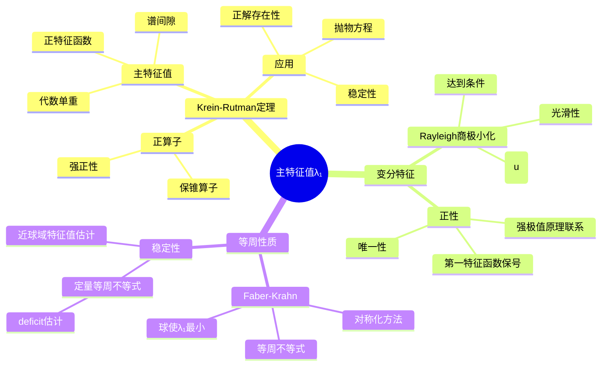
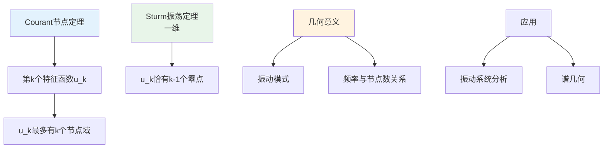

# 特征值问题 - 思维导图

## 概述

椭圆型算子的特征值问题是数学物理和偏微分方程中的核心课题，与振动、稳定性、量子力学等基本问题密切相关。Laplace算子的特征值问题（谱问题）是理解更一般椭圆算子谱理论的基础。

---

## 核心思维导图

```mermaid
mindmap
  root((特征值问题<br/>Eigenvalue Problems))
    基本问题
      Laplace特征值问题
        -Δu = λu in Ω
        边界条件
        谱序列
      Sturm-Liouville问题
        -(pu')' + qu = λwu
        一维情形
        振动理论
      一般椭圆算子
        Lu = -Σ∂_i(a_{ij}∂_ju) + cu
        自伴情形
        一致椭圆性
    变分刻画
      Rayleigh商
        R(u) = ∫|∇u|²/∫u²
        极小化原理
        驻点即特征函数
      Courant-Fischer
        极小极大原理
        λ_k = inf_{dim V=k} sup R(v)
        特征值顺序
      Weyl渐近公式
        N(λ) ~ C_n|Ω|λ^{n/2}
        高频渐近
        谱几何联系
    特征值性质
      主特征值
        λ₁ > 0
        单重性
        正特征函数
      特征值序列
        0 < λ₁ ≤ λ₂ ≤ ... → ∞
        重数有限
        离散谱
      单调性
        区域单调性
        系数单调性
        边界条件影响
    特征函数性质
      正交性
        (u_i, u_j) = δ_{ij}
        L²正交归一基
        完备性
      节点性质
        Courant节点定理
        第k个特征函数至多k个节点域
        振荡性质
      渐近行为
        高频振荡
        Weyl定律
        半经典极限
    等周问题
      Faber-Krahn不等式
        球使λ₁最小
        等周不等式联系
        特征值优化
      Szegő-Weinberger
        Neumann问题
        球使第一非零特征值最大
      调和半径
        特征值与容量
        格林函数联系
        势论方法
    计算与逼近
      Rayleigh-Ritz方法
        有限维逼近
        上方估计
        收敛性
      有限元方法
        离散特征值问题
        误差估计
        后验估计
      谱方法
        Fourier展开
        Chebyshev方法
        指数收敛
    应用问题
      振动问题
        膜振动
        梁振动
        固有频率
      稳定性分析
        线性化稳定性
        主特征值符号
        分歧理论
      量子力学
        Schrödinger算子
        能级
        半经典分析
    推广理论
      非自伴问题
        双线性形式
        谱稳定性
        伪谱
      无穷重特征值
        退化椭圆
        子椭圆性
        特征值渐近
      加权特征值问题
        非均匀介质
        度量测度空间
        曲率影响
```

---

## 特征值问题类型

```mermaid
graph TD
    A[椭圆特征值问题] --> B[Laplace算子<br/>-Δu = λu]
    A --> C[一般椭圆算子<br/>Lu = λu]
    A --> D[Sturm-Liouville<br/>一维情形]
    
    B --> E[Dirichlet边界<br/>u|∂Ω = 0]
    B --> F[Neumann边界<br/>∂u/∂n|∂Ω = 0]
    B --> G[Robin边界<br/>混合条件]
    
    C --> H[自伴情形<br/>谱定理适用]
    C --> I[非自伴情形<br/>复杂谱结构]
    
    D --> J[振动理论<br/>Sturm振荡定理]
    D --> K[特征函数零点<br/>交错分布]
    
    style A fill:#e3f2fd
    style B fill:#e8f5e9
    style H fill:#fff3e0
    style J fill:#fce4ec
```

---

## 变分刻画体系

```mermaid
graph TD
    A[Rayleigh商] --> B[R(u) = ‖∇u‖²/‖u‖²]
    B --> C[λ₁ = inf_{u≠0} R(u)]
    C --> D[主特征值变分刻画]
    
    E[Courant极小极大] --> F[λ_k = inf_{dim V=k} sup_{v∈V} R(v)]
    F --> G[特征值顺序刻画]
    
    H[Weyl渐近] --> I[N(λ) ~ (2π)^{-n}ω_n|Ω|λ^{n/2}]
    I --> J[高频特征值计数]
    
    K[应用] --> L[等周不等式]
    K --> M[特征值优化]
    K --> N[几何极值问题]
    
    style A fill:#e3f2fd
    style B fill:#fff3e0
    style E fill:#e8f5e9
    style H fill:#fce4ec
```

---

## 主特征值理论



---

## 特征函数节点理论



---

## 等周不等式与优化

```mermaid
graph TD
    subgraph Faber-Krahn不等式
        A1[Dirichlet特征值] --> B1[λ₁(Ω) ≥ λ₁(B)]
        B1 --> C1[等号 ⟺ Ω为球]
        C1 --> D1[对称化证明]
    end
    
    subgraph Szegő-Weinberger不等式
        A2[Neumann特征值] --> B2[μ₂(Ω) ≤ μ₂(B)]
        B2 --> C2[等号 ⟺ Ω为球]
    end
    
    subgraph  Payne-Pólya-Weinberger猜想
        A3[特征值比] --> B3[λ_{k+1}/λ_k ≤ λ₂/λ₁|球]
        B3 --> C3[已证明k=1,2]
        B3 --> D3[一般情形猜想]
    end
    
    style A1 fill:#e3f2fd
    style A2 fill:#fff3e0
    style A3 fill:#e8f5e9
```

---

## 关键公式速查

| 公式/定理 | 内容 | 意义 |
|-----------|------|------|
| Rayleigh商 | $R(u) = \frac{\int_\Omega |\nabla u|^2}{\int_\Omega u^2}$ | 特征值变分刻画 |
| 主特征值 | $\lambda_1 = \inf_{u \neq 0} R(u)$ | 变分原理 |
| Courant极小极大 | $\lambda_k = \inf_{\dim V=k} \sup_{v \in V} R(v)$ | 高阶特征值 |
| Weyl渐近 | $N(\lambda) \sim \frac{\omega_n}{(2\pi)^n}|\Omega|\lambda^{n/2}$ | 谱计数 |
| Faber-Krahn | $\lambda_1(\Omega) \geq \lambda_1(B), |B|=|\Omega|$ | 等周优化 |

---

## 计算方法

```mermaid
graph LR
    A[Rayleigh-Ritz方法] --> B[有限维子空间逼近]
    B --> C[上方估计λ_k ≤ λ_k^{(h)}]
    C --> D[收敛性证明]
    
    E[有限元方法] --> F[刚度矩阵与质量矩阵]
    F --> G[KU = λMU]
    G --> H[广义特征值问题]
    
    I[误差估计] --> J[先验估计]
    I --> K[后验估计]
    
    style A fill:#e3f2fd
    style E fill:#e8f5e9
    style I fill:#fff3e0
```

---

## Schrödinger算子特征值

```mermaid
graph TD
    A[Schrödinger算子<br/>H = -Δ + V(x)] --> B[离散谱与连续谱]
    
    B --> C[势阱情形<br/>V → ∞]
    C --> D[纯离散谱]
    
    B --> E[衰减势<br/>V → 0]
    E --> F[本质谱[0,∞)]
    F --> G[可能负特征值]
    
    H[半经典极限<br/>ħ → 0] --> I[Weyl定律]
    I --> J[特征值与经典轨道联系]
    
    style A fill:#e3f2fd
    style C fill:#e8f5e9
    style H fill:#fff3e0
```

---

## 与其他概念的联系

- **Sobolev空间**: 特征函数的正则性、变分框架
- **椭圆型方程**: 边值问题、正则性理论
- **谱理论**: 无界自伴算子、谱分解
- **偏微分方程**: 分离变量法、振动模式
- **微分几何**: Laplace-Beltrami算子、谱几何
- **量子力学**: Schrödinger方程、能级
- **数论**: 自守形式、Maass波

---

## 应用领域

- **结构力学**: 桥梁、建筑固有频率分析
- **声学**: 房间声学、乐器设计
- **量子物理**: 原子分子能级、势阱
- **稳定性分析**: 流体稳定性、反应扩散
- **图像处理**: 谱聚类、形状分析
- **数学生物学**: 模式形成、Turing不稳定性

---

*文档版本：1.0*
*创建时间：2026年4月*
*分类：偏微分方程 / 特征值问题 / 思维导图*
*MSC 2020: 35Pxx, 47A75*
