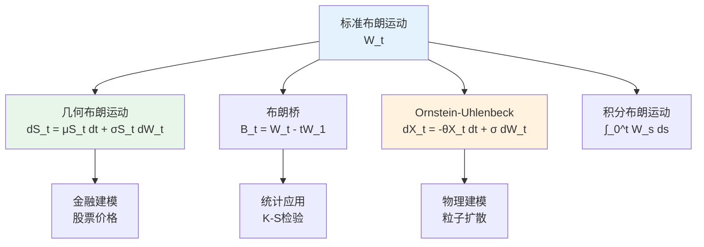

# 布朗运动 - 思维导图

## 概述

布朗运动(Brownian Motion)是随机过程理论中最基本、最重要的随机过程，由Robert Brown于1827年首次观察到，Norbert Wiener于1923年给出严格数学构造。它在物理、金融、生物等领域有广泛应用。

---

## 核心思维导图

```mermaid
mindmap
  root((布朗运动<br/>Brownian Motion))
    历史背景
      Robert Brown 1827年观察花粉运动
      Louis Bachelier 1900年金融应用
      Norbert Wiener 1923年严格构造
      Paul Lévy 路径性质研究
    定义与公理
      标准布朗运动 W_t
        W_0 = 0 a.s.
        独立增量
        平稳增量 W_t - W_s ~ N(0, t-s)
        连续样本路径
      Wiener测度
        C[0,1]上的概率测度
        坐标过程的分布
    数学构造
      Lévy-Ciesielski构造
        Schauder函数展开
        随机Fourier级数
        一致收敛性
      Kolmogorov扩张定理
        有限维分布相容性
        测度存在唯一性
    路径性质
      连续性
        几乎必然连续
        Hölder连续性 (1/2-ε)
      不可微性
        几乎必然处处不可微
        无限变差
      二次变差
        ⟨W⟩_t = t
        [W,W]_t = t
      重对数律
        limsup_{t→0} W_t/√(2t log log(1/t)) = 1
    重要变换
      尺度变换
        W_{ct} =^d √c W_t
      时间反转
        tW_{1/t} 也是BM
      反射原理
        P(τ_a ≤ t) = 2P(W_t ≥ a)
    相关过程
      几何布朗运动
        S_t = S_0 exp(μt + σW_t)
        金融建模核心
      布朗桥
        W_t - tW_1
        条件布朗运动
      Ornstein-Uhlenbeck
        dX_t = -θX_t dt + σ dW_t
        均值回归过程

```

---

## 布朗运动公理体系

```mermaid
graph TD
    subgraph 四大公理
        A[W_0 = 0<br/>初始条件] --> B[独立增量<br/>Independent Increments]
        B --> C[平稳增量<br/>Stationary Increments<br/>W_t-W_s ~ N(0,t-s)]
        C --> D[连续路径<br/>Continuous Paths]
    end
    
    subgraph 导出性质
        D --> E[高斯过程<br/>Gaussian Process]
        E --> F[马尔可夫性<br/>Markov Property]
        F --> G[鞅性质<br/>Martingale]
        G --> H[二次变差 = t]
    end
    
    subgraph 金融应用
        H --> I[Itô积分<br/>Itô Calculus]
        I --> J[Black-Scholes模型]
    end
    
    style A fill:#e3f2fd
    style B fill:#e3f2fd
    style C fill:#e3f2fd
    style D fill:#e3f2fd
    style G fill:#fff3e0
    style I fill:#e8f5e9

```

---

## 路径性质详解

```mermaid
mindmap
  root((路径性质<br/>Path Properties))
    正则性
      连续性
        几乎必然连续
        Kolmogorov-Čentsov准则
      不可微性
        Paley-Wiener-Zygmund
        处处不可微
      Hölder连续性
        指数 < 1/2
        指数 ≥ 1/2 不成立
    变差性质
      一次变差
        几乎必然无限
      二次变差
        ⟨W⟩_t = t
        依概率收敛
      p次变差
        p < 2: 无限
        p = 2: 有限
        p > 2: 零
    极值性质
      最大值分布
        P(max_{s≤t} W_s ≥ a) = 2P(W_t ≥ a)
      首中时
        τ_a = inf{t: W_t = a}
        Lévy分布
      重对数律
        局部行为
        全局行为

```

---

## 布朗运动变换

| 变换类型 | 公式 | 结果 |
|----------|------|------|
| 尺度变换 | W_t^(c) = (1/√c)W_{ct} | 仍是标准BM |
| 时间反转 | B_t = tW_{1/t}, B_0=0 | 仍是标准BM |
| 时间平移 | W_{t+s} - W_s | 独立于F_s的BM |
| 对称性 | -W_t | 仍是标准BM |
| 布朗桥 | B_t = W_t - tW_1 | 条件过程，B_0=B_1=0 |

---

## 首中时与极值

```mermaid
graph LR
    subgraph 首中时分布
        A[τ_a = inf{t≥0: W_t = a}] --> B[密度函数<br/>f(t) = a/√(2πt³) exp(-a²/2t)]
        B --> C[P(τ_a ≤ t) = 2(1-Φ(a/√t))]
    end
    
    subgraph 重要结论
        C --> D[τ_a < ∞ a.s.]
        D --> E[E[τ_a] = +∞]
        E --> F[几乎必然到达任意水平<br/>但期望时间无限]
    end
    
    style A fill:#e3f2fd
    style E fill:#fff3e0

```

---

## 相关随机过程



---

## 学习路径

```mermaid
flowchart LR
    subgraph L1[基础理解]
        A[四大公理] --> B[有限维分布]
        B --> C[协方差结构<br/>Cov(W_s, W_t) = min(s,t)]
    end
    
    subgraph L2[深入掌握]
        C --> D[路径性质]
        D --> E[鞅性质]
        E --> F[马尔可夫性]
    end
    
    subgraph L3[应用拓展]
        F --> G[Itô积分]
        G --> H[随机微分方程]
        H --> I[金融应用]
    end
    
    subgraph L4[高级主题]
        I --> J[局部时]
        J --> K[Girsanov定理]
        K --> L[鞅表示定理]
    end
    
    style A fill:#e3f2fd
    style B fill:#e3f2fd
    style D fill:#fff3e0
    style E fill:#fff3e0
    style G fill:#e8f5e9
    style H fill:#e8f5e9

```

---

## 关键公式速查

| 公式 | 说明 |
|------|------|
| $W_t - W_s \sim \mathcal{N}(0, t-s)$ | 增量分布 |
| $\text{Cov}(W_s, W_t) = \min(s,t)$ | 协方差结构 |
| $\mathbb{E}[W_t] = 0$ | 零均值 |
| $\text{Var}(W_t) = t$ | 方差随时间线性增长 |
| $\mathbb{P}(\tau_a \leq t) = 2(1-\Phi(a/\sqrt{t}))$ | 首中时分布 |
| $f_{\tau_a}(t) = \frac{a}{\sqrt{2\pi t^3}}\exp(-\frac{a^2}{2t})$ | 首中时密度 |
| $\langle W \rangle_t = t$ | 二次变差 |
| $\mathbb{E}[e^{\theta W_t - \frac{1}{2}\theta^2 t}] = 1$ | 指数鞅 |

---

## 与其他概念的联系

- **鞅论**: 布朗运动是最基本的连续鞅
- **马尔可夫过程**: 具有强马尔可夫性
- **高斯过程**: 有限维分布都是高斯分布
- **随机微积分**: Itô积分以布朗运动为积分元
- **偏微分方程**: 与热方程有密切联系
- **金融数学**: Black-Scholes模型的基础

---

*文档版本：1.0*
*创建时间：2026年4月*
*分类：概率论 / 随机过程 / 思维导图*
*MSC分类: 60J65 (布朗运动)*
