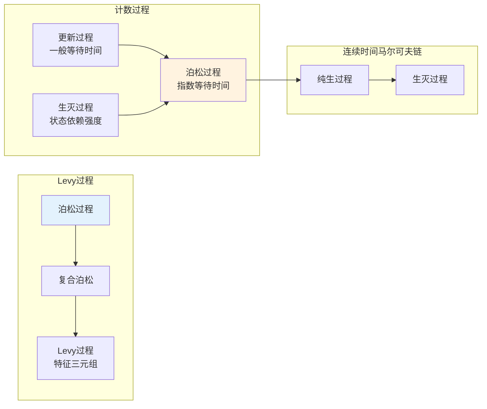
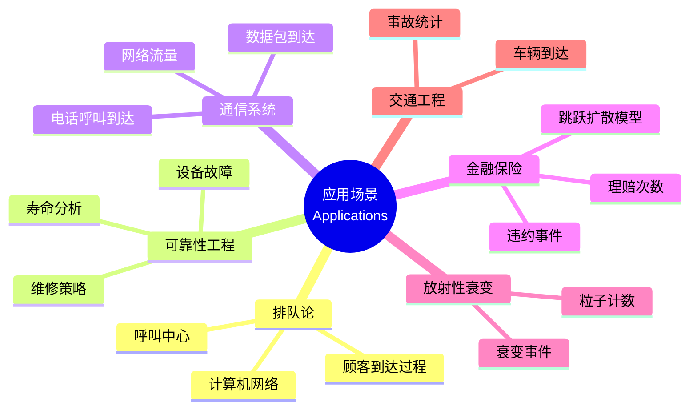
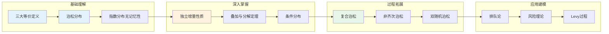

# 泊松过程 - 思维导图

## 概述

泊松过程(Poisson Process)是计数随机过程的典型代表，描述在连续时间中随机事件发生次数的统计规律。它以Siméon Denis Poisson命名，在排队论、可靠性工程、通信网络、保险数学等领域有广泛应用。

---

## 核心思维导图

```mermaid
mindmap
  root((泊松过程<br/>Poisson Process))
    定义与公理
      计数过程 N_t
        N_0 = 0
        非负整数值
        单调不减
        右连续阶梯函数
      三大等价定义
        独立增量定义
        指数等待时间定义
        稀有事件极限定义
    核心性质
      独立增量
        不相交区间独立
      平稳增量
        N_{t+s} - N_t ~ Poisson(λs)
      无记忆性
        等待时间无记忆
        指数分布特征
    分布特征
      泊松分布
        P(N_t = k) = (λt)^k e^(-λt) / k!
        均值 = 方差 = λt
      指数分布
        等待时间 T ~ Exp(λ)
        P(T > t) = e^(-λt)
      Gamma分布
        等待k次的总时间 ~ Gamma(k, λ)
    过程变体
      复合泊松过程
        X_t = Σ_{i=1}^{N_t} Y_i
        跳跃幅度随机
      非齐次泊松过程
        强度λ(t)时变
        积分测度
      条件泊松过程
        双随机泊松过程
        Cox过程
    极限定理
      大数定律
        N_t/t → λ a.s.
      中心极限定理
        (N_t - λt)/√(λt) → N(0,1)
      稀有事件极限
        二项分布→泊松分布
    应用领域
      排队论
        到达过程建模
      可靠性工程
        故障发生模型
      通信网络
        呼叫到达过程
      保险数学
        理赔次数模型
```

---

## 三大等价定义

```mermaid
graph TD
    subgraph 定义1:独立增量
        A1[N_0 = 0] --> B1[独立增量]
        B1 --> C1[平稳增量<br/>N_{t+s}-N_t ~ Poisson(λs)]
    end
    
    subgraph 定义2:等待时间
        A2[T_1, T_2, ... i.i.d. ~ Exp(λ)] --> B2[到达时间<br/>S_n = T_1+...+T_n]
        B2 --> C2[N_t = max{n: S_n ≤ t}]
    end
    
    subgraph 定义3:稀有事件
        A3[n次试验，每次成功p] --> B3[n→∞, p→0<br/>np→λ]
        B3 --> C3[成功次数→Poisson(λ)]
    end
    
    C1 <---> C2
    C2 <---> C3
    
    style A1 fill:#e3f2fd
    style A2 fill:#e3f2fd
    style A3 fill:#e3f2fd
```

---

## 分布特性详解

```mermaid
mindmap
  root((分布特性<br/>Distributional Properties))
    泊松分布
      概率质量函数
        P(N_t = k) = (λt)^k e^(-λt) / k!
      数字特征
        E[N_t] = λt
        Var(N_t) = λt
        指数生成函数
      可加性
        独立泊松变量之和仍泊松
    指数分布
      等待时间 T
        P(T > t) = e^(-λt)
        f_T(t) = λe^(-λt)
      无记忆性
        P(T>s+t|T>s) = P(T>t)
        指数分布独有
      最小值性质
        min(T_1,...,T_n) ~ Exp(Σλ_i)
    Gamma分布
      等待k次事件的分布
        S_k ~ Gamma(k, λ)
        f(t) = λ^k t^(k-1) e^(-λt) / (k-1)!
      与泊松关系
        P(N_t ≥ k) = P(S_k ≤ t)
    二项分布
      条件分布
        N_s | N_t = n ~ Binomial(n, s/t)
      泊松 thinning
        分类后仍泊松
```

---

## 过程变体

```mermaid
graph TD
    PP[标准泊松过程<br/>λ常数] --> CPP[复合泊松过程<br/>X_t = ΣY_i]
    PP --> NHPP[非齐次泊松<br/>λ(t)时变]
    PP --> CPP2[条件泊松过程<br/>Cox过程]
    
    subgraph 复合泊松
        CPP --> J1[随机跳跃幅度]
        CPP --> J2[特征函数<br/>exp(λt(φ_Y(θ)-1))]
        CPP --> J3[Levy过程示例]
    end
    
    subgraph 非齐次泊松
        NHPP --> H1[均值函数<br/>Λ(t) = ∫_0^t λ(s)ds]
        NHPP --> H2[N_t ~ Poisson(Λ(t))]
        NHPP --> H3[时间变换<br/>N_{Λ^{-1}(t)}是标准泊松]
    end
    
    style PP fill:#e3f2fd
    style CPP fill:#fff3e0
    style NHPP fill:#e8f5e9
```

---

## 重要定理与性质

| 定理/性质 | 内容 | 应用 |
|-----------|------|------|
| **叠加定理** | 独立泊松过程之和仍是泊松过程 | 多源到达合并 |
| **分解定理** | 泊松过程可按概率p分解为独立泊松过程 | 事件分类 |
| **条件分布** | N_s \| N_t=n ~ Binomial(n, s/t) | 插值估计 |
| **次序统计量** | 给定N_t=n，到达时刻同分布于n个均匀分布次序统计量 | 模拟算法 |
| **大数定律** | N_t/t → λ a.s. | 强度估计 |
| **中心极限定理** | (N_t - λt)/√(λt) → N(0,1) | 近似计算 |

---

## 泊松过程与其他过程的关系



---

## 典型应用场景



---

## 学习路径



---

## 关键公式速查

| 公式 | 说明 |
|------|------|
| $P(N_t = k) = \frac{(\lambda t)^k e^{-\lambda t}}{k!}$ | 泊松分布PMF |
| $\mathbb{E}[N_t] = \lambda t$ | 均值 |
| $\text{Var}(N_t) = \lambda t$ | 方差 |
| $P(T > t) = e^{-\lambda t}$ | 等待时间生存函数 |
| $f_T(t) = \lambda e^{-\lambda t}$ | 指数分布PDF |
| $P(N_t \geq k) = P(S_k \leq t)$ | 泊松与Gamma关系 |
| $N_s \mid N_t = n \sim \text{Binomial}(n, s/t)$ | 条件分布 |
| $\mathbb{E}[X_t] = \lambda t \mathbb{E}[Y]$ | 复合泊松均值 |
| $\text{Var}(X_t) = \lambda t \mathbb{E}[Y^2]$ | 复合泊松方差 |

---

## 与其他概念的联系

- **Levy过程**: 泊松过程是最基本的Levy过程之一
- **更新过程**: 泊松过程是指数分布等待时间的更新过程
- **马尔可夫链**: 纯生过程是泊松过程的推广
- **随机测度**: 泊松点过程是随机测度的特例
- **鞅论**: 补偿泊松过程 $N_t - \lambda t$ 是鞅
- **排队论**: M/M/1等排队模型的到达过程

---

*文档版本：1.0*
*创建时间：2026年4月*
*分类：概率论 / 随机过程 / 思维导图*
*MSC分类: 60G55 (点过程), 60J27 (连续时间马尔可夫链)*
