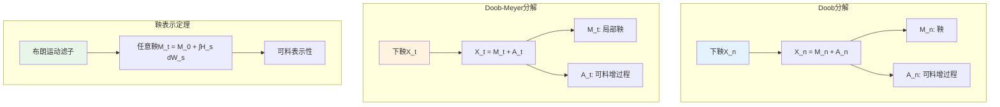

# 鞅论 - 思维导图

## 概述

鞅(Martingale)是随机过程理论的核心概念，由Paul Lévy引入，Joseph Doob系统发展。它描述的是"公平博弈"的数学抽象：给定当前信息，未来的期望收益等于当前价值。鞅论在概率论、金融数学、统计推断等领域具有基础性地位。

---

## 核心思维导图

```mermaid
mindmap
  root((鞅论<br/>Martingale Theory))
    基本定义
      滤子与信息流
        F_t递增σ-代数族
        信息逐步揭示
      适应过程
        M_t是F_t可测
      鞅定义
        E[M_t|F_s] = M_s, s≤t

        公平博弈
      上鞅/下鞅
        E[M_t|F_s] ≤ M_s 上鞅
        E[M_t|F_s] ≥ M_s 下鞅

    经典例子
      随机游走
        对称随机游走
        简单随机游走
      布朗运动
        W_t是鞅
        W_t²-t是鞅
      指数鞅
        exp(θW_t - θ²t/2)
      Doob鞅
        M_n = E[X|F_n]

    停时理论
      停时定义
        {τ≤t}∈F_t
      可选停止定理
        E[M_τ] = E[M_0]
        有界停时条件
      应用
        赌徒破产
        首中时计算
    收敛定理
      Doob上穿不等式
      鞅收敛定理
        上鞅a.s.收敛
        L^p收敛条件
      一致可积性
        L^1收敛充要条件
    不等式
      Doob极大不等式
      Doob L^p不等式
      鞅表示定理
    应用
      金融定价
        风险中性测度
        无套利定价
      随机分析
        Itô积分鞅
        Girsanov定理

```

---

## 鞅定义体系

```mermaid
graph TD
    subgraph 基本要素
        A[概率空间<br/>(Ω,F,P)] --> B[滤子{F_t}]
        B --> C[适应过程{M_t}]
    end
    
    subgraph 鞅的类型
        C --> D[鞅<br/>E[M_t|F_s]=M_s]
        C --> E[上鞅<br/>E[M_t|F_s]≤M_s<br/>超鞅/劣势]
        C --> F[下鞅<br/>E[M_t|F_s]≥M_s<br/>亚鞅/优势]

    end
    
    subgraph 例子
        D --> G[布朗运动W_t]
        D --> H[W_t²-t]
        D --> I[指数鞅]
        E --> J[上鞅: -W_t²]
        F --> K[下鞅: W_t²]
    end
    
    style D fill:#e3f2fd
    style E fill:#fff3e0
    style F fill:#e8f5e9

```

---

## 经典鞅例子

```mermaid
mindmap
  root((经典鞅例子<br/>Classical Martingales))
    离散时间鞅
      简单随机游走
        S_n = ΣX_i, X_i=±1等概率
        E[S_{n+1}|F_n] = S_n

      带漂移随机游走
        非鞅（除非漂移=0）
      条件期望鞅
        M_n = E[X|F_n]

        Doob鞅构造
      Wald鞅
        独立和的特殊构造
    连续时间鞅
      布朗运动
        W_t是鞅
        自然滤子
      布朗运动泛函
        W_t² - t是鞅
        exp(θW_t - θ²t/2)是鞅
        W_t³ - 3tW_t是鞅
      泊松过程补偿
        N_t - λt是鞅
      随机积分
        ∫H_s dW_s是鞅
    局部鞅
      定义
        存在停时列τ_n→∞
        M_{t∧τ_n}是鞅
      与鞅关系
        真局部鞅非鞅
        一致可积局部鞅是鞅

```

---

## 停时与可选停止定理

```mermaid
graph TD
    subgraph 停时定义
        A[停时τ] --> B[{τ≤t}∈F_t, ∀t]
        B --> C[首达时<br/>τ_A = inf{t: X_t∈A}]
        B --> D[首中时<br/>τ_a = inf{t: W_t=a}]
    end
    
    subgraph 可选停止定理
        E[有界停时] --> F[E[M_τ]=E[M_0]]
        G[可积条件] --> F
        H[一致可积] --> F
    end
    
    subgraph 经典应用
        F --> I[赌徒破产问题]
        F --> J[布朗运动首中时]
        I --> K[破产概率计算]
    end
    
    style A fill:#e3f2fd
    style F fill:#fff3e0

```

---

## 收敛定理体系

| 定理 | 条件 | 结论 |
|------|------|------|
| **Doob上穿不等式** | 上鞅M | $E[U_n[a,b]] \leq E[(M_n-a)^-]/(b-a)$ |
| **鞅收敛定理** | 上鞅，$\sup_n E[M_n^-] < \infty$ | $M_n$ a.s.收敛于可积极限 |
| **一致可积收敛** | 鞅一致可积 | $M_n \to M_\infty$ a.s.且$L^1$ |
| **Doob $L^p$收敛** | 鞅，$\sup_n E[|M_n|^p] < \infty$, $p>1$ | $M_n \to M_\infty$ a.s.且$L^p$ |
| **Lévy上升定理** | $M_n = E[X\mid\mathcal{F}_n]$ | $M_n \to E[X\mid\mathcal{F}_\infty]$ |
| **Lévy下降定理** | $M_n = E[X\mid\mathcal{F}_n]$, $\mathcal{F}_n\downarrow$ | $M_n \to E[X\mid\cap\mathcal{F}_n]$ |

---

## Doob不等式

```mermaid
mindmap
  root((Doob不等式<br/>Doob's Inequalities))
    极大不等式
      上鞅形式
        λP(sup_{s≤t} M_s ≥ λ) ≤ E[M_0] + E[M_t^-]
      非负下鞅
        λP(sup_{s≤t} M_s ≥ λ) ≤ E[M_t]
      证明方法
        停时技巧
        可选停止定理
    L^p不等式
      非负下鞅
        E[(sup_{s≤t} M_s)^p] ≤ (p/(p-1))^p E[M_t^p]
      最佳常数
        (p/(p-1))^p
      应用
        随机积分估计
        随机微分方程
    穿越不等式
      上穿次数
        Doob上穿不等式
      振荡控制
        变差估计

```

---

## 鞅表示与分解



---

## 金融应用：风险中性定价

```mermaid
graph LR
    subgraph 金融市场
        A[股票S_t] --> B[布朗运动驱动]
        C[债券B_t] --> D[无风险利率]
    end
    
    subgraph 鞅测度
        E[等价鞅测度Q] --> F[S_t/B_t是Q-鞅]
        G[Girsanov定理] --> E
    end
    
    subgraph 定价公式
        F --> H[V_0 = E^Q[V_T/B_T]]
        H --> I[无套利定价]
        H --> J[完全市场]
    end
    
    style E fill:#e3f2fd
    style H fill:#fff3e0

```

---

## 学习路径


---

## 关键公式速查

| 公式 | 说明 |
|------|------|
| $\mathbb{E}[M_t \mid \mathcal{F}_s] = M_s$ | 鞅定义 ($s \leq t$) |
| $\mathbb{E}[M_\tau] = \mathbb{E}[M_0]$ | 可选停止(有界停时) |
| $\mathbb{P}(\sup_{s \leq t} M_s \geq \lambda) \leq \frac{\mathbb{E}[M_t^+]}{\lambda}$ | Doob极大不等式(下鞅) |
| $\mathbb{E}[\sup_{s \leq t} M_s^p] \leq (\frac{p}{p-1})^p \mathbb{E}[M_t^p]$ | Doob $L^p$不等式 |
| $M_n = \mathbb{E}[X \mid \mathcal{F}_n]$ | Doob鞅构造 |
| $W_t^2 - t$ 是鞅 | 布朗运动泛函 |
| $e^{\theta W_t - \theta^2 t/2}$ 是鞅 | 指数鞅 |
| $M_t = M_0 + \int_0^t H_s dW_s$ | 鞅表示定理 |

---

## 与其他概念的联系

- **布朗运动**: 基本鞅例子，鞅表示的基础
- **随机积分**: Itô积分是鞅
- **Girsanov定理**: 测度变换保持鞅性质
- **金融数学**: 风险中性定价的核心
- **马尔可夫过程**: 某些函数可生成鞅
- **势论**: 调和函数与鞅的深刻联系
- **统计序贯分析**: 停时理论的应用

---

*文档版本：1.0*
*创建时间：2026年4月*
*分类：概率论 / 随机过程 / 思维导图*
*MSC分类: 60G44 (鞅), 60G46 (鞅不等式)*
