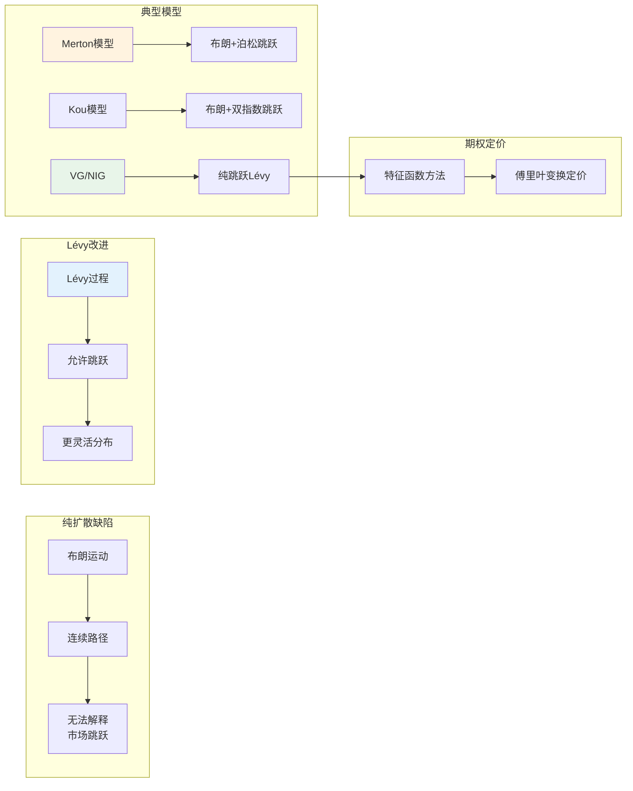
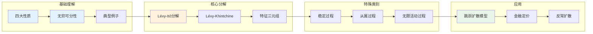

# Lévy过程 - 思维导图

## 概述

Lévy过程是以法国数学家Paul Lévy命名的随机过程，是具有平稳独立增量的随机过程类。它包含布朗运动和泊松过程作为特例，同时允许跳跃行为，是描述包含突发跳跃现象的随机系统的重要工具。在金融建模、物理、保险数学等领域有重要应用。

---

## 核心思维导图

```mermaid
mindmap
  root((Lévy过程<br/>Lévy Process))
    基本定义
      独立增量
        不相交区间独立
      平稳增量
        分布仅依赖时间差
      随机连续
        X_t → X_s in P (t→s)
      初始条件
        X_0 = 0 a.s.
    典型例子
      布朗运动
        连续Lévy过程
        唯一连续例子
      泊松过程
        纯跳跃
        单位跳跃
      复合泊松
        随机跳跃幅度
      稳定过程
        自相似性
        α-稳定分布
      从属过程
        单调增Lévy过程
    Lévy-Itô分解
      连续部分
        漂移+布朗运动
      小跳跃部分
        补偿和
      大跳跃部分
        有限个跳跃
      Lévy测度ν
        控制跳跃结构
    特征函数
      Lévy-Khintchine表示
        ψ(u) = iγu - ½σ²u² + ∫(e^{iux}-1-iux1_{|x|<1})ν(dx)
      特征三元组
        (γ, σ², ν)
    无穷可分分布
      定义
        任意n次卷积根存在
      与Lévy关系
        X_1的分布
        一一对应
    应用
      金融建模
        跳跃扩散
        波动率聚集
      保险数学
        理赔聚合
        破产理论
      物理
        反常扩散
        湍流
```

---

## Lévy过程定义与基本性质

```mermaid
graph TD
    subgraph 四大性质
        A[X_0 = 0] --> B[独立增量]
        B --> C[平稳增量<br/>X_{t+s}-X_t =^d X_s]
        C --> D[随机连续性]
    end
    
    subgraph 导出性质
        D --> E[无穷可分性]
        E --> F[X_t的分布无穷可分]
        E --> G[特征函数有Lévy-Khintchine表示]
    end
    
    subgraph 经典例子
        H[布朗运动<br/>唯一连续Lévy过程] --> I[σ²>0, ν=0]
        J[泊松过程] --> K[σ²=0, ν=δ₁]
        L[复合泊松] --> M[σ²=0, ν有限测度]
    end
    
    style B fill:#e3f2fd
    style C fill:#e3f2fd
    style H fill:#fff3e0
```

---

## Lévy-Itô分解

```mermaid
mindmap
  root((Lévy-Itô分解<br/>Lévy-Itô Decomposition))
    分解结构
      X_t = γt + σW_t + X_t^{(1)} + X_t^{(2)}
    漂移项
      γt
        确定性趋势
    布朗运动部分
      σW_t
        连续波动
        高斯成分
    小跳跃部分
      X_t^{(1)}
        补偿和
        ∫∫_{|x|<1} x(N(ds,dx)-dsν(dx))
        平方可积鞅
    大跳跃部分
      X_t^{(2)}
        ∑_{s≤t} ΔX_s 1_{|ΔX_s|≥1}
        有限个跳跃
    Lévy测度ν
      定义域
        ℝ\{0}
      可积条件
        ∫ min(1,x²)ν(dx) < ∞
      意义
        ν(A) = E[单位时间A中跳跃次数]
      结构
        小跳跃: 可能无限
        大跳跃: 总是有限
```

---

## Lévy-Khintchine表示

```mermaid
graph TD
    subgraph 特征函数
        A[φ_t(u) = E[e^{iuX_t}]] --> B[= exp(tψ(u))]
        B --> C[ψ(u): Lévy指数]
    end
    
    subgraph Lévy-Khintchine公式
        C --> D[ψ(u) = iγu - ½σ²u² + ∫(e^{iux}-1-iux1_{|x|<1})ν(dx)]
    end
    
    subgraph 特征三元组
        D --> E[γ: 漂移系数]
        D --> F[σ²: 高斯方差]
        D --> G[ν: Lévy测度]
    end
    
    subgraph 特殊情况
        H[布朗运动: (0, σ², 0)]
        I[泊松(λ): (0, 0, λδ₁)]
        J[复合泊松: (0, 0, λF)]
    end
    
    style D fill:#e3f2fd
    style E fill:#fff3e0
    style F fill:#e8f5e9
```

---

## 重要Lévy过程类别

| 过程类型 | 特征三元组 | 特点 | 应用 |
|----------|------------|------|------|
| **布朗运动** | $(0, \sigma^2, 0)$ | 唯一连续Lévy过程 | 扩散过程基础 |
| **泊松过程** | $(0, 0, \lambda\delta_1)$ | 单位跳跃 | 计数过程 |
| **复合泊松** | $(0, 0, \lambda F)$ | 随机跳跃幅度 | 聚合风险 |
| **稳定过程** | $(0, 0, \nu)$ | 自相似性: $X_{ct} =^d c^{1/\alpha}X_t$ | 重尾现象 |
| **从属过程** | $(\gamma, 0, \nu)$ | 单调递增 | 时间变换 |
| **方差Gamma** | $(0, 0, \nu)$ | 有限变差 | 金融建模 |
| **CGMY** | $(0, 0, \nu)$ | 无限活动 | 跳跃建模 |
| **NIG** | $(0, 0, \nu)$ | 正态逆高斯 | 金融收益率 |

---

## 稳定过程详解

```mermaid
mindmap
  root((稳定过程<br/>Stable Processes))
    定义
      自相似性
        X_{ct} =^d c^{1/α}X_t
        α∈(0,2]
      稳定分布
        卷积封闭性
        X+Y ~ 同类型
    α参数
      α = 2
        布朗运动
        高斯分布
      α = 1
        Cauchy分布
        对称:Cauchy过程
      α < 2
        重尾分布
        无限方差
    特征函数
      对称稳定
        φ(u) = exp(-|u|^α)
      一般稳定
        涉及偏斜参数
    应用
      金融
        厚尾收益率
      物理
        反常扩散
        Lévy飞行
```

---

## 跳跃行为与路径性质

```mermaid
graph TD
    subgraph 跳跃分类
        A[有限活动] --> B[ν(ℝ) < ∞<br/>复合泊松型]
        C[无限活动] --> D[ν(ℝ) = ∞<br/>密集跳跃]
    end
    
    subgraph 变差性质
        E[有限变差] --> F[∫|x|<1 |x|ν(dx) < ∞]
        G[无限变差] --> H[布朗运动型<br/>或密集小跳跃]
    end
    
    subgraph 连续性模
        I[无连续修正] --> J[存在跳跃]
        J --> K[Kolmogorov-Čentsov不适用]
    end
    
    style A fill:#e3f2fd
    style C fill:#fff3e0
    style E fill:#e8f5e9
```

---

## 金融应用：跳跃扩散模型



---

## 学习路径



---

## 关键公式速查

| 公式 | 说明 |
|------|------|
| $X_t = \gamma t + \sigma W_t + \int_0^t \int_{|x|<1} x \tilde{N}(ds,dx) + \int_0^t \int_{|x|\geq 1} x N(ds,dx)$ | Lévy-Itô分解 |
| $\tilde{N}(dt,dx) = N(dt,dx) - dt\nu(dx)$ | 补偿泊松随机测度 |
| $\psi(u) = i\gamma u - \frac{1}{2}\sigma^2 u^2 + \int_{\mathbb{R}}(e^{iux}-1-iux1_{\{|x|<1\}})\nu(dx)$ | Lévy-Khintchine |
| $\int_{\mathbb{R}} \min(1, x^2) \nu(dx) < \infty$ | Lévy测度可积条件 |
| $\varphi_t(u) = \exp(t\psi(u))$ | 特征函数 |
| $X_{ct} \stackrel{d}{=} c^{1/\alpha} X_t$ | α-稳定自相似性 |
| $\nu(A) = \mathbb{E}[N(1,A)]$ | Lévy测度定义 |

---

## 与其他概念的联系

- **布朗运动**: 唯一连续的Lévy过程
- **泊松过程**: 基本跳跃Lévy过程
- **无穷可分分布**: Lévy过程与之一一对应
- **半鞅**: 所有Lévy过程都是半鞅
- **随机测度**: 泊松随机测度刻画跳跃
- **金融数学**: 跳跃扩散模型的基础
- **统计物理**: 反常扩散、Lévy飞行

---

*文档版本：1.0*
*创建时间：2026年4月*
*分类：概率论 / 随机过程 / 思维导图*
*MSC分类: 60G51 (Lévy过程)*
