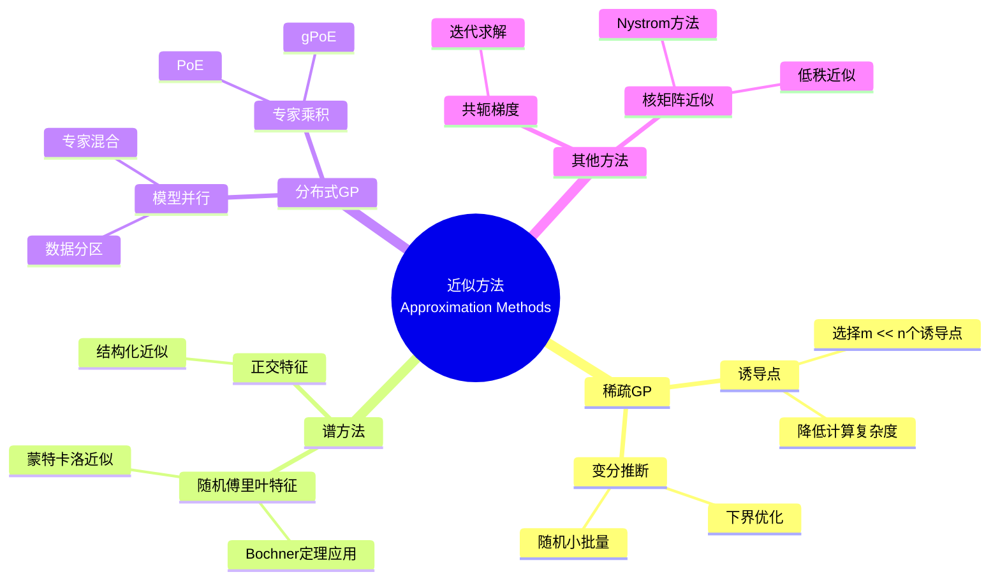

# 高斯过程 - 思维导图

## 概述

高斯过程(Gaussian Process)是所有有限维分布都是多元高斯分布的随机过程。它完全由均值函数和协方差函数刻画，具有优美的数学性质和计算可处理性。在统计学习(高斯过程回归/分类)、空间统计、时序分析、物理等领域有广泛应用。

---

## 核心思维导图

```mermaid
mindmap
  root((高斯过程<br/>Gaussian Process))
    基本定义
      有限维分布
        任意有限点集上联合高斯
      完全刻画
        均值函数 μ(t)
        协方差函数 k(s,t)
      记号
        f ~ GP(μ, k)
    协方差函数
      性质
        对称性 k(s,t)=k(t,s)
        正定性
      常见核函数
        RBF/SE核
        Matérn核
        多项式核
        周期核
      谱表示
        Bochner定理
        谱密度与核关系
    经典例子
      布朗运动
        μ=0, k(s,t)=min(s,t)
      布朗桥
        μ=0, k(s,t)=min(s,t)-st
      Ornstein-Uhlenbeck
        指数协方差
      高斯随机场
        空间高斯过程
    条件分布
      联合高斯条件
        仍是高斯
      更新公式
        均值与方差更新
      预测分布
        回归核心
    统计学习应用
      高斯过程回归
        贝叶斯非参数
        不确定性量化
      分类
        拉普拉斯近似
        期望传播
      超参数优化
        代理模型
    采样与模拟
      谱方法
        傅里叶特征
      有限维近似
        诱导点方法
        稀疏近似

```

---

## 高斯过程定义与刻画

```mermaid
graph TD
    subgraph 定义
        A[任意有限点集<br/>t₁,...,tₙ] --> B[(X_{t₁},...,X_{tₙ}) ~ 多元高斯]
    end
    
    subgraph 完全刻画
        C[均值函数<br/>μ(t) = E[X_t]] --> D[协方差函数<br/>k(s,t) = Cov(X_s, X_t)]
    end
    
    subgraph 有限维分布
        D --> E[X ~ N(μ, K)]
        E --> F[μ = (μ(t₁),...,μ(tₙ))']
        E --> G[K_{ij} = k(t_i, t_j)]
    end
    
    style B fill:#e3f2fd
    style C fill:#fff3e0
    style D fill:#e8f5e9

```

---

## 协方差函数(核函数)

```mermaid
mindmap
  root((协方差函数<br/>Kernel Functions))
    基本性质
      对称性
        k(s,t) = k(t,s)
      正定性
        ∀n, ∀t_i, ∀a_i
        Σa_i a_j k(t_i,t_j) ≥ 0
      Mercer定理
        特征函数展开
    常用核函数
      RBF/SE核
        k(s,t) = σ² exp(-||s-t||²/2ℓ²)

        无限可微
        平滑假设
      Matérn核
        有限阶可微
        灵活性更高
        ν=1/2: 指数核
        ν→∞: SE核
      多项式核
        k(s,t) = (s·t + c)^d
        全局相关性
      周期核
        建模周期性
        季节效应
    谱理论
      Bochner定理
        平稳核↔谱密度
        傅里叶变换对
      谱密度
        S(ω) = ∫k(τ)e^{-iωτ}dτ

```

---

## 经典高斯过程

```mermaid
graph TD
    subgraph 布朗运动
        A[μ(t) = 0] --> B[k(s,t) = min(s,t)]
        B --> C[非平稳]
        B --> D[独立增量]
    end
    
    subgraph 布朗桥
        E[μ(t) = 0] --> F[k(s,t) = min(s,t) - st]
        F --> G[B_0 = B_1 = 0]
        F --> H[条件布朗运动]
    end
    
    subgraph Ornstein-Uhlenbeck
        I[μ(t) = 0] --> J[k(s,t) = exp(-|s-t|/ℓ)]

        J --> K[马尔可夫性]
        J --> L[均值回归]
    end
    
    subgraph 平稳高斯过程
        M[μ(t) = μ] --> N[k(s,t) = k(|s-t|)]

        N --> O[仅依赖时间差]
    end
    
    style B fill:#e3f2fd
    style F fill:#fff3e0
    style J fill:#e8f5e9

```

---

## 条件分布与预测

```mermaid
graph TD
    subgraph 联合分布
        A[[f_X, f_Y]] --> B[~ N([μ_X, μ_Y], [K_XX, K_XY; K_YX, K_YY])]
    end
    
    subgraph 条件分布
        C[f_X | f_Y = y] --> D[~ N(μ_{X|Y}, Σ_{X|Y})]
        D --> E[μ_{X|Y} = μ_X + K_{XY}K_{YY}^{-1}(y-μ_Y)]
        D --> F[Σ_{X|Y} = K_{XX} - K_{XY}K_{YY}^{-1}K_{YX}]

    end
    
    subgraph GP回归
        G[观测数据D=(X,y)] --> H[预测: p(f_*|X,y,X_*)]

        H --> I[均值: 点预测]
        H --> J[方差: 不确定性]
    end
    
    style B fill:#e3f2fd
    style D fill:#fff3e0
    style H fill:#e8f5e9

```

---

## 常见协方差函数对比

| 核函数 | 公式 | 特点 | 参数 |
|--------|------|------|------|
| **RBF/SE** | $\sigma^2 \exp(-\frac{\|s-t\|^2}{2\ell^2})$ | 无限可微，非常平滑 | 长度尺度$\ell$，方差$\sigma^2$ |
| **Matérn 3/2** | $\sigma^2(1+\frac{\sqrt{3}r}{\ell})\exp(-\frac{\sqrt{3}r}{\ell})$ | 一阶可微 | 长度尺度$\ell$ |
| **Matérn 5/2** | $\sigma^2(1+\frac{\sqrt{5}r}{\ell}+\frac{5r^2}{3\ell^2})\exp(-\frac{\sqrt{5}r}{\ell})$ | 二阶可微 | 长度尺度$\ell$ |
| **指数** | $\sigma^2 \exp(-\frac{r}{\ell})$ | Ornstein-Uhlenbeck，粗糙 | 长度尺度$\ell$ |
| **周期** | $\sigma^2 \exp(-\frac{2\sin^2(\pi r/p)}{\ell^2})$ | 捕捉周期性 | 周期$p$，长度尺度$\ell$ |
| **线性** | $\sigma_b^2 + \sigma_v^2(s-c)(t-c)$ | 贝叶斯线性回归 | 偏置$\sigma_b$，方差$\sigma_v$ |
| **有理二次** | $\sigma^2(1+\frac{r^2}{2\alpha\ell^2})^{-\alpha}$ | SE的混合，多尺度 | $\alpha$控制混合 |

---

## 高斯过程回归

```mermaid
mindmap
  root((GP回归<br/>Gaussian Process Regression))
    模型设定
      先验
        f ~ GP(0, k)
      似然
        y = f(x) + ε, ε ~ N(0, σ²)
      后验
        f|X,y ~ GP

    预测
      后验均值
        k_*^T(K+σ²I)^{-1}y
        线性组合核函数
      后验方差
        k(x_*,x_*) - k_*^T(K+σ²I)^{-1}k_*
        不确定性量化
    优势
      概率预测
        全分布输出
      不确定性量化
        预测方差
      非参数灵活
        复杂度自适应
    计算挑战
      复杂度
        O(n³)求逆
        O(n²)存储
      近似方法
        稀疏GP
        诱导点方法
        随机变分推断

```

---

## 超参数学习

```mermaid
graph TD
    subgraph 边际似然
        A[log p(y|X,θ)] --> B[-½y^T K_θ^{-1} y - ½log|K_θ| - n/2 log(2π)]

        B --> C[模型选择准则]
    end
    
    subgraph 优化
        C --> D[梯度下降]
        D --> E[∂logp/∂θ]
        E --> F[自动微分]
    end
    
    subgraph 贝叶斯处理
        G[p(θ|X,y)] --> H[MCMC采样]

        H --> I[模型平均]
    end
    
    style B fill:#e3f2fd
    style C fill:#fff3e0

```

---

## 近似方法



---

## 学习路径


---

## 关键公式速查

| 公式 | 说明 |
|------|------|
| $f \sim \mathcal{GP}(\mu, k)$ | GP记号 |
| $\mu(t) = \mathbb{E}[f(t)]$ | 均值函数 |
| $k(s,t) = \text{Cov}(f(s), f(t))$ | 协方差函数 |
| $k_{RBF}(s,t) = \sigma^2 \exp(-\frac{\|s-t\|^2}{2\ell^2})$ | RBF核 |
| $\mathbb{E}[f_*|X,y,X_*] = k_*^T(K+\sigma^2 I)^{-1}y$ | GP预测均值 |
| $\text{Cov}(f_*|X,y,X_*) = k(X_*,X_*) - k_*^T(K+\sigma^2 I)^{-1}k_*$ | GP预测协方差 |
| $\log p(y|X,\theta) = -\frac{1}{2}y^T K_\theta^{-1} y - \frac{1}{2}\log|K_\theta| - \frac{n}{2}\log(2\pi)$ | 边际似然 |
| $k(s,t) = \int S(\omega)e^{i\omega(s-t)}d\omega$ | Bochner定理(平稳核) |

---

## 与其他概念的联系

- **多元高斯分布**: GP是无限维的高斯分布
- **再生核希尔伯特空间**: GP样本几乎必然在RKHS外
- **贝叶斯统计**: GP是贝叶斯非参数方法
- **核方法**: SVM与GP的对偶性
- **样条回归**: GP与样条的等价性
- **布朗运动**: 特定协方差函数的GP
- **随机微分方程**: GP可作为SDE的解
- **机器学习**: GP回归、分类、贝叶斯优化

---

*文档版本：1.0*
*创建时间：2026年4月*
*分类：概率论 / 随机过程 / 思维导图*
*MSC分类: 60G15 (高斯过程)*
