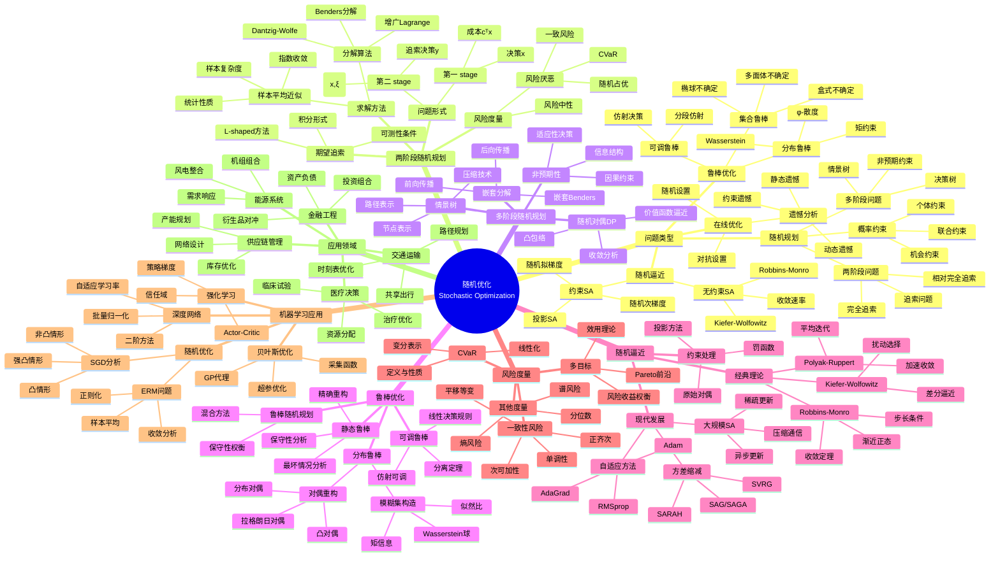

# 随机优化思维导图

## 概述

随机优化研究包含不确定性的优化问题，在机器学习、金融工程、运营管理等领域有广泛应用。它涵盖随机规划、随机逼近、鲁棒优化等方法，处理数据噪声、模型不确定性和环境随机性。

## 核心概念详解

### 1. 两阶段随机规划

**标准形式**：
$$\min_{x} c^T x + \mathbb{E}_\xi[Q(x, \xi)]$$

其中追索函数：
$$Q(x, \xi) = \min_y \{q(\xi)^T y : Wy = h(\xi) - T(\xi)x, \; y \geq 0\}$$

**样本平均近似（SAA）**：
$$\min_{x} c^T x + \frac{1}{N}\sum_{i=1}^N Q(x, \xi_i)$$

**收敛性**：在适当条件下，SAA解以指数速率收敛到真实解

### 2. 条件风险价值（CVaR）

**定义**：
$$\text{CVaR}_\alpha(Z) = \inf_{t} \{t + \frac{1}{1-\alpha}\mathbb{E}[(Z-t)_+]\}$$

**等价表示**：
$$\text{CVaR}_\alpha(Z) = \mathbb{E}[Z | Z \geq \text{VaR}_\alpha(Z)]$$

**优化重构**：
$$\min_{x} \text{CVaR}_\alpha(f(x,\xi)) = \min_{x,t} t + \frac{1}{(1-\alpha)N}\sum_{i=1}^N (f(x,\xi_i) - t)_+$$

### 3. 随机逼近收敛

**Robbins-Monro算法**：
$$x_{k+1} = x_k - \gamma_k \hat{g}_k$$

其中 $\hat{g}_k$ 是 $g(x_k)$ 的无偏估计

**收敛条件**：
- 步长：$\sum \gamma_k = \infty$, $\sum \gamma_k^2 < \infty$
- 增长：$\|g(x)\|^2 \leq a + b\|x\|^2$

**收敛速率**（强凸情形）：
$$\mathbb{E}[\|x_k - x^*\|^2] = O(1/k)$$

### 4. 分布鲁棒优化

**一般形式**：
$$\min_x \sup_{P \in \mathcal{P}} \mathbb{E}_P[f(x, \xi)]$$

**Wasserstein模糊集**：
$$\mathcal{P} = \{P : W_c(P, P_N) \leq \epsilon\}$$

其中 $W_c$ 是以成本 $c$ 为基础的Wasserstein距离

**对偶重构**（凸 $f$）：
$$\min_{x,\lambda,s_i} \lambda\epsilon + \frac{1}{N}\sum_{i=1}^N s_i$$
$$\text{s.t. } s_i \geq f(x,\xi_i) - \lambda c(\xi_i, \xi), \; \forall \xi$$

## 相关主题

- [动态规划](./dynamic-programming.md)
- [凸优化](./convex-optimization.md)
- [应用数学思维导图索引](./00-应用数学思维导图索引.md)

## 参考资源

- Birge & Louveaux: "Introduction to Stochastic Programming"
- Shapiro et al.: "Lectures on Stochastic Programming"
- Ben-Tal et al.: "Robust Optimization"
- Kushner & Yin: "Stochastic Approximation Algorithms"
