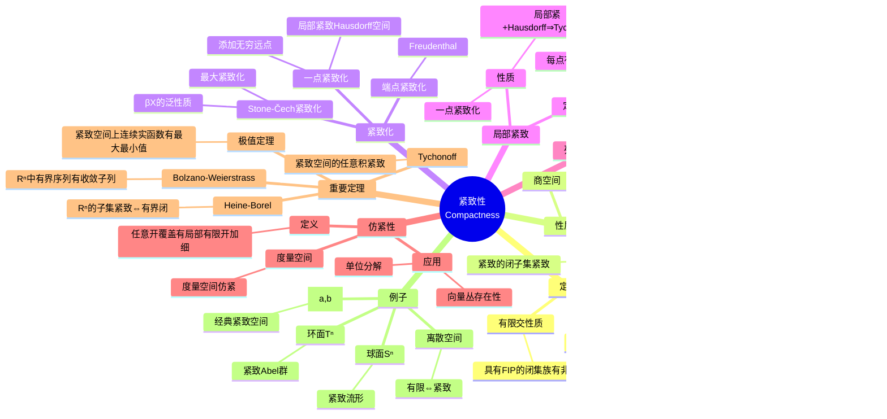

msc_primary: "00A99"
msc_secondary: ['00-XX']
---

# 紧致性思维导图

## 概述
紧致性是拓扑学中最重要的性质之一，它将有限集的性质推广到无穷情形，保证了极值存在性和收敛子列的存在。

## 思维导图



## 紧致性类型关系

```

紧致 ⇒ 可数紧致 ⇒ 极限点紧致
    ↓
仿紧致（Hausdorff空间）

度量空间中：紧致 ⇔ 序列紧致 ⇔ 可数紧致

```

## 核心定理

| 定理 | 内容 | 应用 |
|------|------|------|
| **Heine-Borel** | ℝⁿ中有界闭⇔紧致 | 极值存在性 |
| **Tychonoff** | 积空间紧致性 | 泛函分析 |
| **极值定理** | 连续函数在紧致集上达极值 | 优化理论 |

## 关联概念
- [拓扑空间](./topology-topological-space.md)
- [连续映射](./topology-continuous-map.md)
- [分离公理](./topology-separation-axioms.md)
