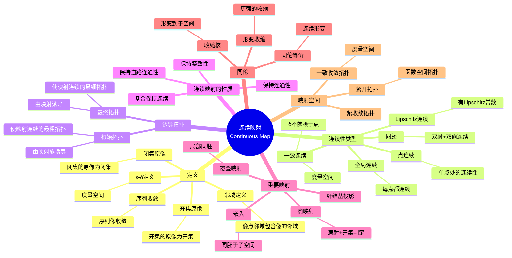

# 连续映射思维导图

## 概述
连续映射是拓扑学中保持拓扑结构的映射，是研究拓扑空间之间关系的核心工具。

## 思维导图

## 核心要点

| 连续性类型 | 条件 | 关系 |
|-----------|------|------|
| **连续** | 开集原像为开集 | 最一般 |
| **一致连续** | ∀ε>0, ∃δ>0 | 强于连续 |
| **Lipschitz** | d(f(x),f(y))≤Ld(x,y) | 强于一致连续 |
| **同胚** | 双射+双向连续 | 拓扑等价 |

## 连续性等价条件

对于映射 $f: X \to Y$，以下等价：
1. $f$ 连续
2. 任意开集 $V \subset Y$，$f^{-1}(V)$ 开
3. 任意闭集 $F \subset Y$，$f^{-1}(F)$ 闭
4. 任意 $A \subset X$，$f(\bar{A}) \subset \overline{f(A)}$

## 关联概念
- [拓扑空间](./topology-topological-space.md)
- [同伦论](./algebraic-homotopy.md)
- [纤维丛](./algebraic-fiber-bundle.md)
