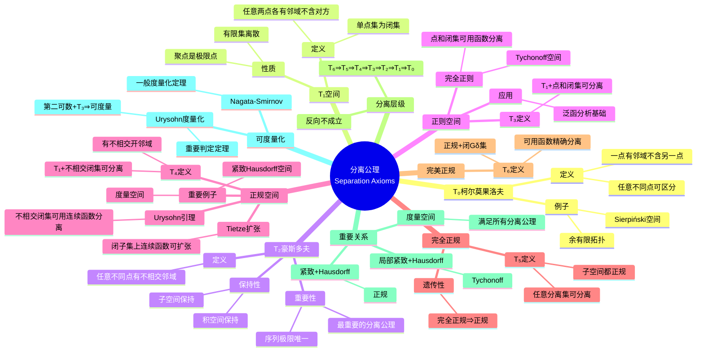

msc_primary: "00A99"
msc_secondary: ['00-XX']
---

# 分离公理思维导图

## 概述
分离公理（Tychonoff分离公理）是一系列用于区分拓扑空间中点和集合的公理，从T₀到T₆刻画了空间"分离"的不同程度。

## 思维导图



## 分离公理层级

```

T₆(完美正规) ⇒ T₅(完全正规) ⇒ T₄(正规) ⇒ T₃(正则) 
    ⇒ T₂(豪斯多夫) ⇒ T₁ ⇒ T₀

```

## 核心定理

| 定理 | 条件 | 结论 |
|------|------|------|
| **Urysohn引理** | 正规空间 | 不相交闭集可用连续函数分离 |
| **Tietze扩张** | 正规空间+闭子集 | 连续函数可连续扩张到全空间 |
| **Urysohn度量化** | 第二可数+T₃ | 空间可度量化 |

## 典型空间的分离性

| 空间 | 最高分离公理 |
|------|-------------|
| 度量空间 | T₆ |
| 紧致Hausdorff | T₄ |
| ℝⁿ | T₆ |
| 余有限拓扑 | T₁ |
| Zariski拓扑 | T₁ |

## 关联概念
- [拓扑空间](./topology-topological-space.md)
- [紧致性](./topology-compactness.md)
- [连续映射](./topology-continuous-map.md)
