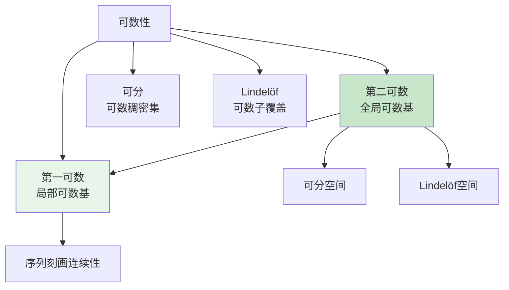
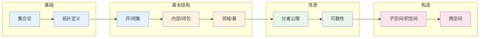

# 拓扑空间思维导图

## 概述

拓扑空间是拓扑学的基本概念，它抽象地描述了"连续性"和"邻近性"的数学结构。通过开集公理，拓扑空间为研究连续性、收敛性和连通性提供了最一般的框架。

---

## 核心思维导图

```mermaid
mindmap
  root((拓扑空间<br/>Topological Space))
    基本概念
      拓扑定义
        开集族
        三公理
          ∅和X开
          有限交开
          任意并开
      闭集
        补集为开集
        对偶性质
      邻域
        含开集的集合
        邻域系
      内部与闭包
        int(A): 最大开子集
        cl(A): 最小闭超集
        边界∂A
    拓扑构造
      度量诱导
        度量开球
        度量拓扑
      子空间拓扑
        相对拓扑
        诱导拓扑
      积拓扑
        乘积空间
        投影连续
      商拓扑
        商空间
        粘合
    分离公理
      T₀: Kolmogorov
      T₁: Fréchet
      T₂: Hausdorff
      T₃: 正则
      T₄: 正规
    可数性
      第一可数
        可数局部基
      第二可数
        可数拓扑基
      可分性
        可数稠密子集
      Lindelöf
        可数子覆盖
    重要例子
      离散拓扑
      平凡拓扑
      余有限拓扑
      实数标准拓扑
      Zariski拓扑
```

---

## 拓扑公理体系

```mermaid
graph TD
    subgraph 拓扑定义
        A[拓扑τ ⊂ P(X)] --> B[∅ ∈ τ]
        A --> C[X ∈ τ]
        A --> D[有限交封闭]
        A --> E[任意并封闭]
    end
    
    subgraph 闭集性质
        F[闭集族] --> G[∅, X 闭]
        F --> H[有限并封闭]
        F --> I[任意交封闭]
    end
    
    subgraph 邻域结构
        J[邻域系N(x)] --> K[x ∈ U ⊂ N]
        K --> L[N ∈ τ]
    end
    
    B --> G
```

---

## 分离公理层次

```mermaid
graph BT
    A[T₀] <-- B[T₁]
    B <-- C[T₂: Hausdorff]
    C <-- D[T₂½: 完全Hausdorff]
    D <-- E[T₃: 正则]
    E <-- F[T₃½: Tychonoff]
    F <-- G[T₄: 正规]
    G <-- H[T₅: 完全正规]
    H <-- I[T₆: 完美正规]
    
    style C fill:#e8f5e9
    style E fill:#fff3e0
    style G fill:#fce4ec
```

### 分离公理定义

| 公理 | 条件 | 含义 |
|------|------|------|
| **T₀** | ∀x≠y, ∃开集含其一不含另一 | 可区分 |
| **T₁** | ∀x≠y, 各存在不含对方的开邻域 | 点闭 |
| **T₂** | ∀x≠y, 存在不相交开邻域 | Hausdorff |
| **T₃** | T₁ + 点与闭集可分离 | 正则 |
| **T₄** | T₁ + 闭集可分离 | 正规 |

---

## 内部、闭包与边界

```mermaid
graph LR
    subgraph 集合运算
        A[A ⊂ X] --> B[内部 int(A)]
        A --> C[闭包 cl(A)]
        A --> D[边界 ∂A]
    end
    
    B --> E[最大开子集]
    C --> F[最小闭超集]
    D --> G[cl(A) \ int(A)]
    
    H[int(A) ⊂ A ⊂ cl(A)]
    
    style B fill:#e3f2fd
    style C fill:#fff3e0
    style D fill:#e8f5e9
```

### 运算公式

| 运算 | 定义 | 性质 |
|------|------|------|
| **内部** | $\text{int}(A) = \bigcup\{U \subset A : U \text{开}\}$ | $\text{int}(A)^c = \text{cl}(A^c)$ |
| **闭包** | $\text{cl}(A) = \bigcap\{F \supset A : F \text{闭}\}$ | $\text{cl}(A) = A \cup A'$ |
| **边界** | $\partial A = \text{cl}(A) \setminus \text{int}(A)$ | $\partial A = \partial A^c$ |
| **导集** | $A' = \{x : \forall U(x), (U \setminus \{x\}) \cap A \neq \emptyset\}$ | 极限点集 |

---

## 拓扑构造方法

```mermaid
graph TD
    subgraph 构造方法
        A[度量空间] --> B[度量拓扑]
        
        C[子空间] --> D[子空间拓扑<br/>τ_Y = {U∩Y : U∈τ}]
        
        E[乘积空间] --> F[积拓扑<br/>箱拓扑更细]
        
        G[等价关系] --> H[商拓扑<br/>强拓扑使投影连续]
    end
    
    I[基与子基] --> J[生成拓扑]
    J --> K[最小拓扑包含子基]
```

---

## 可数性公理



---

## 重要拓扑例子

| 空间 | 拓扑 | 性质 |
|------|------|------|
| **离散拓扑** | 所有子集开 | T₆，所有映射连续 |
| **平凡拓扑** | 只有∅和X开 | T₀当|X|≤1，退化 |
| **余有限拓扑** | 有限集补集开 | T₁非T₂，紧致 |
| **标准实拓扑** | 开区间生成 | T₆，第二可数，可分 |
| **Zariski拓扑** | 代数集闭 | T₁，紧，代数几何用 |
| **Sorgenfrey线** | [a,b)为基 | 第一可数，Lindelöf，非第二可数 |

---

## 学习路径



---

## 与其他概念的联系

- **分析学**: 连续性的抽象框架
- **度量几何**: 度量诱导的拓扑
- **代数几何**: Zariski拓扑
- **泛函分析**: 弱拓扑、算子拓扑
- **动力系统**: 轨道闭包、吸引子

---

## 参考

- 《拓扑学》Munkres
- 《点集拓扑学》熊金城
- 《General Topology》Kelley

---

*文档版本：1.1（质量提升版）*
*最后更新：2026年4月*
*分类：拓扑学 / 点集拓扑 / 思维导图*
