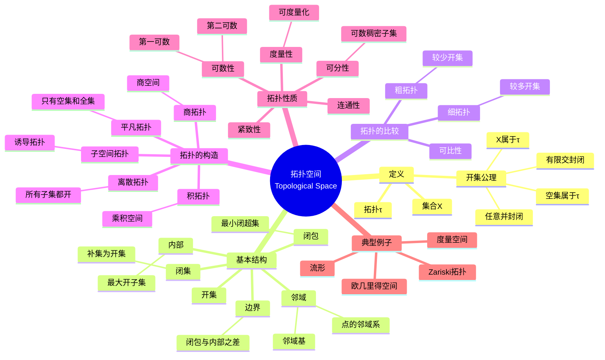

# 拓扑空间思维导图

## 概述
拓扑空间是拓扑学的基础概念，为连续性、邻域和收敛提供了抽象框架。

## 思维导图

## 核心要点

| 概念 | 说明 |
|------|------|
| **开集** | 拓扑的基本构件，刻画"接近"的概念 |
| **邻域** | 描述点周围的局部结构 |
| **闭包** | 点集所有极限点的集合 |
| **内部** | 点集所有内点的集合 |

## 重要定理

1. **Urysohn引理**：正规空间中不相交闭集可用连续函数分离
2. **Tychonoff定理**：紧致空间的乘积仍紧致
3. **度量化定理**：第二可数+正则⇔可度量化（Urysohn）

## 关联概念
- [连续映射](./topology-continuous-map.md)
- [连通性](./topology-connectedness.md)
- [紧致性](./topology-compactness.md)
- [分离公理](./topology-separation-axioms.md)
