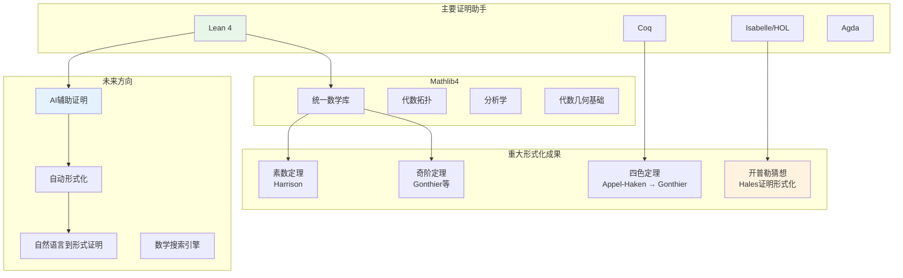
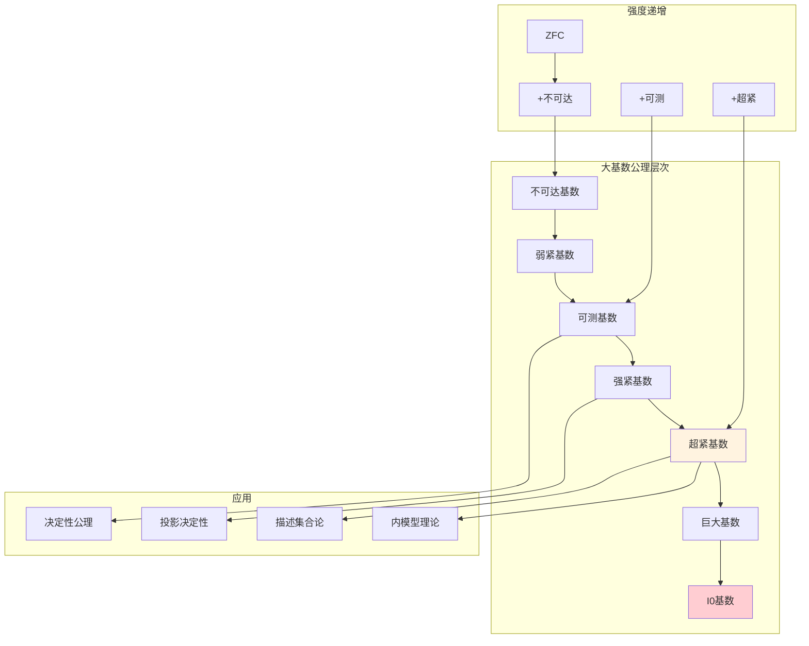
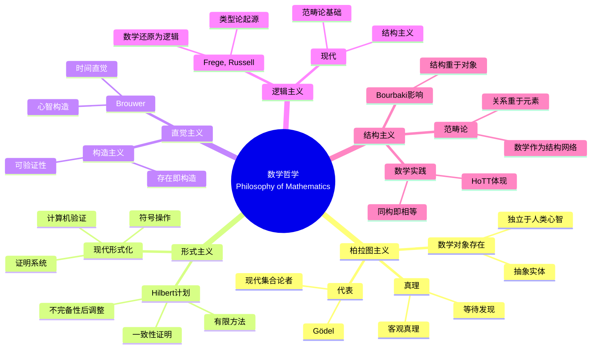
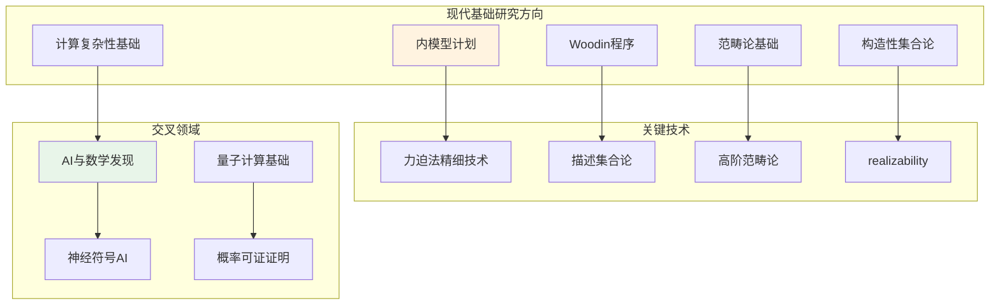
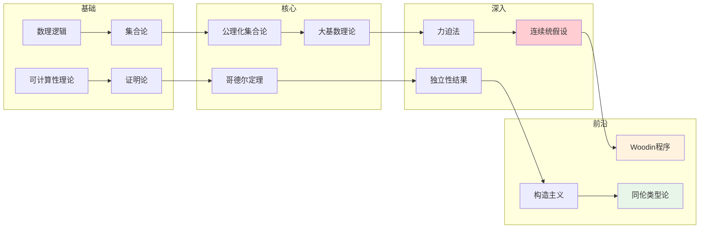

# 数学基础问题 - 思维导图

## 概述

数学基础问题探讨的是数学的本体论、认识论和方法论基础，涉及数学真理的本质、数学对象的存在性、以及数学推理的可靠性等根本性问题。从古希腊的悖论到现代的公理化运动，再到哥德尔不完备性定理带来的震撼，数学基础问题始终是数学哲学的核心议题。包括连续统假设、大基数公理、构造主义vs经典数学之争、以及自动定理证明与形式化数学等现代问题。

---

## 核心思维导图

```mermaid
mindmap
  root((数学基础问题<br/>Foundations of Mathematics))
    连续统假设
      CH
        2^{ℵ₀} = ℵ₁
        不存在中间基数
      独立性
        Gödel(1940)
          CH与ZFC一致
        Cohen(1963)
          ¬CH与ZFC一致
        现代地位
          需新公理解决?
      大基数
        决定性公理
        Woodin程序
        内模型计划
    哥德尔不完备性
      第一不完备性
        足够强的形式系统
        存在不可判定命题
      第二不完备性
        一致性不可证
      影响
        Hilbert计划破产
        数学局限性认知
        计算机科学联系
    公理化集合论
      ZFC
        Zermelo-Fraenkel
        选择公理AC
      替代方案
        NF, MK
        无AC的ZF
        构造性集合论
      大基数公理
        可测基数
        超紧基数
        决定公理
    构造主义
      直觉主义
        Brouwer
        排中律拒绝
        选择序列
      构造性数学
        Bishop学派
        可计算分析
        实现语义
      同伦类型论
        新时代构造主义
        统一理论
        计算机证明助手
    形式化验证
      定理证明器
        Coq, Lean, Isabelle
        完全形式化
        机器可验证
      应用
        四色定理
        开普勒猜想
        编译器验证
      未来
        AI辅助证明
        数学图书馆
```

---

## 连续统假设及其独立性

```mermaid
graph TD
    subgraph 连续统假设
        CH[2^{ℵ₀} = ℵ₁]
    end

    subgraph 历史背景
        H1[Cantor(1878)提出]
        H2[Hilbert第一问题(1900)]
        H3[普遍认为可判定]
    end

    subgraph 独立性证明
        I1[Gödel(1940)<br/>可构成宇宙L<br/>CH在ZFC中不可否证]
        I2[Cohen(1963)<br/>力迫法<br/>¬CH与ZFC一致]
    end

    subgraph 现代观点
        M1[CH是独立的]
        M2[需要新公理?]
        M3[Woodin程序]
        M4[内模型计划]
    end

    CH --> H1
    CH --> I1
    CH --> I2

    I1 --> M1
    I2 --> M1
    M1 --> M2
    M2 --> M3
    M2 --> M4

    style CH fill:#ffcdd2
    style M1 fill:#fff3e0
```

---

## 哥德尔不完备性定理

```mermaid
mindmap
  root((哥德尔不完备性<br/>Incompleteness Theorems))
    第一不完备性定理
      陈述
        任何足够强的一致形式系统
        存在不可判定命题
      关键概念
        Gödel编码
          语法算术化
          自指构造
        对角线方法
          康托尔技巧
          可计算性应用
      意义
        Hilbert计划破产
          完备性不可达
          有限一致性证明不可能
        数学不能完备公理化
    第二不完备性定理
      陈述
        一致性的不可证明性
        Con(T)在T中不可证
      含义
        数学基础限制
        元数学层次
      应用
        安全性证明局限
        程序验证理论
    现代影响
      计算机科学
        停机问题
        可计算性理论
        复杂性理论
      人工智能
        机器学习的极限
        自动证明的边界
      哲学
        数学真理vs可证性
        柏拉图主义vs形式主义
```

---

## 构造主义数学流派

```mermaid
graph TD
    subgraph 构造主义流派
        C1[Brouwer直觉主义]
        C2[Bishop构造性分析]
        C3[Martin-Löf类型论]
        C4[同伦类型论]
    end

    subgraph 核心特征
        F1[拒绝排中律<br/>∀P, P∨¬P 不总成立]
        F2[存在即构造<br/>∃x.P(x) 需要给出x]
        F3[无穷作为过程<br/>而非完成整体]
    end

    subgraph Brouwer直觉主义
        B1[选择序列]
        B2[连续性原理]
        B3[扇定理]
    end

    subplot Bishop学派
        S1[经典定理的构造性重建]
        S2[可计算分析]
        S3[近似方法]
    end

    subgraph 类型论发展
        T1[Curry-Howard对应]
        T2[程序即证明]
        T3[构造性逻辑]
    end

    C1 --> B1
    C2 --> S1
    C3 --> T1

    B1 --> F1
    S1 --> F2
    T1 --> F3

    C4 --> T1
    C4 --> F1

    style C4 fill:#e8f5e9
    style F1 fill:#fff3e0
```

---

## 同伦类型论(HoTT)

```mermaid
mindmap
  root((同伦类型论<br/>Homotopy Type Theory))
    核心理念
      统一理论
        类型论 = 逻辑
        同伦论 = 相等的空间结构
        高维范畴论
      路径作为相等
        a = b 是类型
        元素是路径 p: a = b
        路径之间的路径...
    单值公理
      UA
        等价诱导相等
        (A ≃ B) → (A = B)
        结构保持
      影响
        同构传递
        数学实践形式化
        范畴论语义
    高阶归纳类型
      HIT
        自由生成相等
        商类型
        圆、球等空间
      应用
        代数拓扑构造
        同伦群计算
        几何实现
    构造性集合论
      集合与类型
        集合作为0-类型
        命题作为(-1)-类型
        层次结构
      与经典数学关系
        兼容但更丰富
        构造性证明提取
    计算机实现
      Coq, Agda, Lean
        形式化验证
        证明助手
      数学图书馆
        形式化数学项目
        合作证明环境
```

---

## 形式化数学与证明助手



---

## 大基数公理层次



---

## 数学哲学立场



---

## 重要定理与结果

| 定理 | 年份 | 人物 | 意义 |
|------|------|------|------|
| **哥德尔完备性** | 1929 | Gödel | 一阶逻辑的完备性 |
| **哥德尔不完备性** | 1931 | Gödel | 数学的固有局限 |
| **Church-Turing论题** | 1936 | Church, Turing | 可计算性形式化 |
| **Cohen力迫法** | 1963 | Cohen | 独立性证明方法 |
| **Martin决定性** | 1975 | Martin | 大基数与决定性 |
| **四色定理证明** | 1976/2005 | Appel-Haken/Gonthier | 计算机辅助证明 |

---

## 现代研究方向



---

## 与其他数学领域的联系

- **数理逻辑**: 公理系统、证明论、模型论、可计算性理论
- **集合论**: 大基数、力迫法、描述集合论
- **范畴论**: Topos理论、数学结构的统一视角
- **计算机科学**: 类型论、程序语义、形式验证
- **物理学**: 量子力学基础、量子引力中的数学
- **认知科学**: 数学认知、数学心理学

---

## 学习路径



---

*文档版本：1.0*
*创建时间：2026年4月*
*分类：数学基础 / 数理逻辑 / 数学哲学 / 思维导图*
