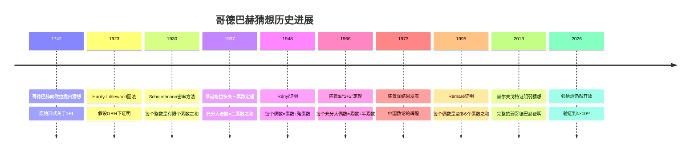
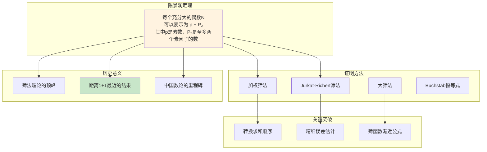
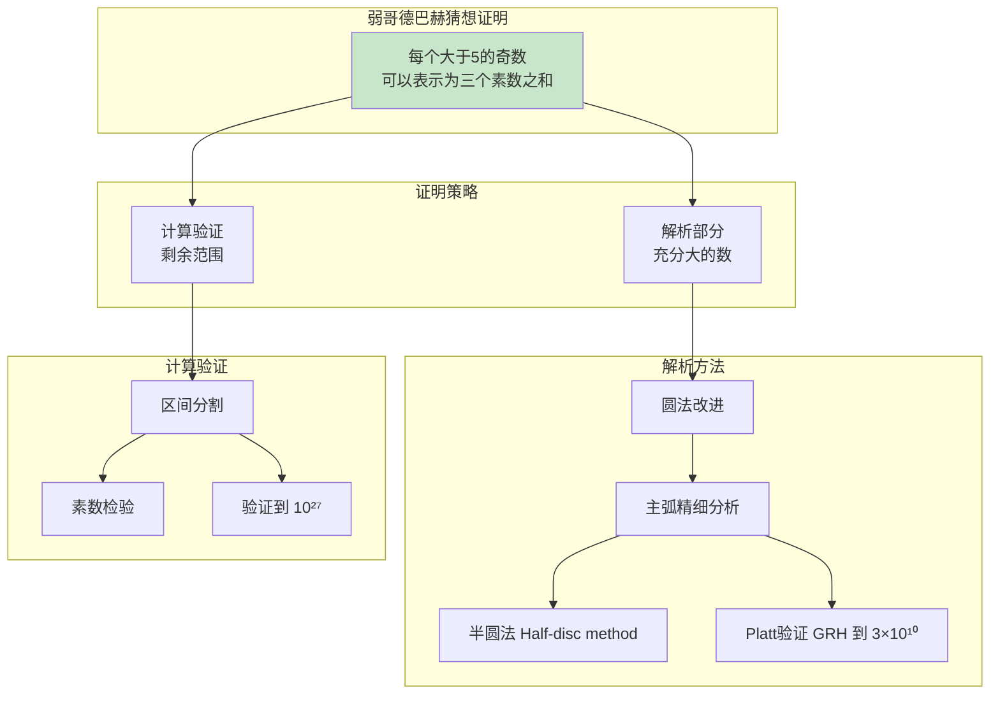
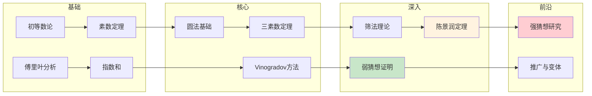

# 哥德巴赫猜想 - 思维导图

## 概述

哥德巴赫猜想(Goldbach Conjecture)是数论中最著名、最古老的未解决问题之一，由普鲁士数学家克里斯蒂安·哥德巴赫于1742年在一封写给莱昂哈德·欧拉的信中提出。猜想包含两个相关陈述：强哥德巴赫猜想（每个大于2的偶数都可表示为两个素数之和）和弱哥德巴赫猜想（每个大于5的奇数都可表示为三个素数之和）。弱猜想已于2013年由哈拉尔德·赫尔夫戈特证明，但强猜想至今仍未解决，已被验证到非常大的数值范围。

---

## 核心思维导图

```mermaid
mindmap
  root((哥德巴赫猜想<br/>Goldbach Conjecture))
    强哥德巴赫猜想
      陈述
        每个偶数 n>2
        n = p₁ + p₂
        p₁, p₂ 为素数
      例子
        4 = 2+2
        6 = 3+3
        8 = 3+5
        10 = 3+7 = 5+5
      验证状态
        验证到 ~4×10¹⁸
        分布式计算项目
      表示数量
        随n增大而增加
        G(n) ~ C·n/(ln n)²
    弱哥德巴赫猜想
      陈述
        每个奇数 n>5
        n = p₁ + p₂ + p₃
      证明(2013)
        赫尔夫戈特(Helfgott)
        圆法改进
        计算验证与解析结合
    历史进展
      1923
        Hardy-Littlewood
        圆法，假设GRH成立
      1937
        维诺格拉多夫
        对充分大奇数的三素数定理
      1966
        陈景润
        1+2: 充分大偶数=素数+半素数
      2013
        赫尔夫戈特
        弱猜想完全证明
    相关结果
      Chen(1966)
        每个充分大偶数
        可表示为p+P₂
        (素数+至多两素因子)
      Montgomery-Vaughan
        例外集估计
        E(x) = O(x^{1-δ})
    方法
      圆法
        Hardy-Littlewood方法
        主弧与余弧
      筛法
        布朗筛法
        塞尔伯格筛法
      密率方法
        Schnirelmann密率

```

---

## 猜想结构与关系

```mermaid
graph TD
    subgraph 哥德巴赫猜想体系
        SC[强哥德巴赫<br/>2n = p₁ + p₂<br/>未解决]
        WC[弱哥德巴赫<br/>2n+1 = p₁ + p₂ + p₃<br/>✓ 2013证明]
    end
    
    subgraph 相关定理
        T1[三素数定理<br/>维诺格拉多夫(1937)<br/>充分大奇数]
        T2[陈景润定理(1966)<br/>2n = p + P₂]
        T3[布朗定理(1919)<br/>每个充分大偶数<br/>= 两殆素数之和]
    end
    
    subgraph 隐含关系
        SC --> WC
        SC -.-> |弱化| T2
        SC -.-> |弱化| T3

        T1 --> WC
    end
    
    subgraph 素数表示
        P1[孪生素数猜想<br/>p, p+2 无穷多]
        P2[素数k-tuple猜想]
        P3[Lemoine猜想<br/>奇数=p+2q]
    end
    
    SC -.-> P1
    SC -.-> P2
    
    style SC fill:#ffcdd2
    style WC fill:#c8e6c9
    style T2 fill:#fff3e0

```

---

## 历史时间线



---

## 圆法(Circle Method)详解

```mermaid
mindmap
  root((圆法<br/>Circle Method))
    基本思想
      生成函数
        F(x) = Σ_{p≤N} x^p
        系数提取
      单位圆积分
        ∮ F(x)² x^{-n} dx
        表示数计算
    积分分解
      主弧 Major Arcs
        有理点附近
        a/q 小分母
        贡献主要项
      余弧 Minor Arcs
        远离有理点
        估计困难
        需要界
    Hardy-Littlewood分析
      主弧贡献
        奇异级数
        主项: n/(ln n)²
      余弧估计
        指数和估计
        Weyl方法
        Vinogradov改进
    应用
      Waring问题
      哥德巴赫问题
      华林-哥德巴赫问题
      多项式推广

```

---

## 陈景润定理(1+2)



---

## 赫尔夫戈特与弱猜想证明



---

## 数值验证进展

| 年份 | 研究者 | 验证范围 | 方法 |
|------|--------|----------|------|
| 1938 | Pipping | 10⁵ | 手工计算 |
| 1964 | Shen | 3.3×10⁷ | 计算机 |
| 1989 | Granville | 2×10¹⁰ | 分布式 |
| 1998 | Deshouillers | 10¹⁴ | 算法改进 |
| 2008 | Oliveira e Silva | 1.2×10¹⁸ | GPU加速 |
| 2013 | Oliveira e Silva | 4×10¹⁸ | 最新记录 |

---

## 相关猜想与推广

```mermaid
mindmap
  root((相关猜想))
    Lemoine猜想
      每个奇数 n>5
      n = p + 2q
      p,q 素数
    Levy猜想
      每个奇数 n>5
      n = 2p + q
    哥德巴赫型问题
      孪生素数
        p, p+2 无穷多
      素数k元组
        有无穷多组
      华林-哥德巴赫
        素数幂次和
    多项式哥德巴赫
      多项式取值
        f(n) = p₁ + p₂
      素数值多项式
    代数数域推广
      整数环中的哥德巴赫
      代数整数表示
    加性基问题
      Erdős-Turán猜想
      最小基问题

```

---

## 现代研究方向

| 方向 | 描述 | 进展 |
|------|------|------|
| **例外集估计** | 估计不能表示为两素数之和的偶数集 | E(x) = O(x^{0.72}) |
| **短区间问题** | 小区间内偶数的哥德巴赫表示 | 对充分大x, [x, x+x^θ] |
| **算术级数** | 哥德巴赫数在算术级数中的分布 | 与Dirichlet定理结合 |
| **小素数间隙** | 哥德巴赫表示中素数的间隙 | 与孪生素数猜想联系 |
| **随机模型** | Cramér模型预测 | 与素数分布统计一致 |

---

## 与其他数学领域的联系

- **解析数论**: 圆法、筛法是核心工具
- **代数数论**: 代数整数环中的推广
- **计算数论**: 大规模数值验证
- **概率数论**: 素数分布的统计模型
- **调和分析**: 指数和估计技术
- **遍历理论**: Furstenberg方法的联系

---

## 学习路径



---

*文档版本：1.0*  
*创建时间：2026年4月*  
*分类：数论 / 加性数论 / 哥德巴赫猜想 / 思维导图*
