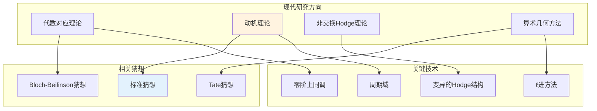

# Hodge猜想 - 思维导图

## 概述

Hodge猜想是代数几何中最重要、最深远的未解决问题之一，也是克雷数学研究所的千禧年大奖难题之一。由英国数学家威廉·瓦伦斯·道格拉斯·霍奇(William Vallance Douglas Hodge)在1950年国际数学家大会上的报告中正式提出。猜想断言：在射影代数簇上，每个有理上同调类都可以用代数循环的线性组合来表示。换句话说，拓扑上看起来"代数"的对象确实是代数的。这个猜想连接了代数几何的算术/代数方面与拓扑/分析方面，是现代数学中最深刻的结构性猜想之一。

---

## 核心思维导图

```mermaid
mindmap
  root((Hodge猜想<br/>Hodge Conjecture))
    核心陈述
      射影代数簇 X
        复光滑射影簇
      Hodge类
        H^{2p}(X, Q) ∩ H^{p,p}(X)
        有理(p,p)-型上同调类
      猜想断言
        每个Hodge类都是
        代数循环的有理线性组合
    代数循环
      定义
        余维p的代数子簇
        形式线性组合
        有理系数
      上同调类
        基本类映射
        Z → [Z] ∈ H^{2p}(X, Q)
      Chow群
        代数循环的等价类
        有理等价
    Hodge理论
      Hodge分解
        H^k(X, C) = ⊕_{p+q=k} H^{p,q}
        H^{p,q} = H̅^{q,p}
      Hodge滤过
        F^p = ⊕_{r≥p} H^{r,k-r}
      Hodge结构
        权k的纯Hodge结构
        极化Hodge结构
    已知情况
      余维1
        Lefschetz (1,1) 定理
        已证明
      Abel簇
        部分结果
      特殊维度
        低维情形
        特定类型簇
    推广
      Tate猜想
        ℓ进上同调版本
        有限域上的类比
      广义Hodge猜想
        Hodge子结构
        Grothendieck提出

```

---

## Hodge理论框架

```mermaid
graph TD
    subgraph 复流形的上同调
        DR[de Rham上同调<br/>H^k_{dR}(X, C)]
        Sing[奇异上同调<br/>H^k(X, Z)]
        Dol[Dolbeault上同调<br/>H^{p,q}_{∂̄}(X)]
    end
    
    subgraph Hodge定理
        H1[H^{p,q} ≅ H^q(X, Ω^p)]
        H2[H^k(X, C) = ⊕_{p+q=k} H^{p,q}]
        H3[H^{p,q} = H̅^{q,p}]
    end
    
    subgraph Hodge类
        HC[H^{2p}(X, Q) ∩ H^{p,p}(X)]
        HC1[有理上同调中的(p,p)类]
    end
    
    subgraph 代数循环
        AC[余维p代数子簇]
        CC[Chow群 A^p(X)]
        FC[基本类 [Z] ∈ H^{2p}]
    end
    
    DR --> H2
    Dol --> H1
    H1 --> H2
    H2 --> HC
    
    AC --> CC
    CC --> FC
    FC --> HC
    
    HC -.-> |Hodge猜想| FC
    
    style HC fill:#fff3e0
    style FC fill:#c8e6c9

```

---

## 核心陈述与图示

```mermaid
graph TD
    subgraph Hodge猜想的交换图
        A[代数循环<br/>代数子簇的<br/>有理线性组合]
        H[Hodge类<br/>H^{2p}(X,Q)∩H^{p,p}]
    end
    
    subgraph 映射
        M1[基本类映射<br/>cl: Z^p(X) → H^{2p}(X,Q)]
        M2[像⊆ Hodge类]
    end
    
    subgraph 猜想断言
        C[Hodge类 = 代数循环类的像]
        C1[满射性]
        C2[每个Hodge类<br/>都是代数的]
    end
    
    A --> M1
    M1 --> H
    
    M2 -.-> C
    
    C --> C1
    C --> C2
    
    style C fill:#ffcdd2
    style A fill:#e3f2fd
    style H fill:#fff3e0

```

---

## 已知结果与特例

```mermaid
mindmap
  root((已知结果))
    Lefschetz (1,1) 定理
      余维1情形
        p = 1
        H²(X,Q) ∩ H^{1,1}
      证明方法
        指数序列
        Picard群
        线丛的Chern类
      完整证明
        Hodge猜想的唯一完全证明情形
    Abel簇
      特定类型
        自同态代数的结构
      部分结果
        某些维度和类型
      Moonen-Zarhin
        特定分类
    特殊簇
      曲面
        p=1 已知
        p=2 一般开放
      四维簇
        部分结果
      有理齐性空间
        已知
      Flag簇
        已知
    数值等价
      数值与代数的区别
        猜想等价性
        未证明
      主定理
        数值类可以是Hodge类
    整系数版本
      比有理系数更强
        已知反例存在
        Atiyah, Kollár
      理系数是正确表述

```

---

## Lefschetz (1,1) 定理详解

```mermaid
graph TD
    subgraph Lefschetz (1,1) 定理
        T[H²(X,Z) ∩ H^{1,1}(X) = Pic(X) ⊗ Q]
    end
    
    subgraph 指数序列
        E1[0 → Z → O → O* → 1]
        E2[连接同态<br/>c₁: H¹(X,O*) → H²(X,Z)]
    end
    
    subgraph 证明要点
        P1[线丛的Chern类]
        P2[c₁(L) ∈ H²(X,Z)]
        P3[c₁(L)的Hodge型为(1,1)]
        P4[反过来: Hodge型(1,1)类<br/>来自线丛]
    end
    
    subgraph 应用
        A1[Kähler几何]
        A2[曲面的分类]
        A3[相交理论]
    end
    
    T --> E1
    E1 --> E2
    E2 --> P1
    P1 --> P2
    P2 --> P3
    P3 --> P4
    
    P4 --> A1
    P4 --> A2
    
    style T fill:#c8e6c9
    style P4 fill:#fff3e0

```

---

## Tate猜想：有限域上的类比

```mermaid
graph TD
    subgraph 两种猜想对比
        H[Hodge猜想<br/>复簇上]
        T[Tate猜想<br/>有限域上]
    end
    
    subgraph Hodge猜想
        HH[上同调: H^{2p}(X, Q)]
        HH1[Hodge分解<br/>H^{p,p}分量]
        HH2[Hodge类 = 代数循环类]
    end
    
    subgraph Tate猜想
        TT[ℓ进上同调<br/>H^{2p}(X, Q_ℓ)]
        TT1[Frobenius作用的不变向量]
        TT2[Tate类 = 代数循环类]
    end
    
    subgraph 已知结果
        R1[Tate猜想 ⇒ Hodge猜想<br/>对CM域上定义的簇]
        R2[Abel簇上部分结果]
        R3[有限域上更多进展]
    end
    
    H --> HH
    T --> TT
    
    HH --> HH1
    TT --> TT1
    
    HH1 --> HH2
    TT1 --> TT2
    
    H -.-> R1
    T -.-> R1
    
    style H fill:#ffcdd2
    style T fill:#fff3e0
    style R1 fill:#e3f2fd

```

---

## 广义Hodge猜想

```mermaid
mindmap
  root((广义Hodge猜想))
    原始Hodge猜想
      对H^{p,p} ∩ H^{2p}(X,Q)
      断言是代数的
    推广动机
      一般Hodge子结构
        权k的Hodge结构
        子空间 V ⊆ H^k(X,Q)
        继承Hodge分解
      几何来源
        应该来自几何构造
        不必须是(p,p)型
    Grothendieck的表述
      代数对应
        两个簇之间的代数循环
        诱导上同调映射
      Hodge子结构的像
        应该是代数的
    与原始猜想关系
      更强
        蕴含原始Hodge猜想
      开放程度
        同样未解决
        更难证明
    应用
      motive理论
        Grothendieck的动机
        代数循环的范畴
      标准猜想
        Lefschetz标准猜想
        Hodge标准猜想

```

---

## 历史时间线

| 年份 | 人物 | 贡献 |
|------|------|------|
| 1930s | Hodge | 发展Hodge理论 |
| 1950 | Hodge | ICM报告正式提出猜想 |
| 1960s | Grothendieck | 提出广义Hodge猜想，motive理论 |
| 1964 | Tate | 提出ℓ进类比 |
| 1970s-80s | 多项研究者 | Abel簇部分结果 |
| 1990s | Cattani-Deligne-Kaplan | Hodge类的代数性 |
| 2000 | CMI | 列为千禧年大奖难题 |
| 2000s | 多项研究者 | 特殊情形的进展 |

---

## 现代研究方向



---

## 与其他数学领域的联系

- **代数几何**: 代数循环、相交理论、motive理论
- **复几何**: Hodge理论、Kähler几何、周期映射
- **数论**: Tate猜想、算术几何、ℓ进上同调
- **表示论**: Hodge结构的自同构群、Mumford-Tate群
- **范畴论**: motive的范畴、Tannakian形式
- **弦理论**: 镜像对称、Calabi-Yau流形的Hodge结构

---

## 学习路径

```mermaid
flowchart LR
    subgraph 基础
        A[代数几何基础] --> B[层上同调]
        C[复几何] --> D[Kähler流形]
    end
    
    subgraph 核心
        B --> E[de Rham上同调]
        D --> F[Hodge分解定理]
        E --> G[代数循环]
    end
    
    subgraph 深入
        F --> H[Hodge结构理论]
        G --> I[相交理论]
        H --> J[Lefschetz (1,1) 定理]
    end
    
    subgraph 前沿
        J --> K[Hodge猜想]
        I --> K
        K --> L[广义Hodge猜想]
        K --> M[motive理论]
    end
    
    style K fill:#ffcdd2
    style L fill:#fff3e0
    style M fill:#e8f5e9

```

---

*文档版本：1.0*  
*创建时间：2026年4月*  
*分类：代数几何 / Hodge理论 / Hodge猜想 / 思维导图*
