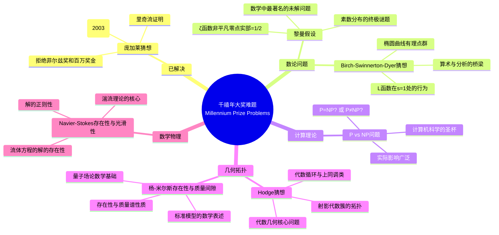
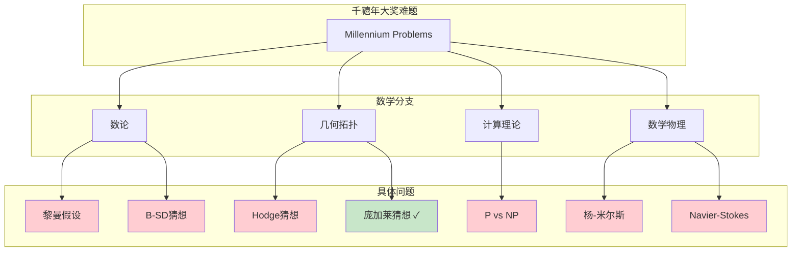
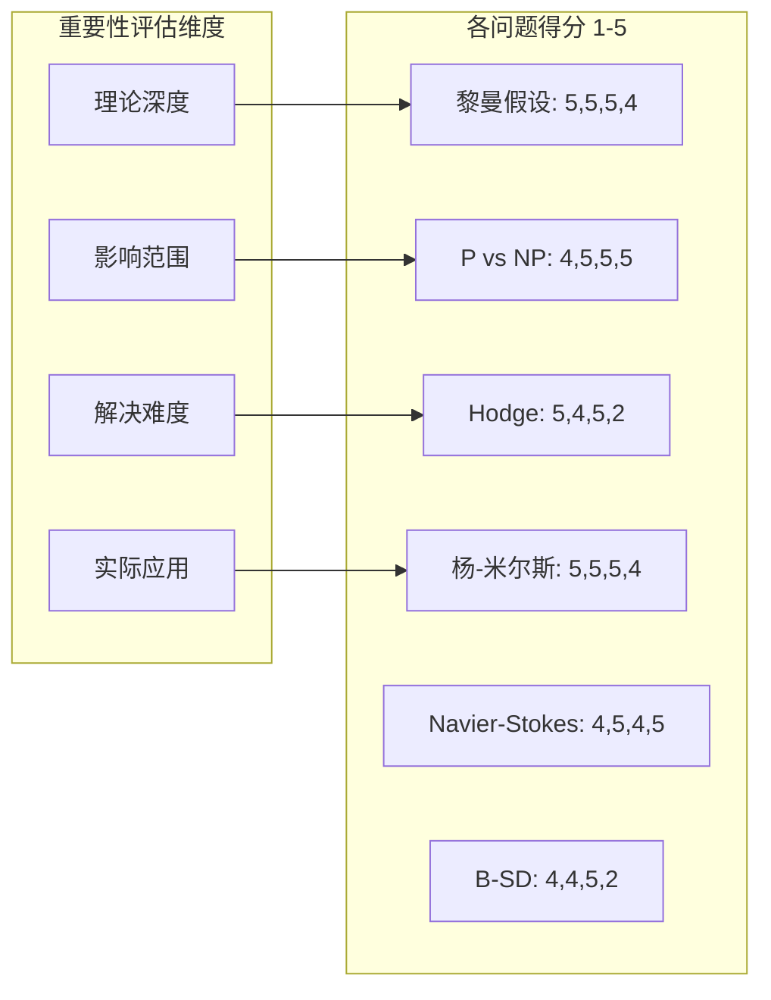
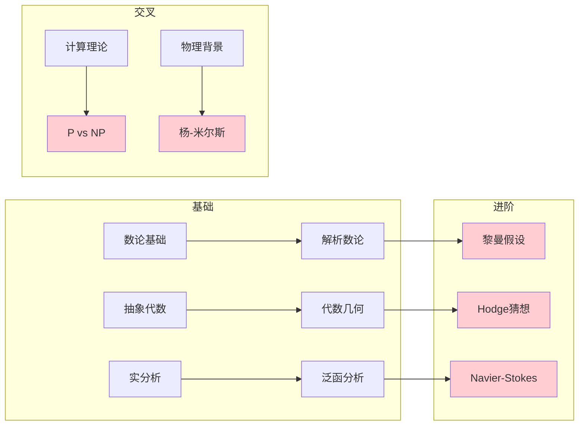

# 千禧年大奖难题 - 思维导图

## 概述

2000年5月24日，克雷数学研究所(Clay Mathematics Institute, CMI)在巴黎宣布了七个"千禧年大奖难题"，每个问题的奖金为100万美元。这七个问题代表了数学中最深刻、最困难的开放性问题，涉及数论、几何、拓扑学、计算理论和数学物理等领域。截至2026年，只有庞加莱猜想被格里戈里·佩雷尔曼解决（他于2003年证明，2010年确认，但他拒绝了奖金）。

---

## 核心思维导图



---

## 问题分类与关联



---

## 庞加莱猜想（已解决）

```mermaid
mindmap
  root((庞加莱猜想<br/>Poincaré Conjecture))
    陈述
      三维球面是唯一的单连通闭三维流形
      S³是唯一的紧致单连通三维流形
    历史
      庞加莱(1904)提出
      四维版本Smale(1961)证明
      五维及以上解决(1980s)
      三维是最后的堡垒
    佩雷尔曼证明(2002-2003)
      里奇流方法
        Hamilton开创
        奇点分析
        手术技术
      核心突破
        熵泛函
        κ-非坍缩
        有限时间内的手术
    影响
      几何化猜想
        瑟斯顿纲领
        所有三维流形的分类
      应用
        宇宙形状问题
        拓扑学革命
    争议
      佩雷尔曼拒绝菲尔兹奖
      拒绝克雷百万奖金
      数学界的震撼
```

---

## 各问题历史时间线

| 时间 | 事件 |
|------|------|
| 1859 | 黎曼假设提出 |
| 1900 | 希尔伯特23个问题 |
| 1904 | 庞加莱猜想提出 |
| 1960s | BSD猜想形成 |
| 1970s | P vs NP问题正式提出 |
| 1980s | 杨-米尔斯理论发展 |
| 2000 | CMI宣布千禧年大奖难题 |
| 2003 | 佩雷尔曼证明庞加莱猜想 |
| 2006 | 佩雷尔曼拒绝菲尔兹奖 |
| 2010 | 庞加莱猜想正式确认，佩雷尔曼拒绝奖金 |
| 2026 | 剩余6个问题仍然开放 |

---

## 重要性评估



---

## 研究现状

| 问题 | 研究进展 | 活跃程度 |
|------|----------|----------|
| **黎曼假设** | 临界线验证(>10¹³个零点)，多种等价的猜想形式 | 🔥🔥🔥🔥🔥 |
| **P vs NP** | 电路复杂性，去随机化，证明技术障碍 | 🔥🔥🔥🔥🔥 |
| **Navier-Stokes** | 弱解理论，部分正则性，数值模拟 | 🔥🔥🔥🔥 |
| **杨-米尔斯** | 格点规范理论，构造性量子场论 | 🔥🔥🔥 |
| **Hodge** | 动机理论，p-adic Hodge理论进展 | 🔥🔥🔥 |
| **B-SD** | 秩的计算，p-adic L函数，Iwasawa理论 | 🔥🔥🔥🔥 |

---

## 与其他数学领域的联系

- **代数几何**: Hodge猜想、BSD猜想属于算术几何
- **分析学**: Navier-Stokes是偏微分方程的核心问题
- **数论**: 黎曼假设是解析数论的顶峰
- **计算机科学**: P vs NP是计算复杂性理论的基石
- **数学物理**: 杨-米尔斯和Navier-Stokes连接数学与物理
- **拓扑学**: 庞加莱猜想的解决推动了三维拓扑的发展

---

## 学习路径



---

*文档版本：1.0*  
*创建时间：2026年4月*  
*分类：数学问题 / 千禧年难题 / 思维导图*
