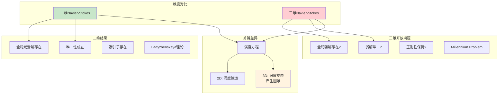
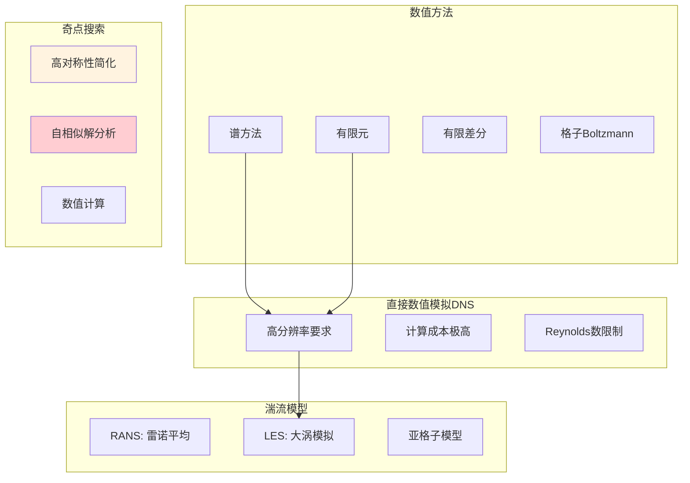
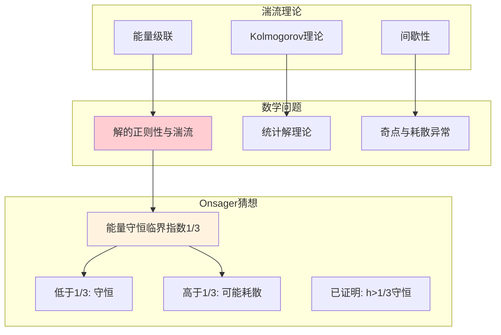
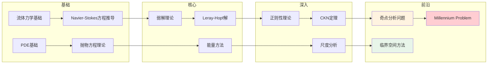

# Navier-Stokes方程存在性与光滑性 - 思维导图

## 概述

Navier-Stokes方程存在性与光滑性问题描述的是三维不可压缩Navier-Stokes方程的解是否总是存在且光滑。这是数学物理中最重要、最困难的开放问题之一，也是克雷数学研究所的千禧年大奖难题之一。Navier-Stokes方程描述了粘性不可压缩流体的运动，是流体力学的基本方程。问题的核心在于：给定光滑的初始条件，解是否在全部时间内保持光滑（不会形成奇点/爆炸），还是可能在有限时间内产生奇点（blow-up）？

---

## 核心思维导图

```mermaid
mindmap
  root((Navier-Stokes问题<br/>Navier-Stokes Problem))
    方程
      不可压缩Navier-Stokes
        ∂u/∂t + (u·∇)u = -∇p + νΔu + f
        ∇·u = 0
        u: 速度场, p: 压力, ν: 粘性系数
      维度关键
        2维: 已解决，解光滑
        3维: 未解决，核心难题
    核心问题
      存在性
        全局弱解存在(Leray-Hopf)
        强解局部存在
        全局强解存在?
      光滑性/正则性
        解是否始终光滑?
        有限时间内奇点形成?
      唯一性
        弱解唯一?
        3维情况开放
    弱解理论
      Leray(1934)
        全局弱解存在
        能量不等式
        构造方法
      Hopf
        推广到边界情况
      不足
        唯一性未知
        正则性未知
    部分结果
      小初值
        全局光滑解存在
      轴对称
        无旋情况的进展
      局部正则性
        ε-正则性定理
        部分正则性
    奇点分析
      可能的奇点结构
        自相似解?
        已排除
      尺度分析
        能量尺度
        临界空间

```

---

## Navier-Stokes方程结构

```mermaid
graph TD
    subgraph Navier-Stokes方程组
        Eq1[∂u/∂t + (u·∇)u = -∇p + νΔu + f]
        Eq2[∇·u = 0]
    end
    
    subgraph 各项物理意义
        T1[∂u/∂t<br/>局部加速度]
        T2[(u·∇)u<br/>对流项<br/>非线性]
        T3[-∇p<br/>压力梯度]
        T4[νΔu<br/>粘性扩散<br/>线性]
        T5[f<br/>外力]
        T6[∇·u=0<br/>不可压缩性]
    end
    
    subgraph 关键困难
        D1[非线性对流项<br/>最高阶困难]
        D2[压力约束<br/>非局部性]
        D3[不可压缩约束<br/>耦合方程组]
    end
    
    Eq1 --> T2
    Eq1 --> T4
    Eq2 --> T6
    
    T2 --> D1
    T3 --> D2
    T6 --> D3
    
    style T2 fill:#ffcdd2
    style D1 fill:#ffcdd2

```

---

## 二维 vs 三维对比



---

## 解的分类与性质

```mermaid
mindmap
  root((Navier-Stokes解理论))
    弱解
      Leray-Hopf弱解
        u ∈ L^∞(L²) ∩ L²(H¹)
        满足能量不等式
        全局存在(3D)
      不足
        唯一性未知
        正则性未知
        是否满足能量等式?
    强解
      定义
        更高正则性
        u ∈ L^∞(H¹) ∩ L²(H²)
      存在性
        局部存在
        小初值全局存在
        一般情况开放
    温和解
      积分方程形式
        半群方法
        不动点论证
      临界空间
        L³, Ḣ^{1/2}
        Koch-Tataru空间
    部分正则性
      Caffarelli-Kohn-Nirenberg
        奇异集Hausdorff维数≤1
        ε-正则性定理
      Scheffer结果
        奇异集测度为零
    解的长时间行为
      吸引子
        2D: 存在有限维吸引子
        3D: 弱全局吸引子
      统计解
        Hopf方程
        湍流建模

```

---

## 历史时间线

| 年份 | 人物 | 贡献 |
|------|------|------|
| 1822 | Navier | 建立粘性流体方程 |
| 1845 | Stokes | 完善方程组 |
| 1934 | Leray | 弱解存在性，开创性工作 |
| 1951 | Hopf | 弱解理论推广 |
| 1969 | Ladyzhenskaya | 2D理论系统建立 |
| 1982 | Caffarelli-Kohn-Nirenberg | 部分正则性定理 |
| 2000 | CMI | 列为千禧年大奖难题 |
| 2014 | Tao | 构造平均化的NS模型，证明奇点可能 |

---

## 正则性准则

```mermaid
graph TD
    subgraph 正则性准则
        C[若解满足某种条件<br/>则解光滑]
    end
    
    subgraph Serrin型准则
        S1[u ∈ L^q(0,T; L^p)<br/>2/q + 3/p ≤ 1<br/>⇒ 正则]
        S2[特别: u ∈ L^∞(L³)]
        S3[尺度不变空间]
    end
    
    subgraph 分量准则
        C1[Beale-Kato-Majda<br/>∫₀ᵀ‖ω‖_∞ < ∞<br/>⇒ 正则]
        C2[一个方向正则性]
    end
    
    subgraph 其他准则
        O1[压力条件]
        O2[梯度条件]
        O3[一个方向导数]
    end
    
    C --> S1
    C --> C1
    C --> O1
    
    S1 --> S2
    S1 --> S3
    C1 --> C2
    
    style C fill:#fff3e0
    style S3 fill:#e3f2fd

```

---

## 尺度分析与临界空间

```mermaid
mindmap
  root((尺度分析))
    尺度对称性
      缩放变换
        u_λ(t,x) = λu(λ²t, λx)
        p_λ(t,x) = λ²p(λ²t, λx)
      不变范数
        L³, Ḣ^{1/2}
        BMO⁻¹
        Koch-Tataru
    临界空间
      定义
        ‖u_λ‖ = ‖u‖
        缩放不变
      重要性
        小数据全局存在
        正则性准则
      例子
        L³(R³)
        Ḣ^{1/2}(R³)
        BMO⁻¹
    超临界 vs 次临界
      超临界
        尺度"大于"NS
        技术困难
      次临界
        尺度"小于"NS
        相对容易处理
      临界
        刚好平衡
        核心困难

```

---

## 数值与计算方面



---

## 相关开放问题

| 问题 | 描述 | 状态 |
|------|------|------|
| **全局正则性** | 光滑初值是否产生全局光滑解 | 开放 |
| **弱解唯一性** | Leray-Hopf弱解是否唯一 | 开放 |
| **能量等式** | 弱解是否满足能量等式 | 开放 |
| **奇点结构** | 若奇点存在，其结构如何 | 开放 |
| **无界域** | 全空间问题与有界域差异 | 部分解决 |

---

## 与湍流理论的联系



---

## 与其他数学领域的联系

- **偏微分方程**: NS是抛物型方程与椭圆型的耦合
- **泛函分析**: Sobolev空间、泛函框架
- **调和分析**: Littlewood-Paley理论、抛物aproduct
- **概率论**: 随机NS方程、统计解
- **微分几何**: 流形上的NS方程
- **动力系统**: 吸引子、长时间行为

---

## 学习路径



---

*文档版本：1.0*  
*创建时间：2026年4月*  
*分类：数学物理 / 偏微分方程 / Navier-Stokes / 思维导图*
